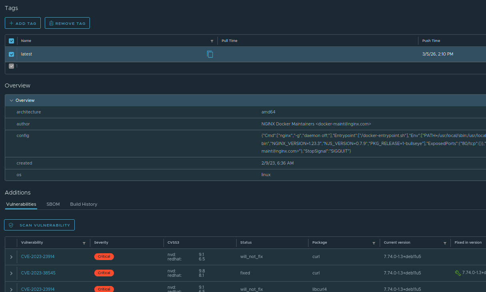

## Vulnerability Scanning

Vulnerability scanning analyzes container images to identify known security issues in the operating system packages or libraries they contain. Satama has an integrated tools Trivy to perform these scans automatically or on-demand. 

### Enable Automatic Vulnerability Scanning 

You can enable automatic scan of images on push. 

* Inside the project, navigate to **Configuration** tab.
* Locate the **Vulnerability scanning** section.
* Check box in front of **Automatically scan images on push**

If enabled, every time a user pushes an image, Satama automatically scans it for CVEs. If disabled, user can maually trigger scans. 

### Run Manual Scan

You can run manual scan for individual images.

* Click on the repository and select the image you want to scan.
* Go to **Additions** section.
* Click on **Vulnerabilities** tab.
* You can start scanning by clicking on **scan vulnerability** button.

### Check the Scan Result

 Once scan is completed, all CVEs will be displayed under **Vulnerabilities** tab. Satama displays:

 * Number of vulnerabilities
 * Severity levels (Critical, High, Medium, Low)
 * Affected packages
 * Recommended fixes
