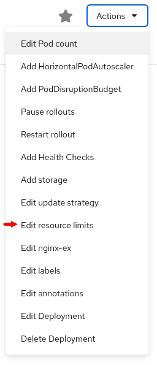
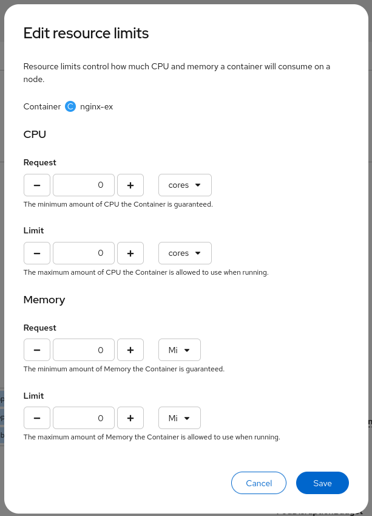
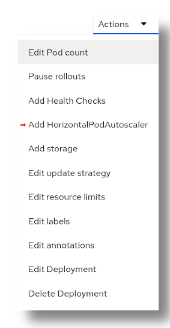
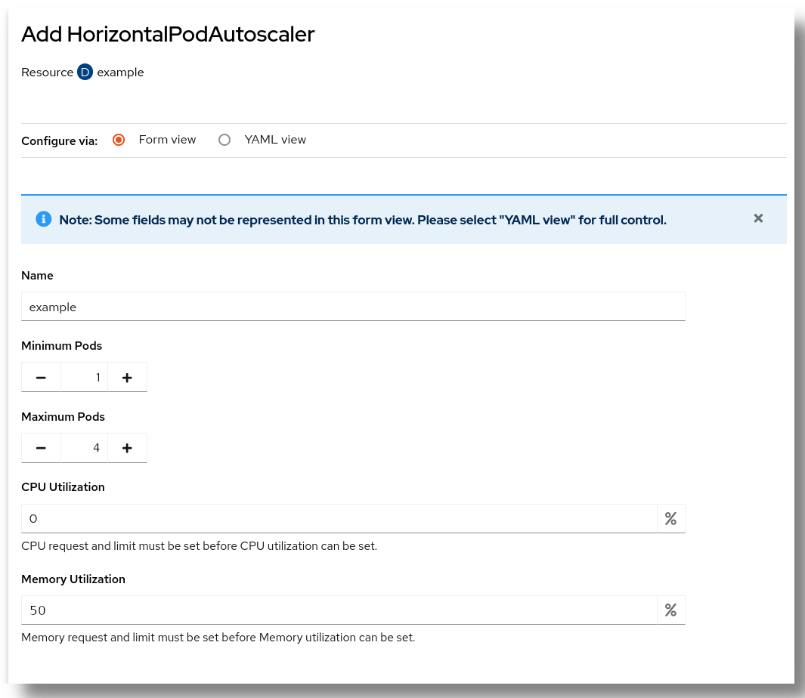
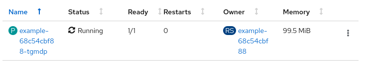
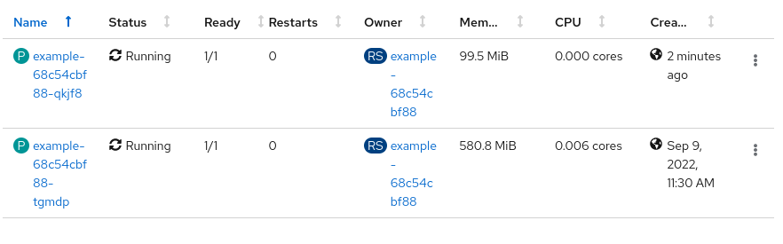

# How to automatically scale up and down replicas

Rahti 2 allows automatic Horizontal auto-scaling based on CPU and Memory consumption. This means that the platform can be configured to add more copies of an application (scale up) when the current copies are consuming too much CPU and/or Memory, and to remove copies of the application (scale down) when the consumption of CPU and/or memory is too low and a lower amount of copies can cope with the current load. 

!!! info "Horizontal/Vertical scaling"

    Horizontal scaling is when more copies or replicas of an application are added. For Kubernetes this means more Pods running with the same container and parameters. For virtual machines this means to add more virtual machines with the same flavor and image.

    Vertical scaling is when more resources are added to the current copy. For Kubernetes this means setting higher CPU or memory limits. For virtual machines it means to recreate the machine with a bigger flavor with more CPU or memory.

The obvious utility of this is to allow automatically and dynamically optimize the resources consumed. It lowers the cost of maintaining an application that will only have occasionally high load. The response time for scaling up is in the realm of seconds, and when tuned in properly, it can allow a seamless experience for the users of the application. 

## Setup

For doing this, first we need a `Deployment`. Any deployment will work, but you can use this example that deploys a dummy application: 

**Note:** Remember to [login in Rahti 2](../rahti2/usage/cli.md#how-to-login-with-oc) first

```sh
echo "apiVersion: apps/v1
kind: Deployment
metadata:
  name: example
spec:
  selector:
    matchLabels:
      app: httpd
  replicas: 4
  template:
    metadata:
      labels:
        app: httpd
    spec:
      containers:
        - name: httpd
          image: docker.io/lvarin/oom-killer
          command:
           - /app/app.py
           - '10'
          ports:
            - containerPort: 8080
" | oc create -f -
```

The deployment should now spin up 4 copies of the same `Pod`. We will later configure it to lower or increase the number of Pods based on resource consuption.

### Add resources limits

{ align=right }

The next step is to set resource limits for CPU and Memory. This is the maximum amount of CPU and memory that each Pod will be able to use. From the Deployment page, go to **Actions > Edit resource limits**

You have to set a limit (per Pod) for CPU and memory. It is not necessary to fill up the "Request" field.


For this example, we will set:

* `1` CPU limit.
* `1` Gi memory limit.



### Add the HorizontalAutoscaler

Once the Pod limits are set, you can now add the Horizontal auto-scaler. From the Deployment page, go to **Actions > Add HorizontalPodAutoscaler**.

{ align=right }

First set the **maximum** and **minimum** number of replicas. In general, one will leave the minimum to 1, and set the maximum to a value to a "fair share" of the total quota. For example, if you have a total quota of 20 Pods, and one single Deployment, the maximum should be set to 20, to use all the quota available. But if you have two deployments sharing the same name space, the maximum should be set to 10 each.

After the minimum and maximum are set, we need to setup the % of resource usage that will be needed to trigger an scale up. One or both of the two resources (CPU and memory) can be set. What limit and of what resource depends on ghe application you are running. Some applications are more CPU usage intensive, some are memory usage intensive, others are both. In practise, it is an iterative process for tunning the parameters. 

When the usage of the resources configured is surpassed, a new replica will be created. For example, we setup a 50% of memory with a limit of 1Gi. When the usage of memory reaches and surpasses the 500MB mark, a new replica will be created, doubling the total memory available. This scale up will continue meanwhile the total memory usage is more than 50% of the memory available.

On the hand, an scale down will happen when the extra capacity is no longer needed, i.e.: When by removing one replica, the total memory used will not be more that 50% of the total available after the scale down.



For this example we will setup:

* `1` as the Minimum number of Pods.
* `4` as the Maximum number of Pods.
* `50`% of memory utilization.

We will not touch the CPU utilization. 

## Test and monitor

After some minutes, we should have only one single Pod with almost zero CPU usage and 100MB of memory usage. The autoscaler waits up to 10 minutes to delete Pods to avoid flapping, see below for more information. You can check this in the `Pods` page (**Project > Pods** in the Developer page).



!!! info "Using the CLI"

    You can use the command line interface to get the current status of the autoscaler:
    ```
    $ oc get HorizontalPodAutoscaler example   
    NAME      REFERENCE            TARGETS          MINPODS   MAXPODS   REPLICAS   AGE
    example   Deployment/example   9%/50%, 0%/50%   1         4         1          1h
    ```

There is only need for a single Pod because only ~100MB is used out of 1Gi of total memory. This is less than the 50% of memory we configured. We will now artificially raise the memory usage. We will enter in a terminal of the single Pod that is running (Click in the Pod name and then in the "Terminal" tab), and run the following command:

```sh
/app/app.py 5 100
```

This will create a new process that will reserve 5 chunks of 100MB of RAM. As 100+500 MB is more than 50% of the total 1Gi of memory, a new Pod will be created by the auto scaler. 



Monitor the situation and wait for the second Pod to be created. The resources can be monitored from the main project page, this gives a general view of the whole project, including the quota usage. Alternatively you can enter in the page of the deployment we created (from the **Project** page, go to **Deployment**, click in **example**, and finally in the Metrics tab. 

Afterwards, you can kill the process you created and see how the application is scaled down by killing the second Pod.

!!! Info "Scale down delay"
    Meanwhile the scale up is designed to be as fast as possible, the scale down will take up to 10 minutes. This is due to the stabilization window, from the [upstream kubernetes documentation](https://kubernetes.io/docs/tasks/run-application/horizontal-pod-autoscale/#stabilization-wind):

    > The stabilization window is used to restrict the flapping of replica count when the metrics used for scaling keep fluctuating. The autoscaling algorithm uses this window to infer a previous desired state and avoid unwanted changes to workload scale.

