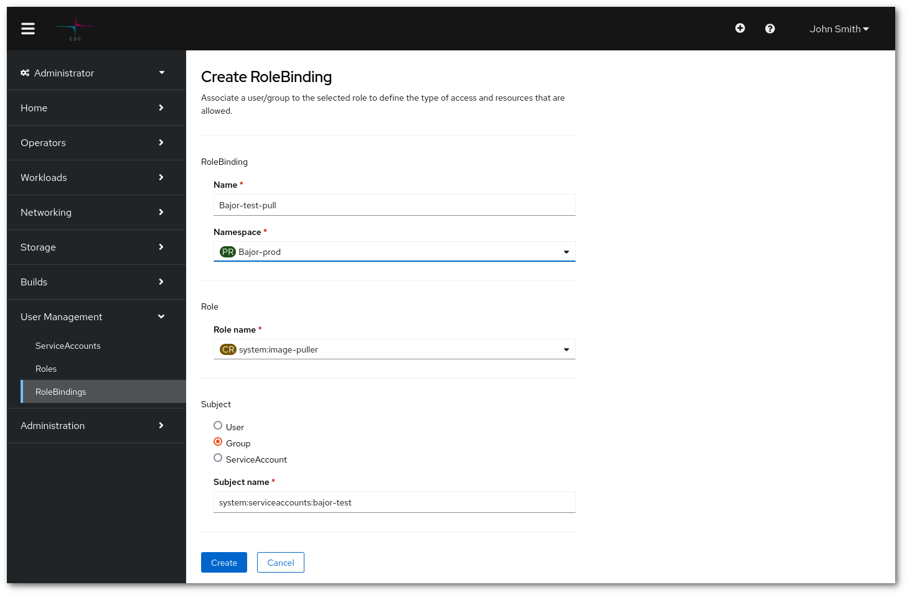

# Allow pulls of images from one Rahti project to another

Every Rahti project has a private image registry space. Any image compatible with the [OCI](https://opencontainers.org/) format can be stored in the registry. Common uses for the registry are to store [images built by Rahti](../../rahti2/images/creating/#using-rahti-2-to-build-container-images) or cache upstream images.


By default, any image stored in a project's private registry can be pulled from within the project. Also, by default, only authenticated member of the project will be allowed to pull or push an image from outside the project. This means that if you want to build and deploy an image, Pods will be able to use it without any extra configuration. And it also means that you will be able to pull that image only if your are authenticated and member of the project.

The objective of this tutorial is to explain how to achieve an extra use case, pulling images from another project within Rahti. The use case for this is when several projects are used to deploy the same infrastructure thus sharing the same images. In the example below, the first project will be production (`bajor-prod`), the other one will be for testing (`bajor-test`). Both need to share the same registry to make the test and deployment easier and simpler to follow.

1. Make sure you have two projects to play with. If you do not have two projects that you can play with, you can follow the [create project](../../rahti2/usage/projects_and_quota/#creating-a-project) documentation.

1. There are two methods to achieve this:
    1. You can do this using the [oc command line tool](../../rahti2/usage/cli/), by running:

        ```sh
        oc adm policy add-role-to-user system:image-puller system:serviceaccounts:bajor-test \
               -n bajor-prod
        ```

        The command above will allow the group `system:serviceaccounts:bajor-test` to pull any image stored in `bajor-prod`. The group contains every service account of the project.

    1. You can use the web interface, by going to the `Administrator` interface and then to `User Management > RoleBindings`. Finally click in the `Create binding` button and fill up the form as shown:

        

        The **Name** of the new rolebinding can be any name, it is recommended to keep it informative of its purpose. The **Namespace** has to be the destination project, ie: the project that hosts the images. The **Role name** has to be `system:image-puller`. Finally the **Group** has to be `system:serviceaccounts:bajor-test`, the group corresponding to the project that needs to pull the images.

1. In order to test it, one just need to deploy a Pod in `bajor-test` that uses an image from `bajor-prod` (similar to `image-registry.apps.2.rahti.csc.fi/bajor-prod/image-name`).

