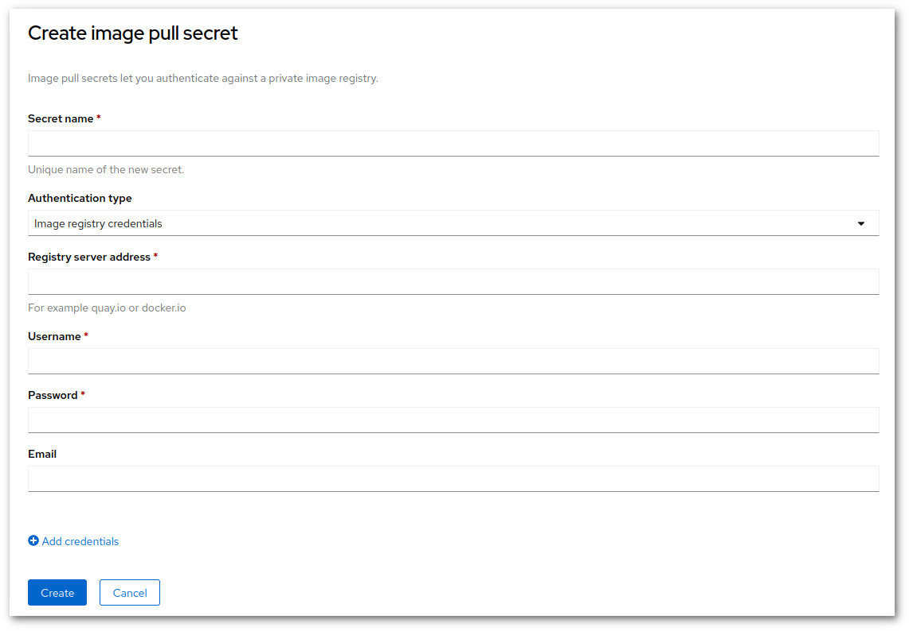

# How to add docker hub credentials to a project

Since 2nd November 2020, docker hub has imposed a rate limit for image pulls. For Rahti 2 this means a
limit of 200 pulls every 6 hours. This limit can be easily reached and it prevents new applications to be deployed if the image is in docker hub.

The error looks like this:

```
Pulling image "docker.io/centos/python-38-centos7@sha256:da83741689a8d7fe1548fefe7e001c45bcc56a08bc03fd3b29a5636163ca0353" ...
pulling image error : toomanyrequests: You have reached your pull rate limit. You may increase the limit by authenticating and upgrading: https://www.docker.com/increase-rate-limit
```

The solution involves using both the Web UI and the client:

* First, you need a docker hub account. It can be a free account. In this case you will still have rate limits, but only the pulls you have done using your credential will be taken into account for the rate limit. Paid accounts have no limit.
    * You will need a TOKEN, go to <https://hub.docker.com/settings/security> and create a token. You will be able to see when the token was last used. Also you can create several tokens, and use them in different projects, increasing security.

* Secondly, navigate to the Web UI and select developer view. On the left navigation, select **Secrets**.

* On upper right, click "Create" menu, and select "Image pull secret". Set the following values:
    * Secret name = give it a clear name, this will be used later
    * Authentication type = "Image Registry Credentials"
    * Registry server address = "docker.io"
    * Username = your docker user name
    * Password = your docker **token**
    * Email = your docker email



* Verify values are correct and select "Create".

* Next we'll go to command line. Log in and use following commands to link credentials to service accounts:

```sh
$ oc -n <project-name> secrets link builder <secret-name>
```

**Note**: Substitute <project-name> place holder with actual project name (without <>) and <secret-name> with actual secret-name.

## Troubleshooting

If the error persists, you may check two things:

1. From <https://hub.docker.com/settings/security> you will be able to see when the token was last used. Please check that if the time there matches the last time it should have been used.

1. Check that the links between the secret and the service accounts are there:

    ```sh
    $ oc -n <project-name> describe sa builder
    ```

    **Note**: Substitute <project-name> place holder with actual project name (without <>).

1. Check the Pod used for the build and double check that the secret you created is indeed used:

  ```sh
  $ oc get pod
  NAME                               READY     STATUS      RESTARTS   AGE
  my-hello-1-build                   0/1       Error       0          5h
  my-hello-2-build                   0/1       Error       0          1h
  ```

  Both Pods above are failed builds. Their are named in the following way:

  ```sh
  <buildname>-<number>-build
  ```

  Take the last build, in this case `my-hello-2-build`. describe its status and look for the Volume mounts:

  ```sh
  $ oc describe pod my-hello-2-build
  (...)
    Mounts:
      /tmp/build from buildworkdir (rw)
      /var/run/crio/crio.sock from crio-socket (rw)
      /var/run/docker.sock from docker-socket (rw)
      /var/run/secrets/kubernetes.io/serviceaccount from builder-token-r5zp8 (ro)
      /var/run/secrets/openshift.io/pull from estivadores-secreto2-pull (ro)
      /var/run/secrets/openshift.io/push from builder-dockercfg-kn8h6-push (ro)
  ```

  In the code above we can see that the pull secret used was `estivadores-secreto2-pull`. We can double check that the path was used for pulling by:

  ```sh
  $  oc describe pod my-hello-2-build | grep PULL_DOCKERCFG_PATH
        PULL_DOCKERCFG_PATH:  /var/run/secrets/openshift.io/pull
  ```

  and see that our secret was mounted in that path.

In case you need more information, please consult the [upstream image pull secrets](https://docs.openshift.com/container-platform/3.11/dev_guide/managing_images.html#using-image-pull-secrets) upstream documentation.
