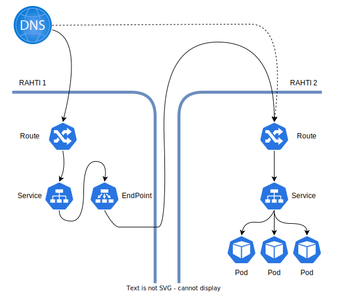

# Integrating External Services

Kubernetes, and by extension OpenShift OKD, gives a lot of flexibility regarding network use cases. One of the uses cases is the one that allows to use external services, like databases, transparently in a OpenShift project. Other of the use cases would be to to have a network proxy between OpenShift installations. This could be used as a temporal solution to ease migration periods, where a user of your web application will visit a "Rahti 1 URL", but content will be server by a "Rahti 2 application". Other option is to [setup a HTTP redirector in Rahti](http-redirector.md).



In the example above we are proxying traffic from Rahti 1 to Rahti 2. This is obtained by creating two routes, a service and an Endpoint.

## Procedure

1. First deploy an application in Rahti 2. Any application is suitable for this test.

1. [Install](../../rahti2/usage/cli/#how-to-install-the-oc-tool) and [login with OC](../../rahti2/usage/cli/#how-to-login-with-oc) in Rahti 2.

1. Create a special `Route` in Rahti 2:

    ```yaml
    echo 'apiVersion: route.openshift.io/v1
    kind: Route
    metadata:
      name: test-route
    spec:
      host: <test>.rahtiapp.fi
      port:
        targetPort: http
      to:
        kind: Service
        name: <Service-name>
        weight: 100
      wildcardPolicy: None
    status: {}' | oc create -f -
    ```
    Replace `<test>` so the URL is the same as in Rahti 1. Rahti 1 will be later configured to relay the request to Rahti 2, when the request reaches Rahti 2, the Loadbalancer needs to know to which application to send the request, the host parameter is used (Using `HTTPD` headers).
    The `<service-name>` must be the one corresponding to the application you deployed. Double check which ports is `<Service-name>` exporting and adapt the Route in accordance to that.

    You can test the setup so far:

    ```sh
    curl <test>.rahtiapp.fi -vL --resolve <test>.rahtiapp.fi:80:195.148.21.61
    ```
    The command above uses `--resolve` to change the ip associated to a DNS that corresponds to Rahti 2.

1. [Install](../../rahti/usage/cli/#how-to-install-the-oc-tool) and [login with OC](../../rahti/usage/cli/#how-to-login-with-oc) in Rahti 1.

1. Create a project in Rahti 1, or use an existing one.

1. Then create an `EndPoint` in Rahti 1:

    ```yaml
    echo 'kind: Endpoints
    apiVersion: v1
    metadata:
      name: proxy-service
    subsets: 
    - addresses:
      - ip: 195.148.21.61
      ports:
      - port: 80
        name: http' | oc create -f -
    ```
    The IP in the example, is the one behind `router-default.apps.2.rahti.csc.fi`. 

1. Then a `Service`, also in Rahti 1:

    ```yaml
    echo 'kind: Service
    apiVersion: v1
    metadata:
      name: proxy-service
    spec:
      ports:
      -  name: http
         protocol: TCP
         port: 80
         targetPort: 80 
         nodePort: 0
    selector: {}' | oc create -f -
    ```
    The name of the `Service` and the `EndPoint` must be the same.

1. Finally the `Route` in Rahti 1:

    ```yaml
    echo 'apiVersion: route.openshift.io/v1
    kind: Route
    metadata:
      name: test-route
    spec:
      host: <test>.rahtiapp.fi
      port:
        targetPort: http
      tls:
        insecureEdgeTermination: Redirect
        termination: edge
      to:
        kind: Service
        name: proxy-service
        weight: 100
      wildcardPolicy: None
    status: {}' | oc create -f -
    ```
    The URL must be the same as in step 3.

## Final considerations

In the tutorial above we have setup a proxy from Rahti 1 to Rahti 2, every request will go first to Rahti 1. This means two things, first that the performance will be affected by this proxy, secondly that when Rahti 1 is retired (or is down due to an incident or a planned maintenance) this setup will stop working. This is just a temporal fix.

It is possible to "proxy" more than one URL, the only necessary step is to create the `Route`s in Rahti 1 and 2 with the same URL in each service. It is not necessary to replicate the `Service` and `Endpoint` in Rahti 1.

You need to also consider that some applications will not work transparently with this setup. In some cases, applications need to know from which URL they are working. This means that the URL is hardwired in some assets like CSS or images, the result is the look of a "broken webpage".

For more information and other network proxy options:

- <https://docs.openshift.com/dedicated/3/dev_guide/integrating_external_services.html>
