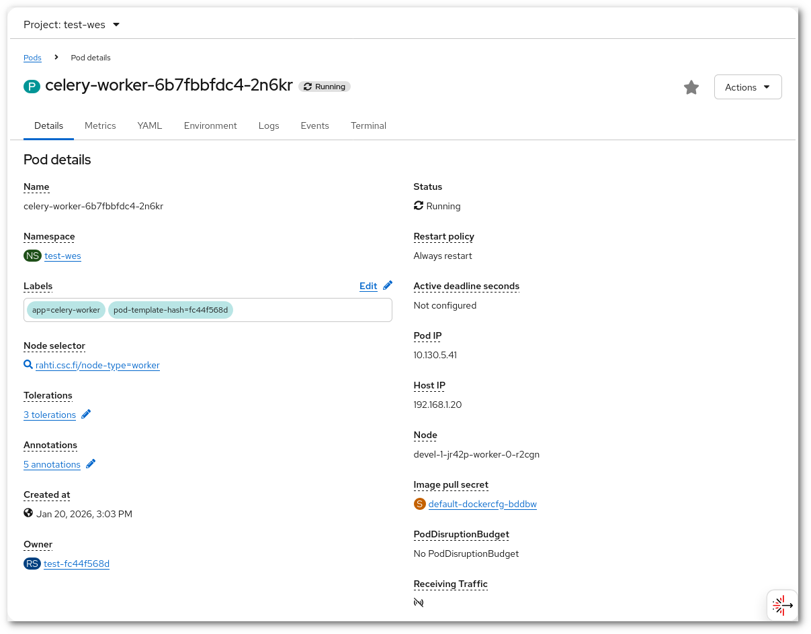

# Pod (anti) affinity

Pod affinity and anti-affinity allow you to constrain where your Pods will be scheduled on, based on the labels of Pods already running on that node. This general idea can also be used to select (or avoid) specific nodes with specific hardware configurations like a GPU.

This is useful because sometimes (affinity) it is interesting to be sure that two Pods share the same mounted volume and avoid network synchronization issues, or the opposite, (anti-affinity) make sure two pods will not share the same server and thus increase the availability of an application.

In this example of a deployment we want the Pods from the `wes-deployment` to run in the same node as the `celery-worker` ones so they can both mount the same storage volume (which can only be mounted on a single physical node).

```diff
diff --git a/charts/wes/templates/wes/wes-deployment.yaml b/charts/wes/templates/wes/wes-deployment.yaml
index 93ca230..e64349b 100644
--- a/charts/wes/templates/wes/wes-deployment.yaml
+++ b/charts/wes/templates/wes/wes-deployment.yaml
@@ -12,6 +12,16 @@ spec:
       labels:
         app: {{ .Values.wes.appName }}
     spec:
+      affinity:
+        podAffinity:
+          requiredDuringSchedulingIgnoredDuringExecution:
+          - labelSelector:
+              matchExpressions:
+              - key: app
+                operator: In
+                values:
+                - celery-worker
+            topologyKey: "kubernetes.io/hostname"
       initContainers:
```

The `affinity` block needs to be under `spec`. For applying this to another deployment one will need to change only the `value` and perhaps the `key`, so it corresponds to one `key` and `value` pair of the **Labels** belonging to the Pod we want to have affinity with. It is possible to see the **Labels** of a Pod via the command line or via the web interface.



And from the command line:

```sh
$ oc describe pods celery-worker-6777488df4-s9tc7
Name:           celery-worker-6777488df4-s9tc7
Namespace:      wes
Priority:       0
Node:           rahti-comp-io-s25-d/192.168.54.13
Start Time:     Wed, 17 Jan 2024 14:55:57 +0200
Labels:         app=celery-worker
                deployment=celery-worker-57
(...)
```

When the `affinity` block is added to this deployment, the scheduler will (re-)launch the Pods corresponding to `wes-deployment` into the same as `celery-worker` is running. As the policy used is `requiredDuringSchedulingIgnoredDuringExecution`, if there is no space in the chosen node, the deployment will not succeed. Other policy is `preferredDuringSchedulingIgnoredDuringExecution`, which means that the scheduling will not fail if there is no space in the chosen node as they will be scheduled in a different one.

More information and further examples can be found at:

<https://kubernetes.io/docs/concepts/scheduling-eviction/assign-pod-node/#inter-pod-affinity-and-anti-affinity>
