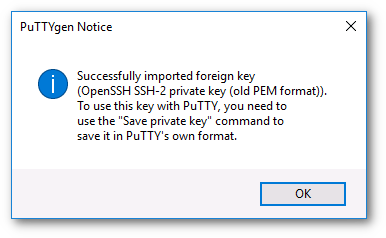
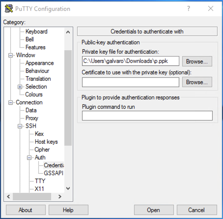

# SSH Key Pair

The SSH key pair is very useful in [many situations](https://en.wikipedia.org/wiki/Secure_Shell#Use) and is not limited to use in the OpenStack environment.

This tutorial covers the creation of an SSH key pair and a practical use case with OpenStack.

SSH keys are text files and, as the name of this tutorial suggests, they come in pairs: a private key and a public key.

<center>
{width=400}
</center>

After this tutorial, you will know how to use SSH keys instead of password authentication.

## Creating an SSH key pair on a computer

An SSH key pair can be created with a command `ssh-keygen` in all three major operating systems.

By default the command stores the key pair in right location - under user's home directory, in a directory called `.ssh` - and asks to add a password into it.

```text
$ ssh-keygen
Generating public/private rsa key pair.
Enter file in which to save the key (~/.ssh/id_rsa):
Enter passphrase (empty for no passphrase):
Enter same passphrase again:
Your identification has been saved in ~/.ssh/id_rsa
Your public key has been saved in ~/.ssh/id_rsa.pub
The key fingerprint is:
SHA256:Z/IxPJHY5fO7k28819BXw4jRZeQaNGdSq1GGPneuZ+8 username@usercomputer
The key's randomart image is:
+---[RSA 3072]----+
|            o+=X |
|         o =.oX .|
|        . + *ooo |
|         . o *=+o|
|        S B  o+o+|
|         = +  ..+|
|          .   .=o|
|              +oB|
|              .BE|
+----[SHA256]-----+
$ ls -l .ssh | grep rsa
-rw-------  1 username  staff   2655 Nov 18 08:24 id_rsa
-rw-r--r--  1 username  staff    577 Nov 18 08:24 id_rsa.pub
$
```

After the command exits, two files may be found from the .ssh directory.

!!! success "Key pair created"

    By default the `ssh-keygen` command creates a private key named **id_rsa** and a public key named **id_rsa.pub**.

Below is an example execution of the command in Windows 11 PowerShell.


## Adding an existing key pair to OpenStack

If you have an existing key pair or have created one on your computer, it can be added to OpenStack environment.

To do this, you need to be signed in to one of the Pouta services.

1. Go to the **Compute > Key Pairs** section, and select **Import Public Key**.
2. Give the key pair a name.
3. Either use **Choose File** button and select **id_rsa.pub** file or copy + paste the content of it to the **Public Key** text area.
4. Click **Import Public Key** button.


!!! info "Tip"

    To ensure compatibility with OpenStack and to distinguish between multiple keys, it is recommended to use the command in the following form: `ssh-keygen -t rsa -f keyname.key`.

## Creating an SSH key in OpenStack

This chapter will walk you through creating an SSH key pair in the OpenStack web interface. You must be signed in to one of the Pouta services.

1. Go to the **Compute > Key Pairs** section, and select **Create Key Pair**.

    

    **Figure** The _Access & Security_ subpage in the cPouta web interface

1. Give your key a name and click in **Create Key Pair**. You will get a "_keyname.pem_" to save. Save it in your home directory. This will be the last time you will be able to download this **private key**, Pouta does not keep a copy in its servers.

    

    **Figure** The Create Key Pair dialog

### Linux and Mac

In order to install the key you downloaded in the previous step (_keyname.pem_ or _keyname.cer_), you must run this commmands:

!!! info "For macOS"

    If you are using Chrome browser in macOS Monterey, you will get keyname.cer instead of keyname.pem. The following procedure will remain same.

```bash
mkdir -p ~/.ssh
chmod 700 .ssh
mv keyname.pem ~/.ssh
chmod 400 ~/.ssh/keyname.pem
```

!!! info "400 = Only owner can read"

    When a file in Unix has 400 permissions, it translates to:
    `r-- --- ---`

    which means, only the owner can read the file. This is the recommended value for SSH, but in case you need to overwrite the file, you will need to give also write permissions: `chmod 600 ~/.ssh/keyname.pem`.


Before using the newly created key, you should protect it with a passphrase:

```bash
chmod 600 ~/.ssh/keyname.pem
ssh-keygen -p -f .ssh/keyname.pem
chmod 400 ~/.ssh/keyname.pem
```

### Windows (PowerShell)

In **Windows** environments it is recommended to use PowerShell. The process is very similar

```PowerShell
mkdir ~/.ssh
mv yourkey.pem ~/.ssh/
```

Before using the newly created key, you should protect it with a passphrase:

```PowerShell
ssh-keygen.exe -p -f yourkey.pem
```

Then, still from PowerShell, you can use the `ssh` command to connect to your machine, in the same way it is done from Linux or Mac.

#### Windows (Putty)

If your copy of Windows does not have the _ssh_ command installed, it is also possible to use _Putty_.

This is done by using the _puttygen_ tool to load your private key (.pem) and save it in the (password protected) .ppk format which Putty can use.

1. Download _Putty_ and _puttygen_, which are available at <https://www.chiark.greenend.org.uk/~sgtatham/putty/latest.html>.

1. Run _puttygen_ and load the key you downloaded (it should be in the Downloads page).

    

1. Set a password to the key. This is not compulsory, but advised.

1. Save the key in _ppk_ format, this is the default Putty format for keys.

    

Now we can use this new in Putty to connect to a Virtual Machine.

1. Run _putty_ and load the ssh key. Go to **Connection > SSH > Auth** and under **Private key file for authentication**, use the **Browse...** button to select the proper .ppk file.

    

1. Once the key is loaded, you will save the session. Go to the **Session** section and under **Saved Sessions** write the name of the new session and click save.
