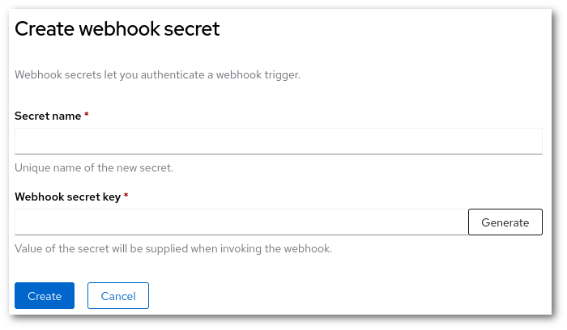
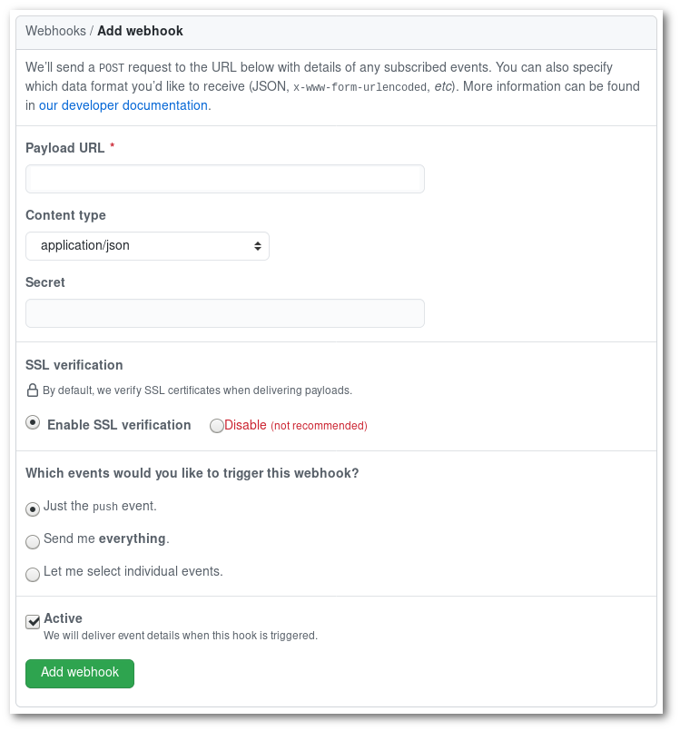

# Webhooks

Webhooks are URLs that allow triggering actions in a system. Rahti supports webhooks to trigger rebuilds. This means that each BuildConfig is listening to a particular URL that includes a secret (more about that later), and that when this URL is called, a build will be triggered. There are few types of formats supported: Generic, GitHub, GitLab and Bitbucket. This means that if the source code of the application is in Gitlab, the Gitlab URL type must be selected.

In this example we will use the GitHub type.

## Creating a secret

In the `Developer` menu, go to the **Secrets** page. Click in **Create -> Webhook secret**. Write any sensible name. And click in Generate. Write down the generated secret. And **Save**.

## Getting the URL

You need an already created `BuildConfig` object, or create a new one. In order to create a new BuildConfig, check out the [Creating an image](../rahti/images/creating.md) article.

Now you need to edit the build config (**Actions -> Edit BuildConfig**), and add a trigger. To do this, click in "Trigger", in the bottom of the edit page, in the "Advanced options" section. Then, click in "Add trigger". The new trigger must have a type, in our case it will be "GitHub". It also needs a secret, select the secret you created in the previous step.

When the `BuildConfig` is configured, you can get the URL via the webinterface. Using the `Developer` menu, go to the **Builds** page, and select the `BuildConfig`. In the `Webhooks` section, you will see "Copy URL with Secret". Click on it, and the URL will be in your clipboard.

## GitHub

Once you got the URL and the secret, go to <https://github.com>. There you should go to the repository where the code is, and in **Settings -> Webhooks**, click in "Add webhook".

You just need to fill up the "Payload URL" and the "Secret", and change the content type to `Application/json`.

