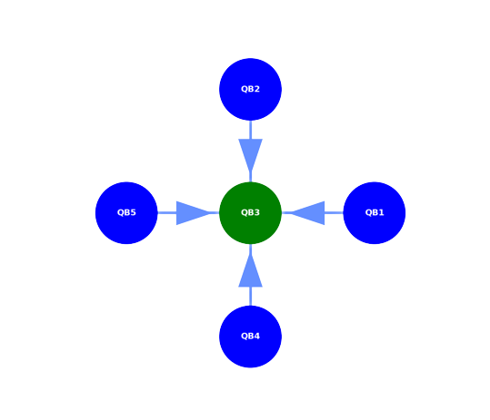

# Technical details about Helmi

## Architecture and Topology

Helmi is a 5 qubit Quantum Computer manufactured by IQM. The qubits are laid out in a start shaped topology, with the central qubit being Qubit 3 (QB2 as per indexing from 0) connected to the other 4 qubits. This means that any two qubit gate will work most efficiently between QB2 and any other qubit whereas 1 qubit gates can be mapped to any of the 4 surrounding qubits. 

<!-- Helmi's native gates  -->

## Further Reading

* [Specific instructions for the LUMI Helmi partition](../../accounts/helmi/)
* [Getting started with Helmi](../../support/tutorials/helmi_quick/)

<!-- ## Acessing Helmi via LUMI

The Helmi software stack provides some useful tools in mapping programs to this specific topology. [For more details see "Running on Helmi"](../running/running-on-helmi/).  

 -->

