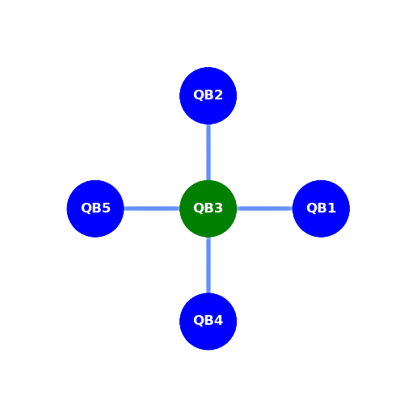

# Technical details about Helmi

## Architecture and Topology

Helmi is a 5 qubit Quantum Computer manufactured by IQM. The qubits are laid out in a start shaped topology, with the central qubit being Qubit 3 (QB2 as per indexing from 0) connected to the other 4 qubits. This means that any two qubit gate will work most efficiently between QB2 and any other qubit whereas 1 qubit gates can be mapped to any of the 4 surrounding qubits. 




The Helmi software stack provides some useful tools in mapping programs to this specific topology. [For more details see "Running on Helmi"](running/running-on-helmi/).  


## Getting Started

### Access to LUMI

Helmi is accessed through the LUMI login nodes as a LUMI project, therefore you will first need to apply for access to LUMI under MyCSC. 

* [How to create Finnish LUMI projects](../../accounts/how-to-create-new-project/#how-to-create-finnish-lumi-projects)

* [Specific instructions for the LUMI Helmi partition](../../accounts/helmi.md)


### Setting up SSH key pair

**You can only log in to LUMI using SSH keys**. There are no passwords. In order
for this to work, [you need to add your ssh keys in MyCSC portal](../connecting/#setting-up-your-ssh-keys-in-mycsc-portal).

#### Generate your SSH keys

After registration, you need to register a **public** key (**Note! Key must be RSA
4K bits or ed25519**). In order to do that
you need to generate an SSH key pair.

<!-- For comparison https://docs.csc.fi/computing/connecting/ 

But this does not contain as detailed information regarding connecting specifically to LUMI. E.g
- ssh-copy-id shouldn't be used for LUMI.


Better to have all correct information in 1 place than have the user go back and forth between this page and the connecting page. This is under the idea that we want to limit the user leaving docs.csc.fi as much as possible i.e try not to link to docs.lumi or "See here for how to connect" and links to docs.lumi

 -->

=== "From a terminal (all OS)"

    An SSH key pair can be generated in the Linux, macOS, Windows PowerShell and 
    MobaXterm terminal. It is important to create a long enough key length. For
    example, you can use the following command to generate a 4096 bits RSA key:

    ```bash
    ssh-keygen -t rsa -b 4096
    ```

    or for a ed25519 key:

    ```bash
    ssh-keygen -t ed25519
    ```

    You will be prompted for a file name and location where to save the
    key. Accept the defaults by pressing ++enter++. Alternatively, you can 
    choose a custom name and location. For example 
    `/home/username/.ssh/id_rsa_lumi`.

    Next, you will be asked for a passphrase. Please choose a secure
    passphrase. It should be at least 8 characters long and should contain
    numbers, letters and special characters. **Do not leave the passphrase 
    empty**.

    After that a SSH key pair is created. If you choose the name given as an
    example, you should have files named `id_rsa_lumi` and `id_rsa_lumi.pub` in
    your `.ssh` directory.

=== "With MobaXTerm or PuTTY (Windows)"

    An SSH key pair can be generated with the PuTTygen tool or with MobaXterm 
    (**Tools --> MobaKeyGen**). Both tools are identical.
    
    In order to generate your key pairs for LUMI, choose the option RSA and
    set the number of bits to 4096. The, press the *Generate* button.

    <figure>
      
    </figure>

    You will be requested to move the mouse in the Key area to generate some 
    entropy; do so until the green bar is completely filled.

    <figure>
      
    </figure>

    After that, enter a comment in the Key comment field and a strong
    passphrase. Please choose a secure passphrase. It should be at least 8 
    characters long and should contain numbers, letters and special characters.
    **Do not leave the passphrase empty**.

    <figure>
      
    </figure>

    The next step is to save your public and private key. Click on the *Save 
    public key* button and save it to the desired location (for example, with 
    `id_rsa_lumi.pub` as a name). Do the same with your private key by clicking
    on the *Save private key* button and save it to the desired location (for 
    example, with `id_rsa_lumi` as a name).

!!! warning "Note"
    The private key should never be shared with anyone, not even with
    LUMI staff. It should also be stored only in the local computer (public key
    can be safely stored in cloud services). Protect it with a good password! Otherwise, anyone with access to the file system can steal your SSH key.

### Upload your public key 

Now that you have generated your key pair, you need to set up your **public** key in your [**user profile**](https://my.csc.fi/). From there, the public key will be copied to LUMI with some delay according to the synchronization schedule.

To register your key with [MyCSC](https://my.csc.fi/), click on *My Profile* item of the menu on the left as shown in the figure below. Then scroll to the end and in the *SSH PUBLIC KEYS* panel click the *Modify* button. From here, click the *Add new* button and paste your new public key in the text area and click *Add*.

<figure>
	
	<figcaption>MyCSC profile information to add ssh public key.</figcaption>
</figure>

After registering the key, there can be a couple of hours delay until it is
synchronized. **You will receive your username via email once your account is 
created**.


## How to log in

Connecting to LUMI via the command line is possible from all major OS. Once you have generated your key pair and uplaoded your public key to MyCSC, you can connect with

```
ssh -i<path-to-private-key> <username>@lumi.csc.fi
```

where you have to replace `<path-to-private-key>` and `<username>` with the 
appropriate values. You should have received your user name via email. There may be a 10-15 minute delay before your account is created on LUMI, be patient. If after this delay you cannot connect, please contact [LUMI support](https://lumi-supercomputer.eu/user-support/need-help/account/).


You will be prompted for the passphrase of the SSH key 
which is the one you entered when you generated the key. When you connect for 
the first time, you will also be asked to check the host key fingerprint of the 
system and need to type `yes` in order to accept it. The fingerprint of the LUMI
login nodes are listed in the table below.

| Hash type | Fingerprint                                       |
|-----------|---------------------------------------------------|
| MD5       | `28:2a:38:71:b0:a6:6b:90:0e:1b:a1:9d:ca:ec:94:20` |
| SHA256    | `hY4mnRCYb8bRchTnVcFo7SqoHHHEsUh9Ym38F4sHN1Y`     |


### Add your key to the SSH Agent

It may be painful to enter the strong passphrase for every connection you make to LUMI. Therefore, to avoid the pain, you can use an SSH agent to remember the passphrase for you. 

The first step in to ensure the SSH agent is running. For that run the command

```
eval "$(ssh-agent -s)"
```

The second step is to add your private key to your agent with the command

```
ssh-add <path-to-private-key>
```

 you will then be asked for your passphrase and now, you should no longer have
 to enter your passphrase every time you connect to LUMI.

### Add LUMI to your SSH configuration

In the previous section, we have discussed how to add your key to the agent and 
thus avoid having to enter your password. You can also create an SSH 
configuration for LUMI on your machine that will act as a shortcut. This is 
achieved by editing the `.ssh/config` file and by adding the following lines

    Host lumi
    	HostName lumi.csc.fi
    	User <username>
    	IdentityFile <path-to-private-key>


Once you added this line to your SSH configuration file, you can connect using the following command `ssh lumi`.


<!-- ## Links -->

## Support channels

The main channel for support regarding Helmi is the [CSC Service Desk](../../support/contact/). 

For support requests concerning connecting to LUMI please [contact the LUMI user support team (LUST)](https://lumi-supercomputer.eu/user-support/need-help/).


