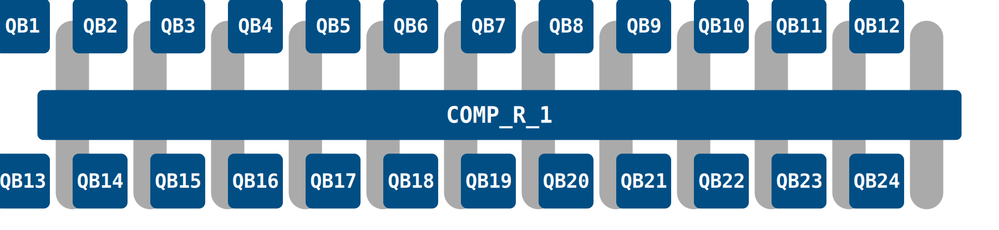

# EuroHPC VLQ

EuroHPC VLQ is this and that and so forth

Here is the layout map and basis gates etc etc iformation

Table of supported SDKs (qiskit, pulla)

## Accessing VLQ

### Configure the environment

Load these modules

Instructions for local use?

### Get your access token

How to get token with py4lexis and QProvider

### Get the backend

Get qiskit or pulla backend