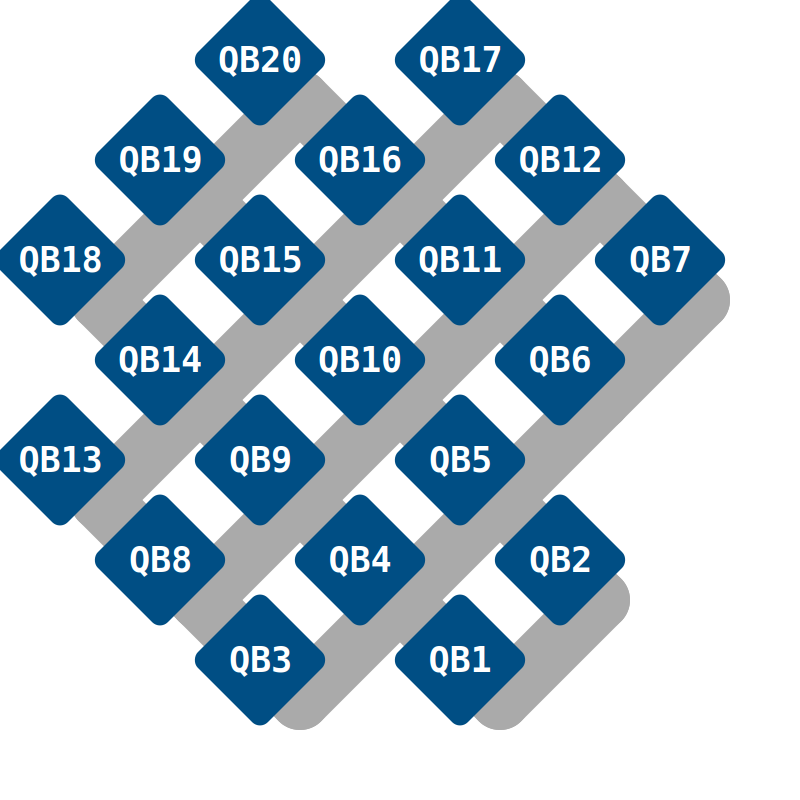

# Running your first quantum computing job on the Quantum computers through LUMI

If you've applied for a project, been accepted, setup your ssh keys and gained access to LUMI, then the next step is to run your first quantum computing job on a real quantum computer! This is a guide for exactly how to do that. The only thing you need to know is your project number! 

## Configuring the environment

The first step after you have logged into LUMI (via `ssh lumi` on your terminal) is to configure the environment. The base environment when first logging into LUMI does not provide the necessary tools to submit quantum jobs, therefore a quantum software stack has been created which sets up the correct python virtual environments and the correct environment variables. This is accessed through the LMOD system on LUMI using *modules*.

To use the quantum software stack you first need to load the Quantum module tree. 

```bash
module use /appl/local/quantum/modulefiles
```

Alternatively, you can achieve the same result by loading the Local-quantum module.

```bash
module load Local-quantum
```

You can then see the list of available *modules* with `module avail`. The quantum modules should be at the top! In this walkthrough Qiskit will be used, therefore the next step is to load the module into our current environment with

```bash
module load fiqci-vtt-qiskit
```

## Creating your first quantum program

The next step is to create your quantum circuit! Here a simple bell state will be created between two qubits, demonstrating entanglement between them! For this we will be using Qiskit but the steps are very similar for Cirq. It is good practice to work in your projects scratch directory, which you can navigate to with `cd /scratch/project_xxx`, inserting your project number.

!!! info "Tip!"
	
	You can quickly see your LUMI workspaces with
	`lumi-workspaces`

Let us first create our python file with `nano first_quantum_job.py`. Here we use `nano` but if you are comfortable you can also use `vim` or `emacs`. This will bring up the `nano` text editor, the useful commands are at the bottom, to save and exit CTRL-X + Y.

### Importing the libraries

First let's import the right python libraries

```python
import os
from qiskit import QuantumCircuit, QuantumRegister, transpile
from iqm.qiskit_iqm import IQMProvider
```

### Creating the circuit

The quantum circuit is created by defining a `QuantumRegister` which hold our qubits and classical bits respectively. As this circuit only requires 2 qubits we only create a `QuantumRegister` of size 2. The number of shots is also defined here. The number of shots is the number of times a quantum circuit is executed. We do this because quantum computers are probabilistic machines and by repeating the experiment many times we can get close to a deterministic result to be able to draw conclusions from. A good number of shots for your first quantum job is `shots = 1000`. Increasing the shots will increase the precision of your results. 

```python
shots = 1000  # Number of repetitions of the Quantum Circuit

qreg = QuantumRegister(2, "qB")
circuit = QuantumCircuit(qreg, name='Bell pair circuit')
```

Now we actually add some gates to the circuit. Here a Hadamard gate is added to the first qubit or the first qubit in the quantum register. Then a controlled-x gate is added with two arguments as it is a two qubit gate. 

```python
circuit.h(qreg[0])  # Hadamard gate on the first qubit in the Quantum Register
circuit.cx(qreg[1], qreg[0])  # Controlled-X gate between the second qubit and first qubit
circuit.measure_all()  # Measure all qubits in the Quantum Register.
```

Note that [`measure_all()`](https://qiskit.org/documentation/stubs/qiskit.circuit.QuantumCircuit.html#qiskit.circuit.QuantumCircuit.measure_all) creates its own [`ClassicalRegister`](https://qiskit.org/documentation/stubs/qiskit.circuit.ClassicalRegister.html)!

Now the circuit is created! If you wish you can see what your circuit looks like by adding a print statement `print(circuit.draw())` and quickly running the python script. 

## Setting the backend

First we need to set our provider and backend. The provider is the service which gives an interface to the quantum computer and the backend provides the tools necessary to submitting the quantum job. Note that he provider name for Aalto Q20 is `radiance20` and for VTT Q50 is it `q50`. The `Q20_CORTEX_URL` is the endpoint to reach Q20, while the `Q50_CORTEX_URL` is the endpoint to reach Q50. This environment variable is set automatically when loading any of the Quantum computing modules such as the `fiqci-vtt-qiskit` module. 

=== "Q20"

    ```python
    # Accessing Q20

    Q20_CORTEX_URL = os.getenv('Q20_CORTEX_URL')
    provider_q20 = IQMProvider(Q20_CORTEX_URL)
    backend_q20 = provider_q20.get_backend()
    ```

=== "Q50"

    ```python
    # Accessing Q50

    Q50_CORTEX_URL = os.getenv('Q50_CORTEX_URL')
    provider_q50 = IQMProvider(Q50_CORTEX_URL, quantum_computer="q50")
    backend_q50 = provider_q50.get_backend()
    ```

### Transpiling the circuit

This next step is where the quantum circuit you've just created is decomposed (transpiled) into its basis gates. These basis gates are the actual quantum gates on the quantum computer. The process of decomposition involves turning the above Hadamard and controlled-x gates into something that can be physically run on the quantum computer. For Q20 and Q50, the basis gates are the entangling gate controlled-z and the one-qubit phased-rx gate. In Qiskit these are defined in the backend and can be printed with `backend.operation_names`. For more on the specs see [Topology Overview](specs.md)

```python
circuit_decomposed = transpile(circuit, backend=backend)
```
You can also print your circuit like before with `print(circuit_decomposed.draw())` to see what it looks like! 

### *Optional* Qubit Mapping

This is an optional step but may be useful to extracting the best out of the quantum computer. This is a python dictionary which simply states which qubits in the Quantum register should be mapped to which *physical* qubit.

```python
qubit_mapping = {
                qreg[0]: 0,
                qreg[1]: 3,
            }
```

As an example, here we are mapping the first qubit in the quantum register to the first of Q20's qubits, QB1, located at the zeroth location due to Qiskit's use of zero-indexing. The second qubit is then mapped to QB4. The same process can be applied to other quantum computers e.g. Q50.

{ width=80% style="display: block; margin: 0 auto;" }


The two qubit Controlled-X gate we implemented in our circuit is currently on the second of our two qubits in the Quantum register, `qreg[1]`. Due to Q20's topology this needs to be mapped to QB4 on Q20. The 1 qubit Hadamard gate can be mapped to any of the qubits connected to QB4. These are QB1, QB3, QB5, QB9, here we choose QB1.


Note that this step is entirely optional. Using the `transpile` function automatically does the mapping based on the information stored in the backend. Inputting the qubit mapping manually simply gives more control to the user. 

To transpile a circuit using the specified qubit mapping you can do the following:

```python
circuit_decomposed = transpile(circuit, backend=backend, initial_layout=qubit_mapping)
```

### Submitting the job

Now we can run our quantum job!

```python
job = backend.run(circuit_decomposed, shots=shots)
```

### Viewing the status of your job

You can view the status of your job with 

```python
job.status()
```

### Results

Before submitting we need to ensure we can get some results! The quantum job will return what are called **counts**. Counts are the accumulation of results from the 1000 times the circuit is submitted to the QPU. Each time the circuit is submitted a binary *state* is returned, this is then added to the tally.  In this case as we are submitting a 2 qubit circuit there are 4 possible resulting states: `00, 11, 01, 10`.  The expected results should be that approximately 50% of the counts should be in state `00` and 50% in state `11`. The states of the qubits are thus entangled: if one of the qubits is measured to be in state |0>, the other one will immediately also collapse to the same state, and vice versa. As real quantum computers are not perfect, you will most likely also see that some measurements find the states |01> and |10>.

To print your results add:

```python
counts = job.result().get_counts()
print(counts)
```

You can also print the entirety of `job.result()` which will contain all the information about your jobs results. 

## Save your file

Once you've made your first quantum program remember to save! CTRL+X then Y to save your file. 

## Running the job through LUMI

To run your quantum programme on LUMI you will need to submit the job through the SLURM batch scheduler on LUMI. Accessing the quantum computers (Q20, Q50) is possible from any LUMI partition. In the same directory where you have saved your quantum program, you can submit the job to SLURM using:

=== "Q20"

    ```bash
    # Using Q20

    module use /appl/local/quantum/modulefiles
    module --ignore_cache load "fiqci-vtt-qiskit"
    export DEVICES=("radiance20")
    srun --account project_xxx -t 00:15:00 -c 1 -n 1 --partition q_fiqci bash -c "source $RUN_SETUP && python -u first_quantum_job.py"
    ```

=== "Q50"

    ```bash
    # Using Q50

    module use /appl/local/quantum/modulefiles
    module --ignore_cache load "fiqci-vtt-qiskit"
    export DEVICES=("Q50")
    srun --account project_xxx -t 00:15:00 -c 1 -n 1 --partition q_fiqci bash -c "source $RUN_SETUP && python -u first_quantum_job.py"
    ```

Remember to add your own project account!

This submits the job *interactively* meaning that the output will be printed straight to the terminal screen. If you wish you can also submit it using `sbatch` using this skeleton batch script. Using `nano` as before create the script `batch_script.sh`. 


=== "Q20"

    ```bash
    #!/bin/bash -l

    #SBATCH --job-name=quantumjob   # Job name
    #SBATCH --output=quantumjob.o%j # Name of stdout output file
    #SBATCH --error=quantumjob.e%j  # Name of stderr error file
    #SBATCH --partition=q_fiqci   # Partition (queue) name
    #SBATCH --ntasks=1              # One task (process)
    #SBATCH --mem-per-cpu=2G       # memory allocation
    #SBATCH --cpus-per-task=1     # Number of cores (threads)
    #SBATCH --time=00:05:00         # Run time (hh:mm:ss)
    #SBATCH --account=project_xxx  # Project for billing

    module use /appl/local/quantum/modulefiles
    module load fiqci-vtt-qiskit

    export DEVICES=("radiance20")

    source $RUN_SETUP

    python -u first_quantum_job.py
    ```

=== "Q50"

    ```bash
    #!/bin/bash -l

    #SBATCH --job-name=quantumjob   # Job name
    #SBATCH --output=quantumjob.o%j # Name of stdout output file
    #SBATCH --error=quantumjob.e%j  # Name of stderr error file
    #SBATCH --partition=q_fiqci   # Partition (queue) name
    #SBATCH --ntasks=1              # One task (process)
    #SBATCH --mem-per-cpu=2G       # memory allocation
    #SBATCH --cpus-per-task=1     # Number of cores (threads)
    #SBATCH --time=00:05:00         # Run time (hh:mm:ss)
    #SBATCH --account=project_xxx  # Project for billing

    module use /appl/local/quantum/modulefiles
    module load fiqci-vtt-qiskit

    export DEVICES=("Q50")

    source $RUN_SETUP

    python -u first_quantum_job.py
    ```

This can be submitted with `sbatch batch_script.sh` in the same directory as your python file. Jobs in the SLURM queue can be monitored through `squeue -u username` and after the job has completed your results can be found in the `quantumjob.oxxxxx` file. This can be printed to the terminal with `cat`. 
To run on Q20 or Q50, you will need to specify the devices that you require. Here `radiance20` represents Aalto Q20 and `Q50` represents VTT Q50.


## Congratulations!

Congratulations! You have just run your first job on a quantum computer. 

The full python script can be found below. 

=== "Q20"

    ```python
    import os

    from qiskit import QuantumCircuit, QuantumRegister, transpile
    from iqm.qiskit_iqm import IQMProvider

    shots = 1000

    qreg = QuantumRegister(2, "QB")
    circuit = QuantumCircuit(qreg, name='Bell pair circuit')

    circuit.h(qreg[0])
    circuit.cx(qreg[0], qreg[1])
    circuit.measure_all()

    # Uncomment if you wish to print the circuit
    # print(circuit.draw())

    Q20_CORTEX_URL = os.getenv('Q20_CORTEX_URL')

    provider_q20 = IQMProvider(Q20_CORTEX_URL)
    backend_q20 = provider_q20.get_backend()

    # Retrieving backend information
    # print(f'Native operations: {backend_q20.operation_names}')
    # print(f'Number of qubits: {backend_q20.num_qubits}')
    # print(f'Coupling map: {backend_q20.coupling_map}')

    transpiled_circuit = transpile(circuit, backend_q20)

    job = backend.run(transpiled_circuit, shots=shots)
    result = job.result()

    # You can retrieve the job at a later date with backend.retrieve_job(job_id)
    # Uncomment the following lines to get more information about your submitted job
    # print("Job ID: ", job.job_id())
	# print(result.circuits)
    # exp_result = result._get_experiment("circuit_name")
    # print("Calibration Set ID: ", exp_result.calibration_set_id)
    # print(result.parameters.qubit_mapping)
    # print(result.parameters.shots)

    counts = result.get_counts()
    print(counts)
    ```

=== "Q50"

    ```python
    import os

    from qiskit import QuantumCircuit, QuantumRegister, transpile
    from iqm.qiskit_iqm import IQMProvider

    shots = 1000

    qreg = QuantumRegister(2, "QB")
    circuit = QuantumCircuit(qreg, name='Bell pair circuit')

    circuit.h(qreg[0])
    circuit.cx(qreg[0], qreg[1])
    circuit.measure_all()

    # Uncomment if you wish to print the circuit
    # print(circuit.draw())

    Q50_CORTEX_URL = os.getenv('Q50_CORTEX_URL')

    provider_q50 = IQMProvider(Q50_CORTEX_URL, quantum_computer="q50")
    backend_q50 = provider_q50.get_backend()

    # Retrieving backend information
    # print(f'Native operations: {backend_q50.operation_names}')
    # print(f'Number of qubits: {backend_q50.num_qubits}')
    # print(f'Coupling map: {backend_q50.coupling_map}')

    transpiled_circuit = transpile(circuit, backend_q50)
    
    job = backend_q50.run(transpiled_circuit, shots=shots)
    result = job.result()

    # You can retrieve the job at a later date with backend.retrieve_job(job_id)
    # Uncomment the following lines to get more information about your submitted job
    # print("Job ID: ", job.job_id())
	# print(result.circuits)
    # exp_result = job.result()._get_experiment("circuit_name")
    # print("Calibration Set ID: ", result.parameters.calibration_set_id)
    # print(result.parameters.qubit_mapping)
    # print(result.parameters.shots)

    counts = result.get_counts()
    print(counts)
    ```
