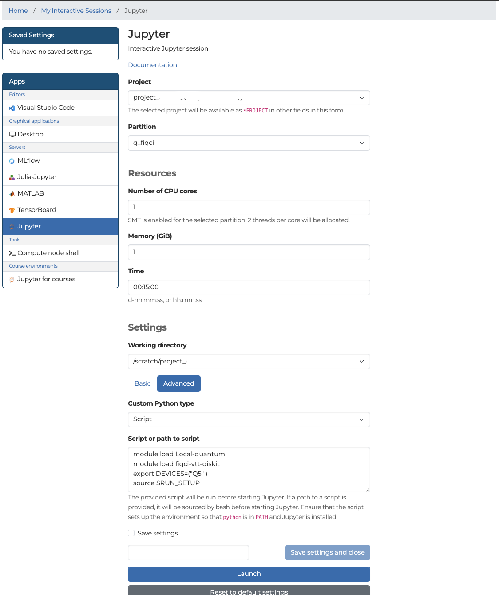

!!! warning "Q20 Service in MyCSC"
    There are currently some issues with the Q20 service for projects that have Q20 allocations. If you cannot find the Aalto-Q20 service or are otherwise experiencing issues please contact the CSC Service Desk at [servicedesk@csc.fi](mailto:servicedesk@csc.fi).

# Running on Q20 and Q50

Currently, Q20 and Q50 support job submissions using Qiskit or Cirq. These scripts must be submitted as standard Python files.

To run jobs on the quantum computers, follow these steps to set up the correct environment on LUMI:

!!! info "Device-specific values"
    The examples on this page use placeholders `<DEVICE_VALUE>`, `<QUANTUM_COMPUTER_ID>`, and `<CORTEX_URL>`. Replace them with the runtime identifiers for your target device, listed under "Runtime identifiers" on the [Aalto Q20](./devices/q20.md#runtime-identifiers) or [VTT Q50](./devices/q50.md#runtime-identifiers) page. For VLQ see the [VLQ instructions](./devices/vlq.md).

!!! info 
    Run these commands either in your batch script or within an interactive session started via `srun`

* Add the module path so the system can locate the available modules: `module use /appl/local/quantum/modulefiles` or `module load Local-quantum`

* Load the appropriate environment module depending on your framework:
    * For Qiskit: `module load fiqci-vtt-qiskit` 
    * For Cirq `module load fiqci-vtt-cirq`


The `fiqci-vtt-qiskit` and `fiqci-vtt-cirq` modules provide pre-configured Python environments for running jobs on the quantum computers.

### Creating your own Python environment

If you prefer a custom Python environment instead of the `fiqci-vtt-qiskit`/`fiqci-vtt-cirq` modules, you can build your own container using the [LUMI container wrapper tool](https://docs.lumi-supercomputer.eu/software/installing/container-wrapper/).

To use your custom container with the quantum computers, load the `fiqci-vtt-standard` module alongside it:

```bash
module use /appl/local/quantum/modulefiles
module load fiqci-vtt-standard
module load custom_python_module
```

Loading `fiqci-vtt-standard` gives your container access to `$RUN_SETUP`, the environment variable used throughout this page (e.g. `source $RUN_SETUP`) to configure the connection to the device.


### Supported software versions

The current supported software versions are:

| Software | LUMI_Module_name | Versions |
|----------|-------------|----------|
| IQM client | fiqci-vtt-qiskit/fiqci-vtt-cirq | ≥ 34.0.0, < 35.0.0 |


### Submitting a Job

Here is an example batch script to submit a quantum job. Replace `<DEVICE_VALUE>` with your device(s) identifier, [see the note above](#running-on-q20-and-q50).

```bash
#!/bin/bash

#SBATCH --job-name=quantumjob   # Job name
#SBATCH --account=project_<id>  # Project for billing (slurm_job_account)
#SBATCH --partition=standard   # Partition (queue) name
#SBATCH --ntasks=1              # One task (process)
#SBATCH --mem-per-cpu=2G       # memory allocation
#SBATCH --cpus-per-task=1     # Number of cores (threads)
#SBATCH --time=00:05:00         # Run time (hh:mm:ss)

module use /appl/local/quantum/modulefiles

# uncomment the correct line:
# module load fiqci-vtt-qiskit
# or
# module load fiqci-vtt-cirq
export DEVICES=("<DEVICE_VALUE>")
source $RUN_SETUP
python your_python_script.py
```

The batch script can then be submitted with `sbatch`. You can also submit interactive jobs through `srun`.

```bash
module use /appl/local/quantum/modulefiles
module --ignore_cache load "fiqci-vtt-qiskit"
export DEVICES=("<DEVICE_VALUE>")
srun --account project_xxx -t 00:15:00 -c 1 -n 1 --partition standard bash -c "source $RUN_SETUP && python your_python_script.py"
```

The `fiqci-vtt-*` module sets up the correct python environment to use Qiskit or Cirq with the quantum computers.

!!! info "Running on Q50"
    When submitting a job on Q50, the user's slurm_job_account (project on which the job is run) is mapped to the project_id and this information is transferred to VTT for accounting purposes.


### Loading Modules and Setting Backend

=== "Qiskit"

    To load the Qiskit module use `module load fiqci-vtt-qiskit`.

    In Qiskit python scripts you will need to include the following. Replace `<CORTEX_URL>` and `<QUANTUM_COMPUTER_ID>` with your device's identifiers, [see the note above](#running-on-q20-and-q50).

    ```python
    import os

    from qiskit import QuantumCircuit, transpile
    from iqm.qiskit_iqm import IQMProvider

    DEVICE_CORTEX_URL = os.getenv('<CORTEX_URL>')

    provider = IQMProvider(DEVICE_CORTEX_URL, quantum_computer="<QUANTUM_COMPUTER_ID>")
    backend = provider.get_backend()
    ```

=== "Cirq"

    To load the Cirq module use `module load fiqci-vtt-cirq`. Replace `<CORTEX_URL>` and `<QUANTUM_COMPUTER_ID>` with your device's identifiers, [see the note above](#running-on-q20-and-q50).

    ```python
    import os

    import cirq
    from iqm.cirq_iqm.iqm_sampler import IQMSampler

    DEVICE_CORTEX_URL = os.getenv('<CORTEX_URL>')

    sampler = IQMSampler(DEVICE_CORTEX_URL, quantum_computer="<QUANTUM_COMPUTER_ID>")
    ```

See the section on [running your first quantum job](first-quantum-job.md#congratulations) for a complete python script.

!!! warning "Save your Job ID!"
    Note that there is currently no method to list previous Job ID's therefore it is recommended to always print your Job ID after job submission and save it somewhere!
    The same applies for the calibration set id.


## Additional examples

Additional examples for e.g. querying additional job metadata can be found from [here](https://github.com/FiQCI/fiqci-examples).


## Simulated test runs

As quantum resources can be scarce, it is recommended that you prepare the codes and algorithms you intend to run on the quantum computers in advance. To help with this process, [`qiskit-on-iqm` provides a fake noise model backend](https://docs.meetiqm.com/iqm-client/user_guide_qiskit.html#noisy-simulation-of-quantum-circuit-execution). You can run the fake noise model backend locally on your laptop for simulation and testing.

A set of Qiskit and Cirq examples and scripts for guidance in using the quantum computers are also available. [You can find these here](https://github.com/FiQCI/fiqci-examples){ target=_blank }.


## Calibration data

Calibration data (or quality metrics set) may be necessary for publishing work produced on Q20/Q50. It also gives an idea as to the current status of the quantum computers. Calibration data is available on the [FiQCI page](https://fiqci.fi/status). Additionally, in `fiqci-examples` there is a helper script to manually fetch the calibration data. The script can be found [here](https://github.com/FiQCI/fiqci-examples/blob/main/scripts/get_calibration_data.py). This file can be added to your own python scripts and will return data in json format. Note that querying the latest calibration data may give an incomplete or outdated set of figures. Therefore calibration set IDs should be saved along with Job IDs.

??? default "Brief description of the figures which are given when querying (Click to show)"

    | Figure | Key | Description |  |  |
    |---|---|---|---|---|
    | T1 Time (s) | `t1_time` | The T1 time is called the longitudinal relaxation rate and describes how quickly the excited state of the qubit returns to its ground state. |  |  |
    | T2 Time (s) | `t2_time` | The T2 time is called the transverse relaxation rate and describes loss of coherence of a superposition state. |  |  |
    | T2 Echo Time (s) |  `t2_echo_time` | The T2 echo time describes the loss of coherence of the superposition state of the qubit. It is more precise than the T2 Time as it is less susceptible to low-frequency noise. |  |  |
    | Readout fidelity | `measure_fidelity_ssro_fidelity` | This describes the fidelity when performing single shot readouts of the qubit state. Single-shot readout prepares 50% of the qubit states in the excited and 50% in the ground state. |  |  |
    | Single shot readout 01 error | `measure_fidelity_ssro_error_0_to_1` | The error in assigning an excited state ('1') when the state is in the ground state ('0'). |  |  |
    | Single shot readout 10 error | `measure_fidelity_ssro_error_1_to_0` | The error in assigning a ground state ('0') when the state is in the excited state ('1'). |  |  |
    | Single qubit gate fidelity | `prx_rb_fidelity` | This is calculated from Randomized Benchmarking and describes the average gate fidelity when a random sequence of single qubit Clifford gates is applied. |  |  |
    | Fidelity 2QB Cliffords averaged |  `clifford_rb_fidelity` | This is calculated from Randomized Benchmarking, showing the average Clifford gate fidelity. |  |  |
    | CZ gate fidelity |  `cz_irb_fidelity` | The controlled-z gate fidelity calculated through interleaved randomized benchmarking, where the controlled-z gate is interleaved. |  |  |
    | MCM fidelity |  `measure_ssro_fidelity` | The fidelity of a mid-circuit measurement. |  |  |
    | QNDness fidelity | `measure_qndness_fidelity` | Quantum non-demolition (QND) fidelity describes the probability that the qubits quantum state is preserved after a mid-circuit measurement operation.  |  |  |
    | QNDness 0 | `measure_qndness_qndness_0` | The QND fidelity for the ground state. It represents the probability that a qubit initially in the ground state remains in the ground state after being measured. |  |  |
    | QNDness 1 | `measure_qndness_qndness_1` | The QND fidelity for the first excited state. It represents the probability that a qubit initially in the first excited state remains in the first excited state after being measured. |  |  |
    | QNDness repeatability | `measure_qndness_repeatability` | Repeatability of mid-circuit measurement outcomes. The probability that the second measurement outcome agrees with the first. This metric includes readout discrimination errors meaning that if the readout fidelity is poor, repeatability will be low even if the measurement is non-destructive. |  |  |


For further information on the calibration data contact [fiqci-feedback@postit.csc.fi](mailto:fiqci-feedback@postit.csc.fi) or the [CSC Service Desk](../../support/contact.md), reachable at [servicedesk@csc.fi](mailto:servicedesk@csc.fi).


## Quantum job on Lumi-web interface

The [LUMI Web interface](https://docs.lumi-supercomputer.eu/runjobs/webui/){ target=_blank } allows users to run quantum jobs on  Q20 and Q50 through a web interface. Details for logging in to the LUMI web interface can be read through the [LUMI Documentation page](https://docs.lumi-supercomputer.eu/firststeps/loggingin-webui/){ target=_blank }.

After successfully authenticating, you should now have access to your dashboard. Click on the Jupyter app, select your project and the partition. If you have an active reservation, you can use it by selecting it under reservation.

It is recommended to use the `Advanced settings`. Under the `Custom init` option select Text, and under the `Script to start` textbox enter the following script to configure the environment to use the quantum software stack. Replace `<DEVICE_VALUE>` with your device's identifier, [see the note above](#running-on-q20-and-q50).

=== "Qiskit"

    ```bash
    module use /appl/local/quantum/modulefiles
    module load fiqci-vtt-qiskit
    export DEVICES=("<DEVICE_VALUE>")
    source $RUN_SETUP
    ```

=== "Cirq"

    ```bash
    module use /appl/local/quantum/modulefiles
    module load fiqci-vtt-cirq
    export DEVICES=("<DEVICE_VALUE>")
    source $RUN_SETUP
    ```



Click on launch to start your Jupyter session. This will launch Jupyter using the command python -m Jupyter lab. If you are using Q20/Q50 during a quantum computing course, a custom environment may have been created specifically for the course. In this case, you can access the quantum computers using the Jupyter-for-courses app.


## Viewing QPU Usage On LUMI and MyCSC

You can now view QPU usage from the [MyCSC dashboard](https://my.csc.fi/dashboard){ target=_blank }. For viewing QPU usage from the terminal on LUMI use the method below. The `lumi-allocations` command does not properly display QPU usage.

To view QPU usage, on your terminal, use the `project-qpu-allocations` script. This script will display your current QPU allocation and usage details for all your projects.

```bash
/appl/local/quantum/resource-checker/project-qpu-allocations

# To view for a specific project, run
/appl/local/quantum/resource-checker/project-qpu-allocations <project_xxxx>
```

## Further Reading
* [Lumi web interface](https://docs.lumi-supercomputer.eu/runjobs/webui/)
* [Jupyter on Lumi web interface](https://docs.lumi-supercomputer.eu/runjobs/webui/jupyter/)
