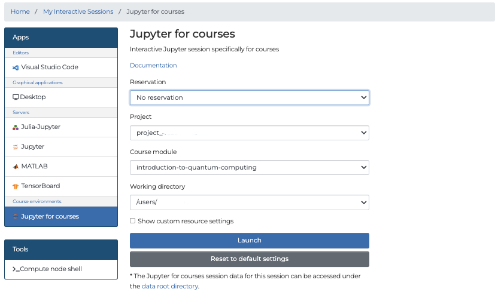

# Running on Helmi and Q50

!!! info "Give feedback!"
    **All feedback is highly appreciated**, Please share your experience
    by emailing us at [fiqci-feedback@postit.csc.fi](mailto:fiqci-feedback@postit.csc.fi).

## Running Jobs

To submit jobs to the quantum computers (Helmi and Q50), use the q_fiqci queue by adding --partition=q_fiqci in your batch script.

Currently, Helmi and Q50 support job submissions using Qiskit or Cirq. These scripts must be submitted as standard Python files.

To run jobs on the quantum computers, follow these steps to set up the correct environment on LUMI:

**Note:** Run these commands either in your batch script or within an interactive session started via `srun`.

* Add the module path so the system can locate the available modules: `module use /appl/local/quantum/modulefiles`

* Load the appropriate environment module depending on your framework:
    * For Qiskit: `module load fiqci-vtt-qiskit` 
    * For Cirq `module load fiqci-vtt-cirq`


The `fiqci-vtt-qiskit` and `fiqci-vtt-cirq` modules provide pre-configured Python environments for running jobs on the quantum computers.
If you need to install additional Python packages, you can do so using: 

`python -m pip install --user package`.


!!! info "Creating your own python environment"
    If you prefer to use a custom Python environment,
    we recommend using the [container wrapper tool](https://docs.lumi-supercomputer.eu/software/installing/container-wrapper/) to create and manage your environment.

The current supported software versions are:

| Software | Module_name | Versions |
|----------|-------------|----------|
| Cirq on IQM | cirq_iqm |  >= 16.0, <= 17.0  |
| Qiskit on IQM | qiskit_iqm |  >= 17.3, <= 18.0 |
| IQM client | iqm_client | >= 22.3, <= 23.0 |

Here is an example batch script to submit a quantum job

=== "Helmi"
    ```bash
    #!/bin/bash

    #SBATCH --job-name=quantumjob   # Job name
    #SBATCH --account=project_<id>  # Project for billing (slurm_job_account)
    #SBATCH --partition=q_fiqci   # Partition (queue) name
    #SBATCH --ntasks=1              # One task (process)
    #SBATCH --mem-per-cpu=2G       # memory allocation
    #SBATCH --cpus-per-task=1     # Number of cores (threads)
    #SBATCH --time=00:05:00         # Run time (hh:mm:ss)

    module use /appl/local/quantum/modulefiles

    # uncomment the correct line:
    # module load fiqci-vtt-qiskit
    # or
    # module load fiqci-vtt-cirq
    export DEVICES=("Q5")
    source $RUN_SETUP
    python your_python_script.py
    ```

=== "Q50"
    ```bash
    #!/bin/bash

    #SBATCH --job-name=quantumjob   # Job name
    #SBATCH --account=project_<id>  # Project for billing (slurm_job_account)
    #SBATCH --partition=q_fiqci   # Partition (queue) name
    #SBATCH --ntasks=1              # One task (process)
    #SBATCH --mem-per-cpu=2G       # memory allocation
    #SBATCH --cpus-per-task=1     # Number of cores (threads)
    #SBATCH --time=00:05:00         # Run time (hh:mm:ss)

    module use /appl/local/quantum/modulefiles

    # uncomment the correct line:
    # module load fiqci-vtt-qiskit
    # or
    # module load fiqci-vtt-cirq
    export DEVICES=("Q50")
    source $RUN_SETUP
    python your_python_script.py
    ```

=== "Multiple backends"
    ```bash
    #!/bin/bash

    #SBATCH --job-name=quantumjob   # Job name
    #SBATCH --account=project_<id>  # Project for billing (slurm_job_account)
    #SBATCH --partition=q_fiqci   # Partition (queue) name
    #SBATCH --ntasks=1              # One task (process)
    #SBATCH --mem-per-cpu=2G       # memory allocation
    #SBATCH --cpus-per-task=1     # Number of cores (threads)
    #SBATCH --time=00:05:00         # Run time (hh:mm:ss)

    module use /appl/local/quantum/modulefiles

    ## uncomment the correct line:
    # module load fiqci-vtt-qiskit
    # or
    # module load fiqci-vtt-cirq
    export DEVICES=("Q5" "Q50")
    source $RUN_SETUP
    python your_python_script.py
    ```

The batch script can then be submitted with `sbatch`. You can also submit interactive jobs through `srun`.

=== "Helmi"
    ```bash
    module use /appl/local/quantum/modulefiles
    module --ignore_cache load "fiqci-vtt-qiskit"
    export DEVICES=("Q5")
    srun --account project_xxx -t 00:15:00 -c 1 -n 1 --partition q_fiqci bash -c "source $RUN_SETUP && python your_python_script.py"
    ```

=== "Q50"
    ```bash
    module use /appl/local/quantum/modulefiles
    module --ignore_cache load "fiqci-vtt-qiskit"
    export DEVICES=("Q50")
    srun --account project_xxx -t 00:15:00 -c 1 -n 1 --partition q_fiqci bash -c "source $RUN_SETUP && python your_python_script.py"
    ```

=== "Multiple backends"
    ```bash
    module use /appl/local/quantum/modulefiles
    module --ignore_cache load "fiqci-vtt-qiskit"
    export DEVICES=("Q5" "Q50")
    srun --account project_xxx -t 00:15:00 -c 1 -n 1 --partition q_fiqci bash -c "source $RUN_SETUP && python your_python_script.py"
    ```

The `fiqci-vtt-*` module sets up the correct python environment to use Qiskit or Cirq in conjunction with the quantum computers.

!!! info "Running on physical Quantum computers"
    When submitting a job on Helmi or Q50, the user's slurm_job_account (project on which the job is run) is mapped to the project_id and this information is transferred to VTT for accounting purposes.
    To run on Q50, please specify the device using `export DEVICES=("Q50") `command

### Qiskit

To load the Qiskit module use `module load fiqci-vtt-qiskit`.

In Qiskit python scripts you will need to include the following:

=== "Helmi"
    ```python
    import os

    from qiskit import QuantumCircuit, transpile
    from iqm.qiskit_iqm import IQMProvider

    DEVICE_CORTEX_URL = os.getenv('HELMI_CORTEX_URL')

    provider = IQMProvider(DEVICE_CORTEX_URL)
    backend = provider.get_backend()

    shots = 1000  # Set the number of shots you wish to run with

    # Create your quantum circuit.
    # Here is an example
    circuit = QuantumCircuit(2, 2)
    circuit.h(0)
    circuit.cx(0, 1)
    circuit.measure_all()

    print(circuit.draw(output='text'))

    transpiled_circuit = transpile(circuit, backend)
    job = backend.run(transpiled_circuit, shots=shots)
    counts = job.result().get_counts()
    print(counts)
    ```

=== "Q50"
    ```python
    import os

    from qiskit import QuantumCircuit, transpile
    from iqm.qiskit_iqm import IQMProvider

    DEVICE_CORTEX_URL = os.getenv('Q50_CORTEX_URL')

    provider = IQMProvider(DEVICE_CORTEX_URL)
    backend = provider.get_backend()

    shots = 1000  # Set the number of shots you wish to run with

    # Create your quantum circuit.
    # Here is an example
    circuit = QuantumCircuit(2, 2)
    circuit.h(0)
    circuit.cx(0, 1)
    circuit.measure_all()

    print(circuit.draw(output='text'))

    transpiled_circuit = transpile(circuit, backend)
    job = backend.run(transpiled_circuit, shots=shots)
    counts = job.result().get_counts()
    print(counts)
    ```

=== "Multiple backends"
    ```python
    import os

    from qiskit import QuantumCircuit, transpile
    from iqm.qiskit_iqm import IQMProvider

    HELMI_DEVICE_CORTEX_URL = os.getenv('HELMI_CORTEX_URL')
    Q50_DEVICE_CORTEX_URL = os.getenv('Q50_CORTEX_URL')

    provider_helmi = IQMProvider(HELMI_DEVICE_CORTEX_URL)
    provider_q50 = IQMProvider(Q50_DEVICE_CORTEX_URL)
    
    backend_helmi = provider_helmi.get_backend()
    backend_q50 = provider_q50.get_backend()

    shots = 1000  # Set the number of shots you wish to run with

    # Create your quantum circuit.
    # Here is an example
    circuit = QuantumCircuit(2, 2)
    circuit.h(0)
    circuit.cx(0, 1)
    circuit.measure_all()

    print(circuit.draw(output='text'))

    transpiled_circuit_helmi = transpile(circuit, backend_helmi)
    transpiled_circuit_q50= transpile(circuit, backend_q50)
    
    job_helmi = backend_helmi.run(transpiled_circuit_helmi, shots=shots)
    job_q50 = backend.run(transpiled_circuit_q50, shots=shots)

    counts_helmi = job_helmi.result().get_counts()
    counts_q50 = job_q50.result().get_counts()
    
    print(f"Counts Helmi {counts_helmi}")
    print(f"Counts Q50 {counts_q50}")
    ```

### Cirq

To load the Cirq module use `module load fiqci-vtt-cirq`.

=== "Helmi"
    ```python
    import os

    import cirq
    from iqm.cirq_iqm import Adonis
    from iqm.cirq_iqm.iqm_sampler import IQMSampler

    adonis = Adonis()

    DEVICE_CORTEX_URL = os.getenv('HELMI_CORTEX_URL')

    sampler = IQMSampler(DEVICE_CORTEX_URL)

    shots = 1000

    # Create your quantum circuit
    # Here is an example
    q1, q2 = cirq.NamedQubit('QB1'), cirq.NamedQubit('QB2')
    circuit = cirq.Circuit()
    circuit.append(cirq.H(q1))
    circuit.append(cirq.CNOT(q1, q2))
    circuit.append(cirq.measure(q1, q2, key='m'))
    print(circuit)

    decomposed_circuit = adonis.decompose_circuit(circuit)
    routed_circuit, initial_mapping, final_mapping = adonis.route_circuit(decomposed_circuit)

    # Optionally print mapping
    # print(routed_circuit)
    # print(initial_mapping)
    # print(final_mapping)

    result = sampler.run(routed_circuit, repetitions=shots)
    print(result.measurements['m'])
    ```

=== "Q50"
    ```python
    import os

    import cirq
    from iqm.cirq_iqm import Adonis
    from iqm.cirq_iqm.iqm_sampler import IQMSampler

    adonis = Adonis()

    DEVICE_CORTEX_URL = os.getenv('Q50_CORTEX_URL')

    sampler = IQMSampler(DEVICE_CORTEX_URL)

    shots = 1000

    # Create your quantum circuit
    # Here is an example
    q1, q2 = cirq.NamedQubit('QB1'), cirq.NamedQubit('QB2')
    circuit = cirq.Circuit()
    circuit.append(cirq.H(q1))
    circuit.append(cirq.CNOT(q1, q2))
    circuit.append(cirq.measure(q1, q2, key='m'))
    print(circuit)

    decomposed_circuit = adonis.decompose_circuit(circuit)
    routed_circuit, initial_mapping, final_mapping = adonis.route_circuit(decomposed_circuit)

    # Optionally print mapping
    # print(routed_circuit)
    # print(initial_mapping)
    # print(final_mapping)

    result = sampler.run(routed_circuit, repetitions=shots)
    print(result.measurements['m'])
    ```

=== "Multiple backends"
    ```python
    import os

    import cirq
    from iqm.cirq_iqm import Adonis
    from iqm.cirq_iqm.iqm_sampler import IQMSampler

    adonis = Adonis()

    HELMI_DEVICE_CORTEX_URL = os.getenv('HELMI_CORTEX_URL')
    Q50_DEVICE_CORTEX_URL = os.getenv('Q50_CORTEX_URL')

    sampler_helmi = IQMSampler(HELMI_DEVICE_CORTEX_URL)
    sampler_q50 = IQMSampler(Q50_DEVICE_CORTEX_URL)

    shots = 1000

    # Create your quantum circuit
    # Here is an example
    q1, q2 = cirq.NamedQubit('QB1'), cirq.NamedQubit('QB2')
    circuit = cirq.Circuit()
    circuit.append(cirq.H(q1))
    circuit.append(cirq.CNOT(q1, q2))
    circuit.append(cirq.measure(q1, q2, key='m'))
    print(circuit)

    decomposed_circuit = adonis.decompose_circuit(circuit)
    routed_circuit, initial_mapping, final_mapping = adonis.route_circuit(decomposed_circuit)

    # Optionally print mapping
    # print(routed_circuit)
    # print(initial_mapping)
    # print(final_mapping)

    result_helmi = sampler_helmi.run(routed_circuit, repetitions=shots)
    result_q50 = sampler_q50.run(routed_circuit, repetitions=shots)

    print(f"Results Helmi: {result_helmi.measurements['m']}")
    print(f"Results Q50: {result_q50.measurements['m']}")
    ```

## Additional examples

An additional [set of examples can be found here](https://github.com/FiQCI/helmi-examples).
The examples emphasize the difference between running on a simulator and a real physical quantum computer,
and how to construct your circuits for optimum results on the quantum computers. The repository also contains some useful
scripts for submitting jobs.


## Simulated test runs

As quantum resources can be scarce, it is recommended that you prepare the codes and algorithms you intend to run on the quantum computers in advance. To help with this process, [`qiskit-on-iqm` provides a fake noise model backend](https://iqm-finland.github.io/qiskit-on-iqm/user_guide.html#noisy-simulation-of-quantum-circuit-execution). You can run the fake noise model backend locally on your laptop for simulation and testing.

A set of Qiskit and Cirq examples and scripts for guidance in using the `q_fiqci` partition are also available. [You can find these here](https://github.com/FiQCI/fiqci-examples).

## Job Metadata

Additional metadata about your job can be queried directly with Qiskit. For example:

=== "Helmi"
    ```python

    DEVICE_CORTEX_URL = os.getenv('HELMI_CORTEX_URL')
    provider = IQMProvider(DEVICE_CORTEX_URL)
    backend = provider.get_backend()

    #Retrieving backend information
    print(f'Native operations: {backend.operation_names}')
    print(f'Number of qubits: {backend.num_qubits}')
    print(f'Coupling map: {backend.coupling_map}')

    transpiled_circuit = transpile(circuit, backend)
    job = backend.run(transpiled_circuit, shots=shots)
    result = job.result()
    exp_result = result._get_experiment(circuit)

    print("Job ID: ", job.job_id())  # Retrieving the submitted job id
    print(result.request.circuits)  # Retrieving the circuit request sent
    print("Calibration Set ID: ", exp_result.calibration_set_id)  # Retrieving the current calibration set id.
    print(result.request.qubit_mapping)  # Retrieving the qubit mapping
    print(result.request.shots)  # Retrieving the number of requested shots.

    #retrieve a job using the job_id from a previous session
    #old_job = backend.retrieve_job(job_id)
    ```

=== "Q50"
    ```python

    DEVICE_CORTEX_URL = os.getenv('Q50_CORTEX_URL')
    provider = IQMProvider(DEVICE_CORTEX_URL)
    backend = provider.get_backend()

    #Retrieving backend information
    print(f'Native operations: {backend.operation_names}')
    print(f'Number of qubits: {backend.num_qubits}')
    print(f'Coupling map: {backend.coupling_map}')

    transpiled_circuit = transpile(circuit, backend)
    job = backend.run(transpiled_circuit, shots=shots)
    result = job.result()
    exp_result = result._get_experiment(circuit)

    print("Job ID: ", job.job_id())  # Retrieving the submitted job id
    print(result.request.circuits)  # Retrieving the circuit request sent
    print("Calibration Set ID: ", exp_result.calibration_set_id)  # Retrieving the current calibration set id.
    print(result.request.qubit_mapping)  # Retrieving the qubit mapping
    print(result.request.shots)  # Retrieving the number of requested shots.

    #retrieve a job using the job_id from a previous session
    #old_job = backend.retrieve_job(job_id)
    ```

!!! info "Save your Job ID!"
    Note that there is currently no method to list previous Job ID's therefore it is recommended to always print your Job ID after job submission and save it somewhere!
    The same applies for the calibration set id.


## Figures of Merit

The figures of merit (or quality metrics set) may be necessary for publishing work produced on Helmi/Q50. It also gives an idea as to the current status of the quantum computers. In `fiqci-examples` there is a helper script to get the calibration data including the figures of merit. The script can be found [here](https://github.com/FiQCI/fiqci-examples/blob/main/scripts/get_calibration_data.py). This file can be added to your own python scripts and will return data in json format. Note that querying the latest calibration data may give an incomplete or outdated set of figures. Therefore calibration set IDs should be saved along with Job IDs.

Here is a brief description of the figures which are given when querying:

| Figure                          | Description                                                                                                                                                                           |     |     |
| ------------------------------- | ------------------------------------------------------------------------------------------------------------------------------------------------------------------------------------- | --- | --- |
| T1 Time (s)                     | The T1 time is called the longitudinal relaxation rate and describes how quickly the excited state of the qubit returns to its ground state.                                          |     |     |
| T2 Time (s)                     | The T2 time is called the transverse relaxation rate and describes loss of coherence of a superposition state.                                                                        |     |     |
| T2 Echo Time (s)                | The T2 echo time describes the loss of coherence of the superposition state of the qubit. It is more precise than the T2 Time as it is less susceptible to low-frequency noise.       |     |     |
| Single shot readout fidelity    | This describes the fidelity when performing single shot readouts of the qubit state. Single-shot readout prepares 50% of the qubit states in the excited and 50% in the ground state. |     |     |
| Single shot readout 01 error    | The error in assigning an excited state ('1') when the state is in the ground state ('0').                                                                                            |     |     |
| Single shot readout 10 error    | The error in assigning a ground state ('0') when the state is in the excited state ('1').                                                                                             |     |     |
| Fidelity 1QB gates averaged     | This is calculated from Randomized Benchmarking and describes the average gate fidelity when a random sequence of single qubit Clifford gates is applied.                             |     |     |
| Fidelity 2QB Cliffords averaged | This is calculated from Randomized Benchmarking, showing the average Clifford gate fidelity.                                                                                          |     |     |
| CZ gate fidelity                | The controlled-z gate fidelity calculated through interleaved randomized benchmarking, where the controlled-z gate is interleaved.                                                    |     |     |


For further information on the figures of merit contact the [CSC Service Desk](../../support/contact.md), reachable at [servicedesk@csc.fi](mailto:servicedesk@csc.fi).


## Using Helmi/Q50 on Lumi-web interface

The [LUMI Web interface](https://docs.lumi-supercomputer.eu/runjobs/webui/) allows users to run quantum jobs on  Helmi and Q50 through a web interface. Details for logging in to the LUMI web interface can be read through the [LUMI Documentation page](https://docs.lumi-supercomputer.eu/firststeps/loggingin-webui/).

### Accessing Helmi/Q50

After successfully authenticating, you should now have access to your dashboard. Click on the Jupyter app, select your project and the partition as q_fiqci. If you have an active reservation, you can use it by selecting it under reservation.

It is recommended to use the `Advanced settings`. Under the `Custom init` option select Text, and under the `Script to start` textbox enter the following script to configure the environment to use the quantum software stack.

#### "Qiskit"
=== "Helmi"
    ```bash
    module use /appl/local/quantum/modulefiles
    module load fiqci-vtt-qiskit
    export DEVICES=("Q5")
    source $RUN_SETUP
    ```

=== "Q50"
    ```bash
    module use /appl/local/quantum/modulefiles
    module load fiqci-vtt-qiskit
    export DEVICES=("Q50")
    source $RUN_SETUP
    ```

=== "Multiple backends"
    ```bash
    module use /appl/local/quantum/modulefiles
    module load fiqci-vtt-qiskit
    export DEVICES=("Q5", "Q50")
    source $RUN_SETUP
    ```

#### "Cirq"
=== "Helmi"
    ```bash
    module use /appl/local/quantum/modulefiles
    module load fiqci-vtt-cirq
    export DEVICES=("Q5")
    source $RUN_SETUP
    ```

=== "Q50"
    ```bash
    module use /appl/local/quantum/modulefiles
    module load fiqci-vtt-cirq
    export DEVICES=("Q50")
    source $RUN_SETUP
    ```

=== "Multiple backends"
    ```bash
    module use /appl/local/quantum/modulefiles
    module load fiqci-vtt-cirq
    export DEVICES=("Q5", "Q50")
    source $RUN_SETUP
    ```


Click on launch to start your Jupyter session. This will launch Jupyter using the command python -m Jupyter lab. If you are using Helmi/Q50 during a quantum computing course, a custom environment may have been created specifically for the course. In this case, you can access the quantum computers using the Jupyter-for-courses app.




## Further Reading
* [Lumi web interface](https://docs.lumi-supercomputer.eu/runjobs/webui/)
* [Jupyter on Lumi web interface](https://docs.lumi-supercomputer.eu/runjobs/webui/jupyter/)
* [Using the quantum computers Lumi web interface](https://fiqci.fi/_posts/2024-08-23-Lumi_web_introduction/)
