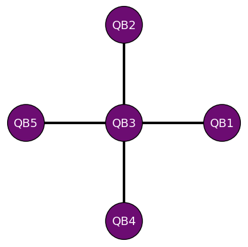
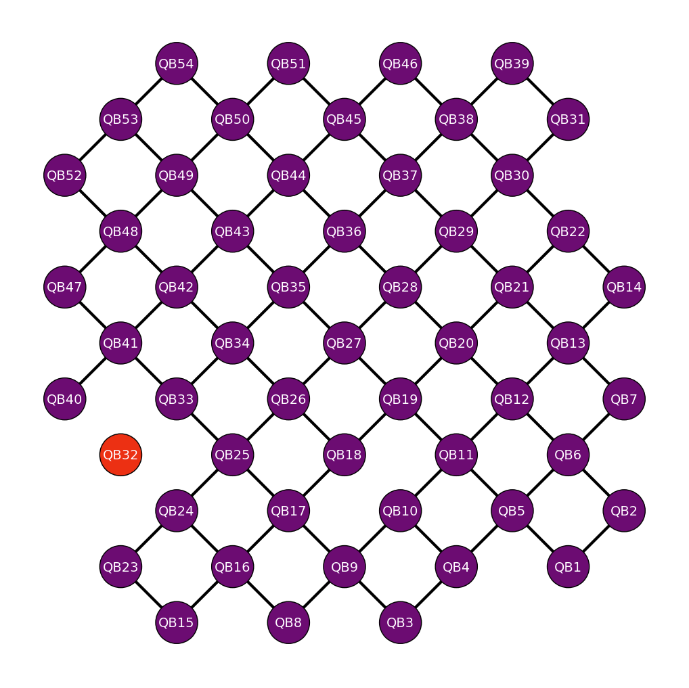

# Tekniset yksityiskohdat { #technical-details }

## Arkkitehtuuri ja topologia { #architecture-and-topology }

### Helmi (VTT Q5) { #helmi-vtt-q5 }
Helmi on VTT:n ja IQM:n yhdessä kehittämä 5-kubitin kvanttitietokone, joka käyttää suprajohtavia kubitteja. 
Kubittien topologia on tähtimäinen: keskimmäinen kubitti on kubitti 3 (QB3), joka on kytketty muihin neljään kubittiin. 
Tämä tarkoittaa, että mikä tahansa kaksikubittiportti toimii QB3:n ja minkä tahansa muun kubitin välillä, 
ja yksikubittiportit voidaan kohdistaa mille tahansa kubitille. 

<center></center>


#### Natiiviportit { #native-gates }

Helmin natiiviportteja ovat kaksikubittinen controlled-z-portti sekä yksikubittinen phased rx -portti.

### VTT Q50 { #vtt-q50 }
VTT Q50 on VTT:n ja IQM:n yhdessä kehittämä 53-kubitin kvanttitietokone, joka käyttää suprajohtavia kubitteja. 
Kubittien topologia on neliöruudukko (Square lattice): kaksiulotteinen hilaverkko, jossa kukin kubitti vuorovaikuttaa suoraan lähimpien naapuriensa kanssa. Laitteessa on yksi viallinen viritettävä kytkin kubittien QB18 ja QB10 välillä.


<center></center>


### Natiiviportit { #native-gates }
Q50:n natiiviportit ovat phased x-rotaatioportti (prx) ja controlled-z-portti (cz)


### Topologian ja porttien määrittely Qiskitissa ja Cirqissa { #defining-topology-and-gates-in-qiskit-and-cirq }

Topologia, tuetut käskyt ja taustajärjestelmäkohtaiset metatiedot voidaan kysyä suoraan [Qiskit on IQM](https://iqm-finland.github.io/qiskit-on-iqm/)‑ tai [Cirq on IQM](https://iqm-finland.github.io/cirq-on-iqm/)‑kirjastoilla. Esimerkiksi:

```python
# Qiskit
from iqm.qiskit_iqm import IQMProvider
provider = IQMProvider(iqm_server_url)
backend = provider.get_backend()
print(f'Native operations of the backend: {backend.operation_names}')
print(f'Coupling map of the backend: {backend.coupling_map}')
```

```python
# Cirq
from iqm.cirq_iqm import Adonis
adonis = Adonis()
print(adonis.metadata.qubit_set)
print(adonis.metadata.gateset)
print(adonis.metadata.nx_graph)
```


## Lisälukemista { #further-reading }

* [fiqci-osion erityisohjeet](fiqci-partition.md)
* [Qiskit-sovitin IQM-laitteille](https://iqm-finland.github.io/qiskit-on-iqm/)
* [Cirq-sovitin IQM-laitteille](https://iqm-finland.github.io/cirq-on-iqm/)