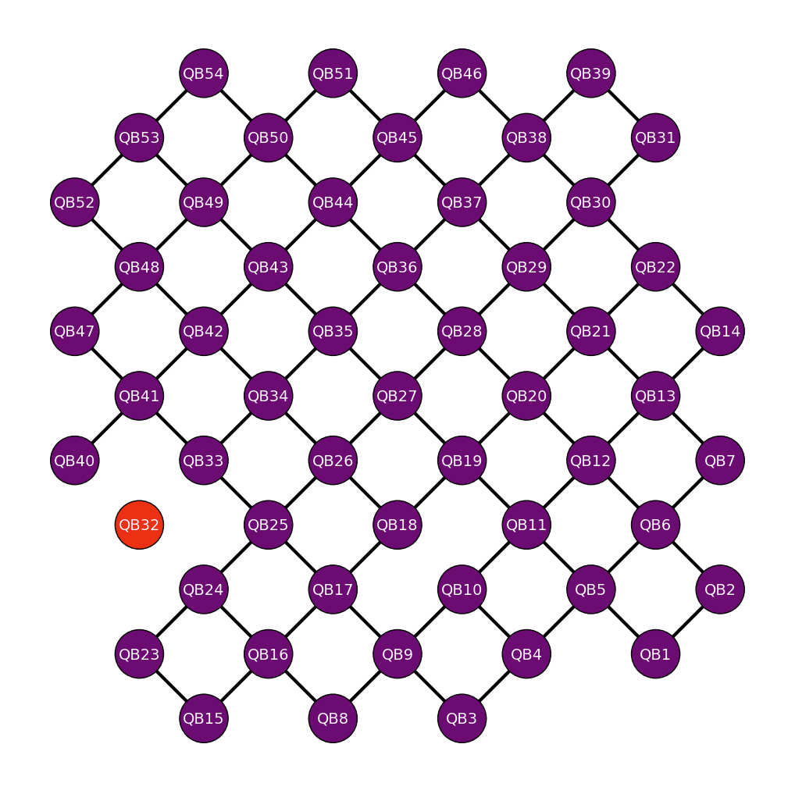

# Technical details

## Architecture and Topology

### Aalto Q20
Aalto Q20 is a superconducting IQM quantum computer operated by Aalto University. Q20 contains 20 qubits in a **aquare latttice** topology where qubits are connected to their nearest neighbours in a 2D grid. Q20 has two broken couplers. The coupler between qubits 16 and 17 and the coupler between qubuts 9 and 14.<>

<center></center>


#### Native Gates

Q20's native are are the two-qubit controlled-z gate and the one-qubit phased rx gate.

### VTT Q50
VTT Q50 is a 53-qubit quantum computer co-developed by VTT and IQM using superconducting qubits. 
The qubits are arranged in a **Square lattice** topology, a 2D grid where each qubit interacts directly with its nearest neighbors. The device has one broken tunable coupler between qubits QB18 and QB10.


<center></center>


### Native Gates
Q50's native gates are the Phased x-rotation gate (prx) and controlled-z gate (cz)


### Defining topology and gates in Qiskit and Cirq

The topology, supported instructions and backend specific metadata can be queried directly with [Qiskit on IQM](https://docs.meetiqm.com/iqm-client/user_guide_qiskit) or [Cirq on IQM](https://docs.meetiqm.com/iqm-client/user_guide_cirq). For example:

```python
# Qiskit
from iqm.qiskit_iqm import IQMProvider
provider = IQMProvider(iqm_server_url, quantum_computer="q50")
backend = provider.get_backend()
print(f'Native operations of the backend: {backend.operation_names}')
print(f'Coupling map of the backend: {backend.coupling_map}')
```

```python
# Cirq
from iqm.cirq_iqm import Adonis
adonis = Adonis()
print(adonis.metadata.qubit_set)
print(adonis.metadata.gateset)
print(adonis.metadata.nx_graph)
```


## Further Reading

* [Specific instructions for the fiqci partition](fiqci-partition.md)
* [Qiskit adapter for IQM devices](https://docs.meetiqm.com/iqm-client/user_guide_qiskit)
* [Cirq adapter for IQM devices](https://docs.meetiqm.com/iqm-client/user_guide_cirq)


