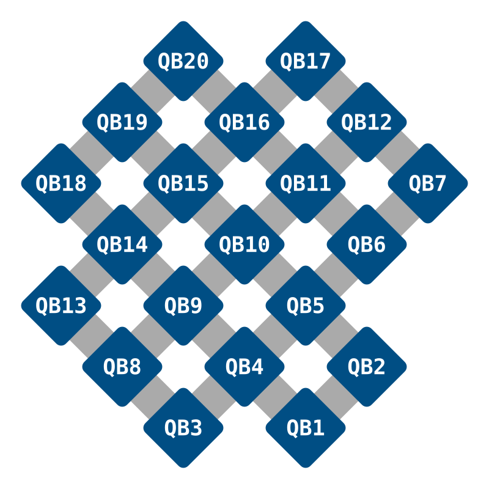
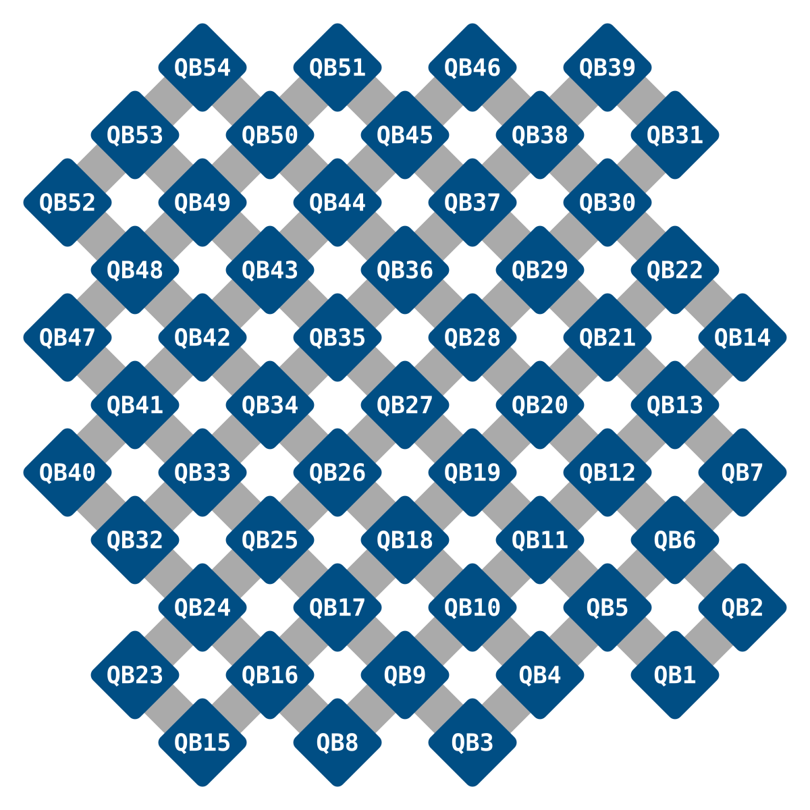
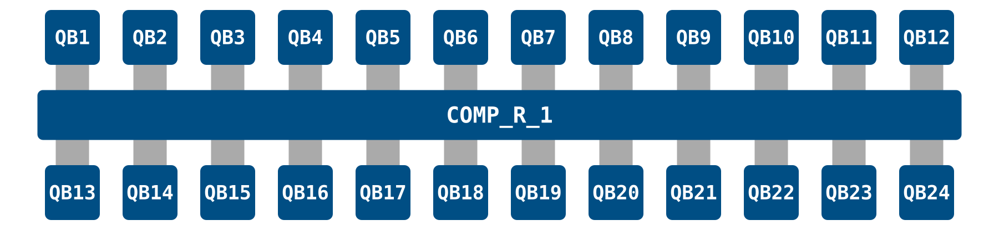

!!! warning "Q20 Service in MyCSC"
    There are currently some issues with the Q20 service for projects that have Q20 allocations. If you cannot find the Aalto-Q20 service or are otherwise experiencing issues please contact the CSC Service Desk at [servicedesk@csc.fi](mailto:servicedesk@csc.fi).

# Technical details

## Architecture and Topology

### Aalto Q20
Aalto Q20 is a superconducting IQM quantum computer operated by Aalto University. Q20 contains 20 qubits in a **aquare latttice** topology where qubits are connected to their nearest neighbours in a 2D grid. Q20 has two broken couplers. The coupler between qubits 16 and 17 and the coupler between qubuts 9 and 14.

{ width=80% style="display: block; margin: 0 auto;" }


#### Native Gates

Q20's native are are the two-qubit controlled-z gate and the one-qubit phased rx gate.

### VTT Q50
VTT Q50 is a 53-qubit quantum computer co-developed by VTT and IQM using superconducting qubits. 
The qubits are arranged in a **Square lattice** topology, a 2D grid where each qubit interacts directly with its nearest neighbors. The device has one broken tunable coupler between qubits QB18 and QB10.


{ width=80% style="display: block; margin: 0 auto;" }

#### Native Gates
Q50's native gates are the Phased x-rotation gate (prx) and controlled-z gate (cz)

### LUMI-Q VLQ

LUMI-Q VLQ is a 24-qubit IQM superconducting quantum computer operated by IT4Innovations. VLQ's qubits are arranged in a star topology where all qubits are coupled to a single computational resonator giving the device eefectively a "one-to-all" connectivity. For more info on VLQ see [IT4I documentation](https://docs.it4i.cz/en/docs/clusters/vlq/introduction).

{ width=80% style="display: block; margin: 0 auto;" }


### Defining topology and gates in Qiskit and Cirq

The topology, supported instructions and backend specific metadata can be queried directly with [Qiskit on IQM](https://docs.meetiqm.com/iqm-client/user_guide_qiskit) or [Cirq on IQM](https://docs.meetiqm.com/iqm-client/user_guide_cirq). For example:

```python
# Qiskit
print(f'Native operations of the backend: {backend.operation_names}')
print(f'Coupling map of the backend: {backend.coupling_map}')
```

```python
# Cirq
print(backend.metadata.qubit_set)
print(backend.metadata.gateset)
print(backend.metadata.nx_graph)
```

For instruction on accessing the quantum computer backends see the [Running quantum jobs page](running-quantum-jobs.md).


## Further Reading

* [Running quantum jobs](running-quantum-jobs.md)
* [Qiskit adapter for IQM devices](https://docs.meetiqm.com/iqm-client/user_guide_qiskit)
* [Cirq adapter for IQM devices](https://docs.meetiqm.com/iqm-client/user_guide_cirq)


