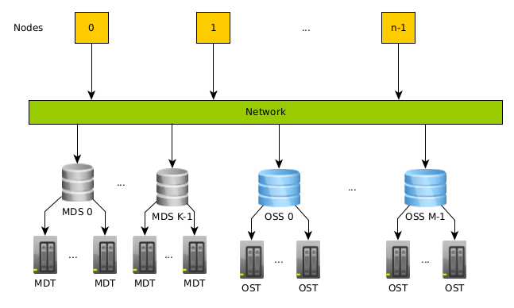

# Lustre filesystem

Both systems Puhti and Mahti have Lustre, a parallel distributed file system, with some differences in their configuration between the systems.


## Lustre Terminology

The Lustre file system is constituted by a set of I/O servers called Object Storage Servers (OSSs) and disks called Object Storage Targets (OSTs). The metadata operations of a file are controlled by Metadata Servers (MDSs) and stored on Metadata Targets (MDTs). Basically, the servers handle the RPC requests in order to access the files and metadata; the clients do not access storage directly. Each OSS/MDS exports multiple OST/MDT to improve the I/O parallelism

* Object Storage Servers (OSSs): They handle RPC requests from the clients in order to access the storage. Moreover, they manage a set of OSTs; each OSS has more than one OST to improve the I/O parallelism.
* Object Storage Targets (OSTs): Usually, an OST consists of a block of storage devices under RAID configuration. The data are stored in one or more objects, and each object is stored on a separate OST. 
* The Metadata Server (MDS): A server that tracks the locations for all the data so it can decide which OSS and OST will be used. For example, once a file is opened, the MDS is not involved anymore.
* The Metadata Target (MDT): The storage contains information about such as the data, filenames, permissions, directories. Each file on MDT includes a layout such as the OST number, object identifier.



*Lustre file system view*

Hint: When a user opens/closes a file many times in a loop during the execution of an application, then the workload on MDT increases. When many users do a similar approach, then the metadata could be slow and influence many users, even to be slow editing a file from a login node. Be cautious when you develop your application.

## File striping and alignment

In order to gain from the Lustre performance, your data should be distributed across many OSTs. The distribution across many OSTs is called file striping. During file striping, a file is split in chunks of bytes and are located on different OSTs, so that the read/write operations to perform faster. The default stripe size is 1 MB on our Lustre. As we use the network during file striping, depending on the workload of OSSs and OSTs, the performance is not always as expected. It is important that each process accesses different stripe of a file during parallel I/O, this can be achieved through stripe alignment. This is the procedure where a process access the file at offsets of the stripe boundaries. Moreover, an MPI process is better to access as few OSTs/OSSs as possible to avoid network contention. When the stripes are aligned, then they can be uniform distributed on each OST. 


*Lustre file striping and alignment*

If in the above example, we had a file of 5 MB, then the OST 0 would have an extra 1 MB of data. If the processes are not aligned, then a process could have to access more than one OST and cause network contention issues. 

### Example set stripe equal to 4

```
mkdir experiments
lfs setstripe -c 4 experiments
```

Hint 1: In case you want all the files of a folder to have a new striping, change the striping to an empty folder. The files that are already located in a folder will not change their striping. 

Hint 2: If your application reads/writes only small files, do not increase the striping.


## Differences between Puhti and Mahti systems


It is known from our guide that both Puhti and Mahti have the storage areas Puhti [home](./../disk.md#home-directory), [project](./../disk.md#projappl-directory) and [scratch](./../disk.md#scratch-directory). However, the Lustre configuration, is not the same between them. 

|  Name       | Puhti  |        | Mahti  |        |
|-------------|--------|--------|--------|--------|
|**Storage area** | **# OSTs** | **# MDTs** | **# OSTs** | **# MDTs** |
| home        |  24    |   4    |    8    |   1    | 
| projappl    |  24    |   4    |    8    |   1    |
| scratch     |  24    |   4    |   24    |   2    |


|             |Mahti   |        |
|-------------|--------|--------|
|**Storage area** | **# OSTs** | **# MDTs** |
| home        |   8    |   1    |   
| projappl    |   8    |   1    |
| scratch     |  24    |   2    |


One main difference is that for Mahti there are separate MDTs between `scratch`, `home`, and `project`, thus the metadata performance does not interfere from the different filesystems. Moreover, the `scratch` on Mahti can have better performance than the other storage areas if your application and the data size is big enough because of more OSTs and MDTs. On Puhti, all the OSTs and MDTs are shared across the storage areas, thus the performance should be similar between them.

The peak performance for Mahti when it was one signle filesystem and not as it is now configured, it was around to ~100 GB/s for read or write and using 64 compute nodes. This performance is under dedicated access to the system, handling one file per process, not for single shared file. The performance for Puhti is around two times less than Mahti.


##Performance

The peak I/O performance for Mahti is around to 100 GB/sec for write and 115 GB/sec for read. However, this performance was achieved on dedicated system with 64 compute nodes, which means around to 1.5 GB/sec per compute node. If more nodes are used or many jobs do significant I/O, then you will not achieve 1.5 GB/sec, including also that maybe the I/O pattern of an application is not efficient. The corresponding performance for Puhti is half of Mahti. 


## Best practices 

* If possible, avoid using `ls -l` as the information on ownership and permission metadata is stored on MDTs, the file size metadata is available from OSTs. Use `ls` instead if you do not need the extra information.

* Avoid saving a large number of files in a single directory, better to split in more directories.

* If possible, avoid accessing a large number of small files on Lustre.

* If an application opens a file for reading, then open the file in read mode only.


* Increase striping count for parallel access, especially on large files:
    * The striping factor should be a factor of the number of used processes performing parallel I/O
    * A rule of thumb is to use as striping the square root of the file size in GB. If the file is 90 GB, the square root is 9.5, so use at least 9 OSTs.
    * If you use, for example, 16 MPI processes for parallel I/O, the number of the used OSTs should be less or equal to 16.

* There is no need to stripe in a case of one file per MPI process 

* How to increase the stripping of a file or a directory to 16:

```
lfs setstripe -c 16 filename
```

* If the file is already created with a specific stripe, you can not change its stripe. Then copy the older file to the new one. Also, if you copy a file under a new striped folder, the file will get the new stripe. If you move a file under a folder, its stripe will not change.


* How to check the stripping of a file or a directory

```
lfs getstripe filename

path/filename
lmm_stripe_count:  24
lmm_stripe_size:   1048576
lmm_pattern:       raid0
lmm_layout_gen:    0
lmm_stripe_offset: 22
	obdidx		 objid		 objid		 group
	    22	       7561377	     0x7360a1	             0
	     8	       7557109	     0x734ff5	             0
	     4	       7561274	     0x73603a	             0
...
	    19	       7561455	     0x7360ef	             0
	    15	       7556931	     0x734f43	             0

```

In the above example, the file is using the 24 OSTs of Mahti and the stripe size is 1 MB. 

## MPI I/O Aggregators

* During a collective I/O operation, the buffers on the aggregated nodes are buffered through MPI, then these nodes write the data to the I/O servers.

* Example 8 MPI processes, 4 MPI processes per computing node, collective I/O, all the processes write on the same file. 


*MPI I/O Aggregators example*

By default, for collective I/O, the OpenMPI on Mahti defines 1 MPI I/O aggregator per compute node. This means that in our example above, only 2 MPI processes do the actual I/O. They gather the data from the rest of the processes (phase 1), and in the second phase they send the data to the storage. The usage of the default MPI aggregators could be enough, but in many cases, it is not.


## File Per Process

Some applications create one file per MPI process. Although this sounds easy, it is not necessarily efficient. If you use a lot of processes per compute node then you will create contention starting from the network on the compute nodes and the time to conclude the I/O operations except that can get a long time, that will interfere with other network operations, maybe also they will never finish because of scheduler time out operations etc. However, there can be cases that they are efficient but always be careful and think about scalability, as this approach is not scalable.


*File Per Process*

## ROMIO Hints

* Hints for Collective Buffering (Two-Phase I/O) and more focus on Lustre

| Hint                | Description                                                                                                      |
|---------------------|------------------------------------------------------------------------------------------------------------------|
|cb_buffer_size       | The buffer size, in bytes, of the intermediate buffer used in two-phase collective I/O                           |
|romio_cb_read        | Collective read operations during collective buffering, values: enable, disable, automatic                       |
|romio_cb_write       | Collective write operations during collective buffering, values: enable, disable, automatic                      |
|romio_no_indep_rw    | Controls if no independent read/write is enabled or not, values: enable, disable, automatic                      |
|cb_config_list       | Defines how many MPI I/O aggregators can be used per node, values: *:X where X aggregators per each compute node |
|cb_nodes             | The maximum number of aggregators to be used                                                                     |

* How can I change the MPI I/O hints?

Create a text file with the required commands and declare inside your submission script:

```
export ROMIO_HINTS=/path/file
```

Replace the `path` and `file`

* How can I increase the number of the MPI I/O aggregators per node?

    * Create or edit a text file with the content:

```
cb_config_list *:2
``` 
  This will activate 2 MPI processes per each compute node of your job to operate as MPI I/O aggregator.

* Change hints in the code of an application (code example):


```
...
call MPI_Info_create(info,ierror)
call MPI_Info_set(info,'romio_cb_write','enable',ierror)
...
call MPI_File_open(comm,filename,amode,info,fh,ierror)
...
```

* In some cases, it is better to activate some hints than let the heuristics to decide with the automatic option

* How to see the used hints and their values?

    * Declare in your submission script:

```
export ROMIO_PRINT_HINTS=1
```

* Then in your output, if and only if there is collective I/O, you will see the hints, for example:

```
key = cb_buffer_size            value = 33554432
key = romio_cb_read             value = enable
key = romio_cb_write            value = enable
key = cb_nodes                  value = 64
key = romio_no_indep_rw         value = false
key = romio_cb_pfr              value = disable
...
```
This is useful in order to be sure that your declarations were really used.

## Benchmark

For testing purposes we use the [NAS BTIO](https://github.com/wkliao/BTIO) benchmark with support to PnetCDF to test the I/O performance on 16  compute nodes of Mahti.

* We create an input file with:

```
w                  # IO mode:    w for write, r for read
2                  # IO method:  0 for MPI collective I/O, 1 for MPI_independent I/O, 2 for PnetCDF blocking I/O, 3 for PnetCDF nonblocking I/O
5                  # number of time steps
2048 1024 256          # grid_points(1), grid_points(2), grid_points(3)
/scratch/project_2002078/markoman/BTIO/output
```

* This means that we do write operations with blocking PnetCDF, 5 time steps, and totally almost half-billion grid points, and the output file is almost 105 GB.

* We use 256 processes, 16 per compute node

* Executing with default settings, from the output of the benchmark:

```
I/O bandwidth    :    1292.96 MiB/s
```

### Striping

* We know that the Lustre striping is 1 MB, thus we declare in a file called `romio`:

```
striping_unit 1048576
```

and we declare:

```
export ROMIO_HINTS=/path/romio
```

* We execute again the benchmark and we have the following:

```
I/O bandwidth    :    2939.85 MiB/s
```

The performance is improved 2.27 times.


### MPI I/O Aggregators

* By default with the current MPI version, uses 1 MPI I/O aggregator, so we increase to two MPI I/O aggregators per compute node 

* Add to the romio file the command:

```
cb_config_list *:2 
```

* This means two MPI I/O aggregators per compute node. We execute the benchmark and we have:

```
I/O bandwidth    :    3699.31 MiB/s 
```

* The performance is improved totally 2.86 times

### Increasing the number of OSTs

* If we use 2 OSTs without any ROMIO Hint the performance is 3500 MiB/s which is less than the optimized 1 OST.

* We use 2 OSTs with this romio file:

```
striping_unit 1048576
romio_cb_write enable
romio_no_indep_rw true
romio_ds_write disable
```

* Then the performance is increased to 4667 MiB/s, an increase of 33%. In this case, increasing the number of the aggregators, does not improve the performance.

* Overall, the ROMIO Hints depend on the application and the used hardware, the optimum parameters are not necessarily the same across various applications.

### Non-Blocking I/O

* We create an input file for non-blocking PnetCDF with:

```
w                  # IO mode:    w for write, r for read
3                  # IO method:  0 for MPI collective I/O, 1 for MPI_independent I/O, 2 for PnetCDF blocking I/O, 3 for PnetCDF nonblocking I/O
5                  # number of time steps
2048 1024 256          # grid_points(1), grid_points(2), grid_points(3)
/scratch/project_2002078/markoman/BTIO/output
```

* With default parameters the performance is 1820 MiB/s for 1 OST, which is quite low for 16 compute nodes.

* Moreover, we declare the romio file:

```
striping_unit 1048576
cb_config_list *:4
romio_ds_write disable
```

* The achieved performance is 4565 MiB/s, this is 2.5 times improvement.

* If we use 2 OSTs with the same romio file, the performance is 9520 MiB/s which is more than twice than 1 OST and more than twice than blocking I/O. With the default parameters, the achieved performance would be 7772 MiB/s, so the hints boost the performance by 22.5%.


## Conclusion

* Use non-blocking I/O for more efficient I/O

* Do not try to reinvent the wheel use well-known I/O libraries with your application. First, verify that your I/O causes issues or it takes significant time from your total execution.

* Then, try to use I/O libraries such as [PNetCDF](https://parallel-netcdf.github.io/), [HDF5](https://www.hdfgroup.org/), [ADIOS](https://csmd.ornl.gov/software/adios2).

