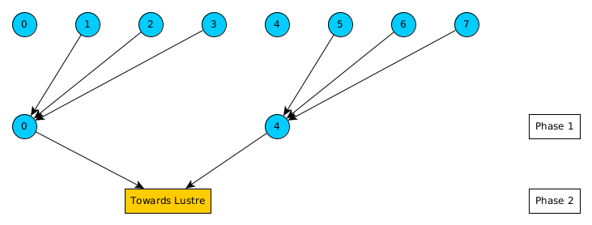
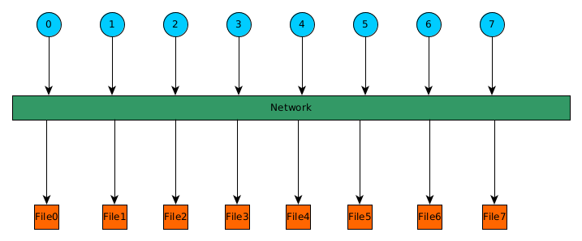

# How to achieve better performance on Lustre

In this section, we discuss more technical details about Lustre performance and we provide examples to achieve higher performance.

## MPI I/O Aggregators

* During a collective I/O operation, the buffers on the aggregated nodes are buffered through MPI, then these nodes write the data to the I/O servers.

* Example 8 MPI processes, 4 MPI processes per computing node, collective I/O, all the processes write on the same file. 



*MPI I/O Aggregators example*

By default, for collective I/O, the OpenMPI on Mahti defines 1 MPI I/O aggregator per compute node. This means that in our example above, only 2 MPI processes do the actual I/O. They gather the data from the rest of the processes (phase 1), and in the second phase they send the data to the storage. The usage of the default MPI aggregators could be enough, but in many cases, it is not.


## File Per Process

Some applications create one file per MPI process. Although this sounds easy, it is not necessarily efficient. If you use a lot of processes per compute node then you will create contention starting from the network on the compute nodes and the time to conclude the I/O operations except that can get a long time, that will interfere with other network operations, maybe also they will never finish because of scheduler time out operations etc. However, there can be cases that they are efficient but always be careful and think about scalability, as this approach is not scalable.



*File Per Process*

## ROMIO Hints

* Hints for Collective Buffering (Two-Phase I/O) and more focus on Lustre

| Hint                | Description                                                                                                      |
|---------------------|------------------------------------------------------------------------------------------------------------------|
|cb_buffer_size       | The buffer size, in bytes, of the intermediate buffer used in two-phase collective I/O                           |
|romio_cb_read        | Collective read operations during collective buffering, values: enable, disable, automatic                       |
|romio_cb_write       | Collective write operations during collective buffering, values: enable, disable, automatic                      |
|romio_no_indep_rw    | Controls if no independent read/write is enabled or not, values: enable, disable, automatic                      |
|cb_config_list       | Defines how many MPI I/O aggregators can be used per node, values: *:X where X aggregators per each compute node |
|cb_nodes             | The maximum number of aggregators to be used                                                                     |

* How can I change the MPI I/O hints?

Create a text file with the required commands and declare inside your submission script:

```
export ROMIO_HINTS=/path/file
```

Replace the `path` and `file`

* How can I increase the number of the MPI I/O aggregators per node?

    * Create or edit a text file with the content:

```
cb_config_list *:2
``` 
  This will activate 2 MPI processes per each compute node of your job to operate as MPI I/O aggregator.

* Change hints in the code of an application (code example):


```
...
call MPI_Info_create(info,ierror)
call MPI_Info_set(info,'romio_cb_write','enable',ierror)
...
call MPI_File_open(comm,filename,amode,info,fh,ierror)
...
```

* In some cases, it is better to activate some hints than let the heuristics to decide with the automatic option

* How to see the used hints and their values?

    * Declare in your submission script:

```
export ROMIO_PRINT_HINTS=1
```

* Then in your output, if and only if there is collective I/O, you will see the hints, for example:

```
key = cb_buffer_size            value = 33554432
key = romio_cb_read             value = enable
key = romio_cb_write            value = enable
key = cb_nodes                  value = 64
key = romio_no_indep_rw         value = false
key = romio_cb_pfr              value = disable
...
```
This is useful in order to be sure that your declarations were really used.

## Benchmark - NAS BTIO

### Non-Blocking I/O

For testing purposes we use the [NAS BTIO](https://github.com/wkliao/BTIO) benchmark with support to PnetCDF to test the I/O performance on 16  compute nodes of Mahti.

* We create an input file with:

```
w                  # IO mode:    w for write, r for read
2                  # IO method:  0 for MPI collective I/O, 1 for MPI_independent I/O, 2 for PnetCDF blocking I/O, 3 for PnetCDF nonblocking I/O
5                  # number of time steps
2048 1024 256          # grid_points(1), grid_points(2), grid_points(3)
/scratch/project_2002078/markoman/BTIO/output
```

* This means that we do write operations with blocking PnetCDF, 5 time steps, and totally almost half-billion grid points, and the output file is almost 105 GB.

* We use 256 processes, 16 per compute node

* Executing with default settings, from the output of the benchmark:

```
I/O bandwidth    :    1292.96 MiB/s
```

#### Striping

* We know that the Lustre striping is 1 MB, thus we declare in a file called `romio`:

```
striping_unit 1048576
```

and we declare:

```
export ROMIO_HINTS=/path/romio
```

* We execute again the benchmark and we have the following:

```
I/O bandwidth    :    2939.85 MiB/s
```

The performance is improved 2.27 times.


#### MPI I/O Aggregators

* By default with the current MPI version, uses 1 MPI I/O aggregator, so we increase to two MPI I/O aggregators per compute node 

* Add to the romio file the command:

```
cb_config_list *:2 
```

* This means two MPI I/O aggregators per compute node. We execute the benchmark and we have:

```
I/O bandwidth    :    3699.31 MiB/s 
```

* The performance is improved totally 2.86 times

#### Increasing the number of OSTs

* If we use 2 OSTs without any ROMIO Hint the performance is 3500 MiB/s which is less than the optimized 1 OST.

* We use 2 OSTs with this romio file:

```
striping_unit 1048576
romio_cb_write enable
romio_no_indep_rw true
romio_ds_write disable
```

* Then the performance is increased to 4667 MiB/s, an increase of 33%. In this case, increasing the number of the aggregators, does not improve the performance.

* Overall, the ROMIO Hints depend on the application and the used hardware, the optimum parameters are not necessarily the same across various applications.

### Non-Blocking I/O

* We create an input file for non-blocking PnetCDF with:

```
w                  # IO mode:    w for write, r for read
3                  # IO method:  0 for MPI collective I/O, 1 for MPI_independent I/O, 2 for PnetCDF blocking I/O, 3 for PnetCDF nonblocking I/O
5                  # number of time steps
2048 1024 256          # grid_points(1), grid_points(2), grid_points(3)
/scratch/project_2002078/markoman/BTIO/output
```

* With default parameters the performance is 1820 MiB/s for 1 OST, which is quite low for 16 compute nodes.

* Moreover, we declare the romio file:

```
striping_unit 1048576
cb_config_list *:4
romio_ds_write disable
```

* The achieved performance is 4565 MiB/s, this is 2.5 times improvement.

* If we use 2 OSTs with the same romio file, the performance is 9520 MiB/s which is more than twice than 1 OST and more than twice than blocking I/O. With the default parameters, the achieved performance would be 7772 MiB/s, so the hints boost the performance by 22.5%.


## Conclusion

* Use non-blocking I/O for more efficient I/O

* Do not try to reinvent the wheel use well-known I/O libraries with your application. First, verify that your I/O causes issues or it takes significant time from your total execution.

* Then, try to use I/O libraries such as [PNetCDF](https://parallel-netcdf.github.io/), [HDF5](https://www.hdfgroup.org/), [ADIOS](https://csmd.ornl.gov/software/adios2).

