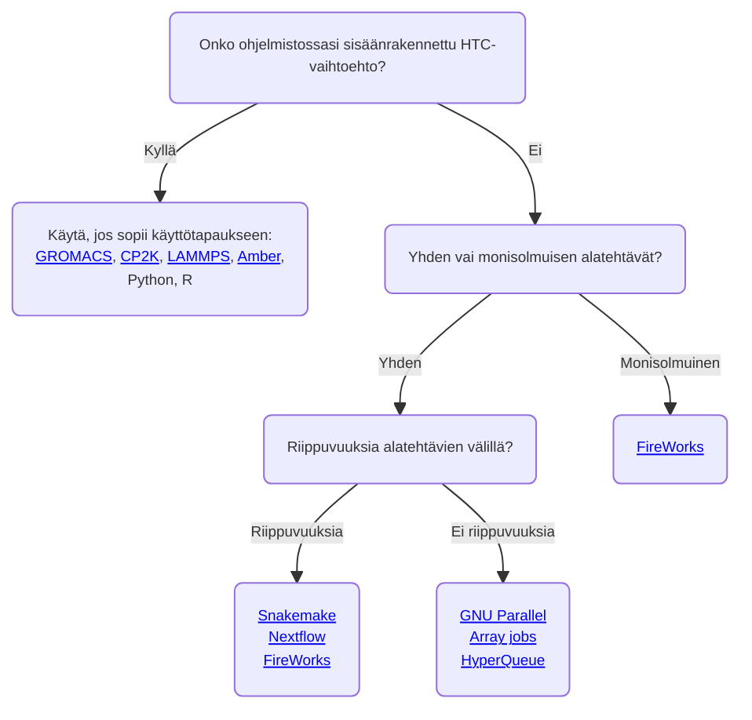
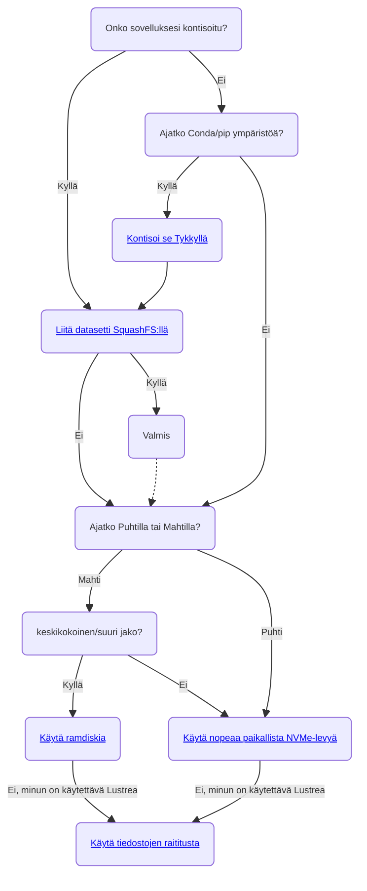

# Suuriteholaskenta ja työnkulut {#high-throughput-computing-and-workflows}

Suuriteholaskenta (HTC) viittaa suureen määrään työtehtäviä, joita usein mahdollistavat automaatio, skriptit ja työnkulkumanagerit. Työnkulkujen automatisointi säästää aikaa ja vähentää manuaalisia virheitä. Työnkulut ovat usein hyvin spesifisiä, ja harvoin löytyy tapa, joka toimisi suoraan tiettyyn sovellukseen.

Tämä sivu esittelee joitakin kriittisiä asioita, jotka sinun tulisi huomioida suunnitellessasi suuritehoisia työnkulkuja. Se auttaa myös rajaamaan oikean työkalusarjan tarpeisiisi. Valitsemalla huolellisesti soveltuvimman teknologia-stackin, työtehtäväsi jonottavat vähemmän, IO-operaatiot toimivat tehokkaammin ja koko HPC-järjestelmän suorituskyky pysyy vakaan nopeana kaikille käyttäjille.

## Yleiset ohjeet {#general-guidelines}

### Suuritehoisten työtehtävien suorittaminen ja hallinta {#running-and-managing-high-throughput-jobs}

Sisältääkö työnkulkusi merkittävän määrän (lyhyitä) erätehtäviä? Tämä on tyypillistä suuriteholaskennalle, jota usein kutsutaan "tehtäväviljelyksi". Se aiheuttaa kuitenkin ongelmia, kuten erätehtävien suorittamisjärjestelijöille, kuten Slurmille, jota käytetään HPC-järjestelmissä. Suuri määrä tehtäviä (käynnistetty `sbatch` komennolla) ja tehtävävaiheita (käynnistetty `srun` komennolla) tuottavat liiallista lokitietoa ja hidastavat Slurmia. Lyhyillä tehtävillä on myös suuri ajoituskustannus, mikä tarkoittaa sitä, että yhä suurempi osa ajasta kuluu jonossa olemiseen laskennan sijaan.

Jotta suuriteholaskenta mahdollistuisi ilman yllä mainittuja ongelmia, pitäisi työt ja työvaiheet pakata niin, että ne voidaan suorittaa minimaalisilla `sbatch`- ja `srun`-kutsuilla. Ensimmäinen ja paras vaihtoehto on tarkistaa, onko käyttämässäsi ohjelmistossa sisäänrakennettua tukea viljelytyyppisille työkuormille. Tämä koskee muun muassa sovelluksia kuten [CP2K][cp2k], [GROMACS][gmx], [LAMMPS][lmp], Python ja R.

Jos sisäänrakennettu tuki viljelytyyppiselle työkuormalle ei ole käytettävissä ohjelmistossasi, toinen vaihtoehto on käyttää ulkoisia työkaluja kuten [HyperQueue] tai [GNU Parallel]. Huomaa, että jotkin työkalut, kuten [FireWorks], voivat silti luoda paljon työvaiheita, vaikka ne sallivatkin pakata omat, mahdollisesti keskinäisriippuvat tehtäväsi suoritettavaksi yhtenä erätehtävänä.

!!!info "Huom"
    Sinun ei tarvitse antaa `srun`-komentoa, jos aiot suorittaa *sarjallisia* tehtäviä osana HTC-työnkulkua. Paljon työvaiheita voidaan välttää yksinkertaisesti poistamalla tarpeettomat `srun`-kutsut.

Voit käyttää alla olevaa kaaviota karsiaksesi sopivimmat teknologiat suuriteholaskentatyönkulkusi käyttöön. Huomaa, että tämä ei ole kattava lista ja muut työkalut saattavat myös sopia tapaukseesi. Nämä työkalut toimivat yleensä hyvin HTC-käyttötapauksissa, joissa on noin 100 ala-tehtävää (tai jopa enemmän, jos alatehtävät hyödyntävät enintään yhtä solmua kerrallaan, katso [HyperQueue]). Jos työnkulkuusi sisältyy satoja tai tuhansia *monisolmu* alatehtäviä, otathan [yhteyttä CSC:n palvelupisteeseen], sillä tämä saattaa vaatia erityisratkaisuja. Älä kuitenkaan epäröi ottaa meihin yhteyttä myös, jos sinulla on muita huolenaiheita liittyen työnkulkusi toteuttamiseen.

Kvalitatiivinen yleiskatsaus Hydra Cloud System (HTC) työkalujen ominaisuuksista ja kyvykkyyksistä, joita CSC suosittelee, on esitetty alla.

||[Nextflow]|[Snakemake]|[HyperQueue]|[FireWorks]|[Array jobs]|[GNU Parallel]|
||:------:|:-------:|:--:|:-------:|:--------:|:----------:|
|Ei liiallista IO:ta|||||||
|Pakkaa työtehtävät/työvaiheet||||||NA|
|Helppo asettaa|||||||
|Riippuvuuden tuki|||||||
|Automaattinen konttien integraatio|||||||
|Virheiden hallinta|||||||
|MPI/OpenMP-paralleelia alatehtävät|||||||
|Slurmin integraatio |||||||
|Moniosainten tuki|||?|?|||

*[Ei liiallista IO:ta]: Työnkulku työkalu ei tuota paljon ylimääräisiä tiedostoja/kansioita
*[Pakkaa työtehtävät/työvaiheet]: Työnkulku työkalu pystyy pakkaamaan useita työtehtäviä (työvaiheita) suoritettavaksi yhtenä työtehtävänä (työvaiheena)
*[Helppo asettaa]: Työnkulku työkalu on helppo asentaa ja asettaa
*[Riippuvuuden tuki]: Työnkulku työkalu tukee riippuvuuksia alatehtävien välillä
*[Automaattinen konttien integraatio]: Työnkulku työkalu tukee automaattista konttien suorittamista ilman ylimääräistä työtä
*[Virheiden hallinta]: Työnkulku työkalu tukee virheiden tunnistamista/lokitusta ja epäonnistuneiden alatehtävien uudelleenkäynnistämistä
*[MPI/OpenMP-paralleelia alatehtävät]: Työnkulku työkalu tukee MPI/OpenMP-paralleelia alatehtäviä
*[Slurmin integraatio]: Työnkulku työkalu integroituu hyvin Slurmiin
*[Moniosainten tuki]: Työnkulku työkalu tukee erilaisten HPC-jakojen käyttöä yhdessä työnkulussa, kuten GPU ja CPU-jaot.

### Syöte/tulostus tehokkuus {#input-output-efficiency}

Usein, kun ajetaan monta rinnakkaista työtehtävää, syöte/tulostus (IO:n) tehokkuuden ongelma tulee esiin. Jos teet paljon IO-operaatioita (tiedostojen lukeminen ja kirjoittaminen) suuritehoisissa työnkuluissa, sinun tulisi kiinnittää erityistä huomiota *missä* nämä toiminnot suoritetaan. CSC:n supertietokoneet käyttävät [Lustre]a rinnakkaisena hajautettuna tiedostojärjestelmänä. Se on suunniteltu suurten tiedostojen tehokkaaseen rinnakkaiseen IO:hon, mutta kun käsitellään monia pieniä tiedostoja, IO:sta tulee nopeasti pullonkaula. Tärkeää on, että intensiiviset IO-operaatiot uhkaavat heikentää tiedostojärjestelmän suorituskykyä kaikille käyttäjille, minkä vuoksi ne tulisi siirtää pois Lustresta.

Jos sinun täytyy lukea ja kirjoittaa tuhansia tiedostoja HTC-työnkulussa, käytä:

* [Nopeaa paikallista NVMe-levyä] Puhtilla ja Mahtilla
* [Ramdiskia] (`/dev/shm`) Mahtin CPU-jakojen kanssa solmukohtaisilla allokaatioilla (vain jos tiedät mitä teet!)
* Jos sovellustasi voidaan suorittaa [Singularity-konttina], toinen hyvä vaihtoehto on [liittää datasetit SquashFS:llä]. Luo datastasi, mahdollisesti tuhansista tiedostoista koostuva SquashFS kuva, mikä vähentää sen yhdeksi tiedostoksi Lustre:n näkökulmasta. Liittäminen kuvaan Singularity-suoritukseen tekee siitä tavanomaisen kansion kontin sisällä.
* Jos joudut käyttämään Lustrea IO-raskaille tehtäville, varmista, että hyödynnät [tiedostojen raititus.]

Riippumatta siitä, suoritatko HTC-työnkulkuja, toinen IO-tehokkuuteen vaikuttava tärkeä seikka on se, miten sovelluksesi on asennettu. [CSC on hylännyt Conda-ympäristöjen suoran käytön] niiden tuomien valtavien tiedostomäärien vuoksi. Suuri osa näistä tiedostoista luetaan joka kerta, kun Conda-ohjelmaa suoritetaan, aiheuttaen kohtuuttoman kuormituksen Lustrelle ja järjestelmänlaajuisia hidastuksia. **Conda-ympäristöt ja muut sovellukset, jotka lukevat tuhansia tiedostoja käynnistyessään, tulisi siksi konttisoida**. [Kontti kääretyökalu Tykky] on tuotu käytettäväksi tämän helpottamiseksi.

Lisätietoja [kuinka työskennellä tehokkaasti Lustarella on dokumentoitu täällä]. Katso myös alla oleva kaavio ohjenuorana oikeiden teknologioiden valitsemiseen IO:lle intensiivisiin työnkulkuihin.

!!!warning "Huom"
    Ethän varaa GPU-solmuja pelkästään solmun NVMe-levyn hyödyntämistä varten. Suorita GPU:illa vain, jos koodisi on GPU-yhteensopiva ja saa hyötyä resurssien käytöstä, [katso käyttöpolitiikka]. Muistathan, että Puhtin CPU-solmuilla on myös NVMe-levyt. Jos sinulla on kysymyksiä työnkulkusi erityispiirteistä, otathan yhteyttä [CSC:n palvelupisteeseen].

## Lisätietoa työnkuluista ja tehokkaasta IO:sta {#more-information-on-workflows-and-efficient-io}

### Työkalut, jotka suorittavat useita työtehtäviä yhdellä skriptillä {#general-tools-that-run-multiple-jobs-with-one-script}

* [Array jobs] on natiiviratkaisu Slurmissa, joka mahdollistaa useiden itsenäisten työtehtävien lähettämisen yhdellä komennolla
* [GNU Parallel] opas näyttää kuinka suorittaa tehokkaasti erittäin suuri määrä sarjallisia työtehtäviä ilman, että Slurmin lokit pursuavat. Voit myös korvata GNU Parallel:in `xargs`-komennolla, katso [xargsjob.sh] esimerkiksi.
* [FireWorks] on työnkulkutyökalu monimutkaisille riippuvuuksille ja monisolmuisille alatehtäville
* [HyperQueue] on työkalu tehokkaalle alasolmustehtävien ajoitukselle
* [Nextflow] on suosittu työnkulkutyökalu työtehtäville, joilla on riippuvuuksia
* [Snakemake] on suosittu työnkulkutyökalu työtehtäville, joilla on riippuvuuksia

### Tieteelle spesifiset työnkulkutyökalut ja opit {#science-specific-workflow-tools-and-tutorials}
* [Data storage guide for machine learning] selittää, missä kannattaa työskennellä ML datojen kanssa, ja kuinka käyttää jaettua tiedostojärjestelmää tehokkaasti
* [Farming Gaussian jobs with HyperQueue]

### Työnkulkutyökalut, jotka integroituvat yleisesti käytettyihin simulaatio-ohjelmistoihin {#workflow-tools-integrated-into-common-simulation-software}

Seuraavat sisäänrakennetut työkalut mahdollistavat useiden simulaatioiden ajon rinnakkain yhdessä Slurm-työvaiheessa. Jos käytät jotakin alla mainituista sovelluksista, harkitse näitä ensisijaisena vaihtoehtona suuriteholaskentatyönkulkujen toteuttamiseen.

* [GROMACS monisuunta vaihtoehto][gmx]
* [CP2K:n FARMING -tila][cp2k] (tukee alatehtävien riippuvuuksia)
* [LAMMPS monijaetun kytkin][lmp]
* [Amber monipmemd][amber-multi-pmemd]
* Python:
    * [Python rinnakkaiset työtehtävät](../../support/tutorials/python-usage-guide.md#python-parallel-jobs)
    * [CSC Dask oppitunti](../../support/tutorials/dask-python.md)
    * [CSC koneoppimisopas](../../support/tutorials/ml-guide.md)
* R:
    * [Rinnakkaiset työtehtävät käyttäen R:ää](../../support/tutorials/parallel-r.md)
    * [R targets kirjasto](https://docs.ropensci.org/targets/)

### Yleiset työkalut ja opit tehokkaaseen IO:hon {#general-tools-and-tutorials-for-efficient-io}

* [Nopeat levykokonaisuudet CSC:n laskentaympäristössä]

[built-in option for farming-type workloads]: throughput.md#workflow-tools-integrated-into-common-simulation-software
[gmx]: ../../support/tutorials/gromacs-throughput.md
[amber-multi-pmemd]: ../../apps/amber.md#high-throughput-computing-with-amber
[cp2k]: ../../apps/cp2k.md#high-throughput-computing-with-cp2k
[lmp]: ../../apps/lammps.md#high-throughput-computing-with-lammps
[HyperQueue]: ../../apps/hyperqueue.md
[GNU Parallel]: ../../support/tutorials/many.md
[FireWorks]: fireworks.md
[Nextflow]: ../../apps/nextflow.md
[contact CSC Service Desk]: ../../support/contact.md
[Snakemake]: ../../apps/snakemake.md
[Array jobs]: array-jobs.md
[Lustre]: ../lustre.md
[Fast local NVMe disk]: ../disk.md#compute-nodes-with-local-ssd-nvme-disks
[Ramdisk]: ../disk.md#compute-nodes-without-local-ssd-nvme-disks
[Singularity container]: ../containers/run-existing.md
[mount your datasets with SquashFS]: ../containers/run-existing.md#mounting-datasets-with-squashfs
[file striping]: ../lustre.md#file-striping-and-alignment
[CSC has deprecated the direct usage of Conda environments]: ../../support/tutorials/conda.md
[container wrapper tool Tykky]: ../containers/tykky.md
[how to work efficiently with Lustre are documented here]: ../lustre.md#best-practices
[Data storage guide for machine learning]: ../../support/tutorials/ml-data.md
[xargsjob.sh]: https://a3s.fi/pub/xargsjob.sh
[see usage policy]: ../usage-policy.md#gpu-nodes
[Fast disk areas in CSC computing environment]: https://csc-training.github.io/csc-env-eff/hands-on/data-io/tutorial-fastdisks.html
[Farming Gaussian jobs with HyperQueue]: https://csc-training.github.io/csc-env-eff/hands-on/throughput/gaussian_hq.html
