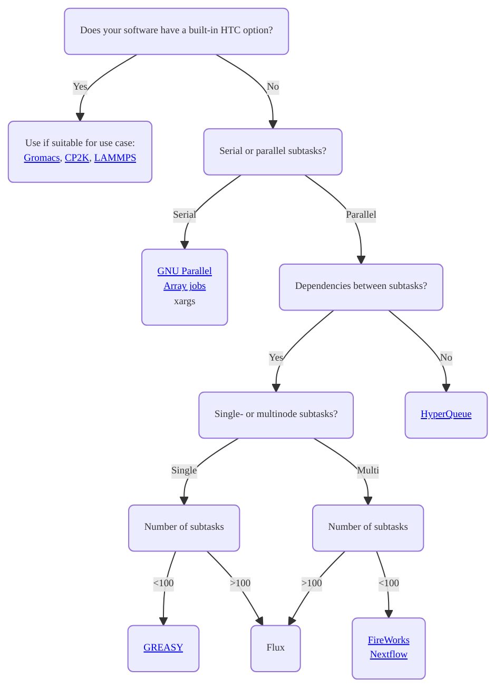
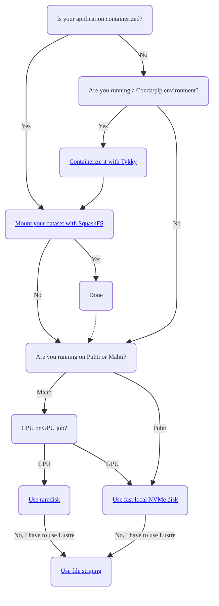

# High-throughput computing and workflows

High-throughput computing (HTC) refers to running a large amount of jobs, frequently enabled by automatization, scripts and workflow managers. Workflow automation saves human time and reduces manual errors. Workflows are frequently very specific and one seldom finds a method that would work out of the box for a certain application. 

This page introduces some critical aspects you should consider when designing high-throughput workflows and helps you in narrowing down the right set of tools for your use case. By carefully selecting the most appropriate technology stack, your jobs will idle less in the queue, IO-operations will be more efficient and the performance of the whole HPC system will remain stable and fast for all users.

## General guidelines

### Running and managing high-throughput jobs

Does your workflow involve running a substantial amount of (short) batch jobs? This is a characteristic feature of high-throughput computing, frequently referred to as "task farming". However, it poses problems for batch job schedulers such as Slurm used in HPC systems. A large number of jobs (launched with `sbatch`) and job steps (launched with `srun`) generate excess log data and slow down Slurm. Short jobs have also a large scheduling overhead, meaning that an increasing fraction of the time will actually be spent in the queue instead of computing.

To enable high-throughput computing while avoiding the above issues, jobs and job steps should be packed so that they can be executed with minimal invocations of `sbatch` and `srun`. The first and best option is to check whether the software you're using comes with a [built-in option for farming-type workloads](throughput.md#workflow-tools-integrated-into-common-simulation-software). This is true for applications such as [Gromacs](../../apps/gromacs.md#high-throughput-computing-with-gromacs), [CP2K](../../apps/cp2k.md#high-throughput-computing-with-cp2k) and [LAMMPS](../../apps/lammps.md#high-throughput-computing-with-lammps).

If integrated support for farming-type workloads is unavailable in your software, another option is to use external tools such as [HyperQueue](https://github.com/It4innovations/hyperqueue) or [GNU Parallel](../../support/tutorials/many.md). Be aware that some tools, for example [GREASY](greasy.md) and [FireWorks](fireworks.md), still create a lot of job steps although they may allow you to conveniently pack your, potentially interdependent, subtasks to be executed as a single batch job.

!!! Note
    You do not need to issue `srun` if you intend to run *serial* jobs as a part of your HTC workflow. A lot of job steps can be avoided just by dropping unnecessary calls of `srun`.

You can use the flowchart below to narrow down the most appropriate technologies for your high-throughput computing workflow. Note that this is not a complete list and other tools may also work for your specific use case.

### Input/output efficiency

Often when running many parallel jobs, the problem of input/output (IO) efficiency arises. If you're doing a lot of IO-operations (reading and writing files) in your high-throughput workflows, you should pay special attention to *where* these operations are performed. CSC supercomputers use [Lustre](../lustre.md) as the parallel distributed file system. It is designed for efficient parallel IO of large files, but when dealing with many small files IO quickly becomes a bottleneck. Importantly, intensive IO-operations risk degrading the file system performance for all users and should thus be moved away from Lustre.

If you need to read and write thousands of files in your HTC workflow, please use:

* [Fast local NVMe disk](../disk.md#compute-nodes-with-local-ssd-nvme-disks) on Puhti and Mahti GPU-nodes
* [Ramdisk](../disk.md#compute-nodes-without-local-ssd-nvme-disks) (`/dev/shm`) on Mahti CPU-nodes
* If your application can be run as a [Singularity container](../containers/run-existing.md), another good option is to [mount your datasets with SquashFS](../containers/run-existing.md#mounting-datasets-with-squashfs). Creating a SquashFS image from your dataset, possibly composed of thousands of files, reduces it to a single file from the point of view of Lustre. However, mounting the image to your Singularity execution makes it appear as an ordinary directory inside the container.
* If you have to use Lustre for IO-heavy tasks, make sure to leverage [file striping](../lustre.md#file-striping-and-alignment)

Whether or not you are running HTC workflows, another important aspect affecting IO-efficiency is how your application is installed. [CSC has deprecated the direct usage of Conda environments](../../support/deprecate-conda.md) due to the huge amount of files they bring about. A large fraction of these files are read each time a Conda application is run, causing excessive load on Lustre and system-wide slowdowns. **Conda environments and other applications reading thousands of files at start-up should thus be containerized**. To make this easy, the [container wrapper tool Tykky](../containers/tykky.md) has been made available.

Further details on [how to work efficiently with Lustre are documented here](../lustre.md#best-practices). Please also consider the flowchart below as a guideline for selecting the most appropriate technologies for your IO-intensive workflows.

## Tools and tutorials related to workflows and HTC

### General tools that run multiple jobs with one script

* [Array jobs](array-jobs.md) are a native Slurm tool to submit several independent jobs with one command
* [GREASY](greasy.md) runs multiple job steps in a larger allocation, and allows simple dependencies
* [DIY GNU Parallel](../../support/tutorials/many.md) tutorial shows how to efficiently run a very large number of serial jobs without bloating the Slurm log. You can also replace GNU Parallel with `xargs`, see [xargsjob.sh](https://a3s.fi/pub/xargsjob.sh) for example.
* [FireWorks](fireworks.md) is a flexible tool for defining, managing and executing workflows with multiple steps and complex dependencies

### Science specific workflow tools and tutorials

* [Nextflow](../../support/tutorials/nextflow-puhti.md) singularity container based bioinformatics pipelines on Puhti
* [Data storage guide for machine learning](../../support/tutorials/ml-data.md) explains where to work with ML data and how to use the shared file system efficiently
* [Using GREASY to run multiple Gaussian jobs on Puhti](https://csc-training.github.io/csc-env-eff/hands-on/throughput/gaussian_greasy.html)

### Workflow tools integrated into common simulation software

The following built-in tools allow running multiple simulations in parallel within a single Slurm job step. If you're using any of the applications below, please consider these as the first option for implementing your high-throughput workflows.

* [Gromacs multidir option](../../apps/gromacs.md#high-throughput-computing-with-gromacs)
* [FARMING mode of CP2K](../../apps/cp2k.md#high-throughput-computing-with-cp2k) (supports dependencies between subjobs)
* [LAMMPS multi-partition switch](../../apps/lammps.md#high-throughput-computing-with-lammps)

### General tools and tutorials for efficient IO

* [Fast disk areas in CSC computing environment](https://csc-training.github.io/csc-env-eff/hands-on/disk-areas/disk-areas-tutorial-fastdisks.html)