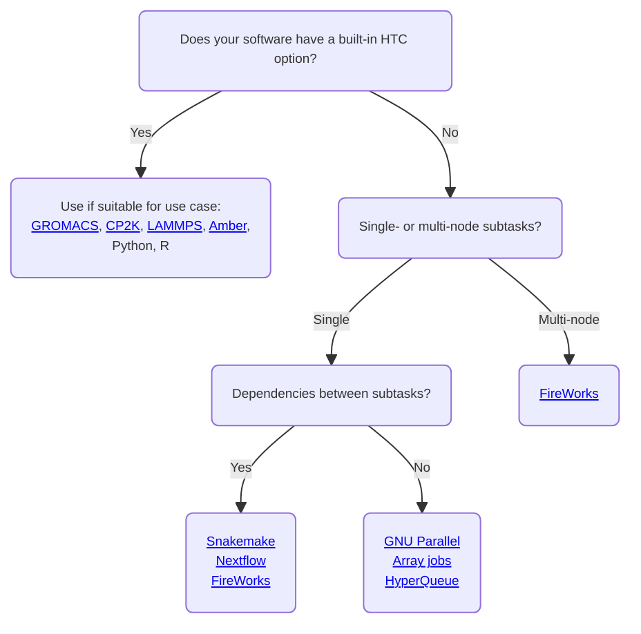
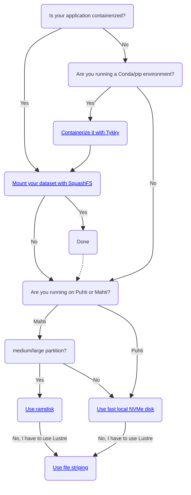

# Läpimenolaskenta ja työnkulut { #high-throughput-computing-and-workflows }

Läpimenolaskennalla (HTC) tarkoitetaan suuren määrän töitä ajamista, mikä toteutetaan usein automaatiolla, skripteillä ja työnkulkujen hallintajärjestelmillä. Työnkulkujen automatisointi säästää aikaa ja vähentää manuaalisia virheitä. Työnkulut ovat usein hyvin tapauskohtaisia, eikä useinkaan löydy menetelmää, joka toimisi sellaisenaan tietyssä sovelluksessa.

Tällä sivulla esitellään kriittisiä näkökohtia, joita kannattaa huomioida läpimenotyönkulkuja suunniteltaessa, ja autetaan rajaamaan oikea työkalujoukko omaan käyttötapaukseen. Kun valitset huolellisesti sopivimman teknologiakokonaisuuden, työsi seisovat vähemmän jonossa, I/O-operaatiot tehostuvat ja koko HPC-järjestelmän suorituskyky säilyy vakaana ja nopeana kaikille käyttäjille.

## Yleiset ohjeet { #general-guidelines }

### Läpimenotöiden ajo ja hallinta { #running-and-managing-high-throughput-jobs }

Sisältyykö työnkulkuusi huomattava määrä (lyhyitä) erätöitä? Tämä on läpimenolaskennan tyypillinen piirre, johon viitataan usein termillä ”task farming”. Se aiheuttaa kuitenkin haasteita eräajon ajoitusjärjestelmille, kuten HPC-järjestelmissä käytettävälle Slurmillle. Suuri määrä töitä (käynnistetty `sbatch`-komennolla) ja työvaiheita (käynnistetty `srun`-komennolla) tuottaa liikaa lokidataa ja hidastaa Slurmia. Lyhyillä töillä on myös suuri ajoitusylipää, mikä tarkoittaa, että yhä suurempi osa ajasta kuluu jonossa laskennan sijaan.

Jotta läpimenolaskenta olisi mahdollista ilman edellä mainittuja ongelmia, työt ja työvaiheet kannattaa pakata siten, että `sbatch`- ja `srun`-kutsuja tarvitaan mahdollisimman vähän. Ensimmäinen ja paras vaihtoehto on tarkistaa, tarjoaako käyttämäsi ohjelmisto [built-in option for farming-type workloads]. Tämä pätee sovelluksiin kuten [CP2K][cp2k], [GROMACS][gmx], [LAMMPS][lmp], Python ja R.

Jos ohjelmistossasi ei ole integroitua tukea farming-tyyppisille kuormille, toinen vaihtoehto on käyttää ulkoisia työkaluja, kuten [HyperQueue] tai [GNU Parallel]. Huomaa, että jotkin työkalut, esimerkiksi [FireWorks], voivat silti luoda paljon työvaiheita, vaikka ne mahdollistavatkin kätevästi toisiinsa mahdollisesti riippuvuussuhteessa olevien alatehtävien pakkaamisen yhdeksi erätyöksi.

!!!info "Huom."
    Sinun ei tarvitse käyttää `srun`-komentoa, jos aiot ajaa työnkulussasi sarjatöitä (serial). Moni työvaihe voidaan välttää yksinkertaisesti jättämällä turhat `srun`-kutsut pois.

Voit käyttää alla olevaa vuokaaviota sopivimpien tekniikoiden valintaan läpimenotyönkulkuusi. Huomaa, että tämä ei ole täydellinen lista, ja muutkin työkalut voivat toimia käyttötapauksessasi. Nämä työkalut toimivat yleensä hyvin HTC-käyttötapauksissa, joissa on noin 100 alatehtävää (tai enemmänkin, jos alatehtävät käyttävät korkeintaan yhtä solmua kukin; katso [HyperQueue]). Jos työnkulussasi on satoja tai tuhansia monisolmuisia alatehtäviä, ole hyvä ja [contact CSC Service Desk], sillä tämä voi vaatia erityisratkaisuja. Älä kuitenkaan epäröi ottaa yhteyttä myös muissa työnkulun toteutukseen liittyvissä kysymyksissä.

Alla on esitetty laadullinen yleiskuva joistakin CSC:n suosittelemien HTC-työkalujen ominaisuuksista ja kyvykkyyksistä.

||[Nextflow]|[Snakemake]|[HyperQueue]|[FireWorks]|[Array jobs]|[GNU Parallel]|
||:------:|:-------:|:--:|:-------:|:--------:|:----------:|
|Ei liiallista I/O|||||||
|Pakkaa työt/työvaiheet||||||NA|
|Helppo ottaa käyttöön|||||||
|Riippuvuuksien tuki|||||||
|Automaattinen kontti-integraatio|||||||
|Virheistä toipuminen|||||||
|MPI/OpenMP-rinnakkaiset alatehtävät|||||||
|Slurm-integraatio |||||||
|Usean osion tuki|||?|?|||

*[Ei liiallista I/O]: Työnkulkuväline ei tuota paljon ylimääräisiä tiedostoja/hakemistoja
*[Pakkaa työt/työvaiheet]: Työnkulkuväline pystyy pakkaamaan useita töitä (työvaiheita) suoritettavaksi yhtenä työnä (työvaiheena)
*[Helppo ottaa käyttöön]: Työnkulkuväline on helppo asentaa ja ottaa käyttöön
*[Riippuvuuksien tuki]: Työnkulkuväline tukee alatehtävien välisiä riippuvuuksia
*[Automaattinen kontti-integraatio]: Työnkulkuväline tukee konttien automaattista suoritusta ilman lisätyötä
*[Virheistä toipuminen]: Työnkulkuväline tukee virheiden havaitsemista/lokittamista ja epäonnistuneiden alatehtävien uudelleenkäynnistystä
*[MPI/OpenMP-rinnakkaiset alatehtävät]: Työnkulkuväline tukee MPI/OpenMP-rinnakkaisia alatehtäviä
*[Slurm-integraatio]: Työnkulkuväline integroituu hyvin Slurmiin
*[Usean osion tuki]: Työnkulkuväline tukee eri HPC-osioiden käyttöä samassa työnkulussa, esimerkiksi GPU- ja CPU-osiot.

### I/O-tehokkuus { #inputoutput-efficiency }

Usein monia rinnakkaisia töitä ajettaessa nousee esiin sisään-/uloslukuoperaatioiden (I/O) tehokkuus. Jos työnkuluissasi on paljon I/O-toimintoja (tiedostojen luku ja kirjoitus), on erityisen tärkeää kiinnittää huomiota siihen, missä nämä toiminnot tehdään. CSC:n supertietokoneet käyttävät [Lustre]-tiedostojärjestelmää rinnakkaisena ja hajautettuna tiedostojärjestelmänä. Se on suunniteltu suurten tiedostojen tehokkaaseen rinnakkaiseen I/O:hon, mutta kun käsitellään suurta määrää pieniä tiedostoja, I/O voi nopeasti muodostua pullonkaulaksi. Tehokas I/O kuormittaa lisäksi tiedostojärjestelmää ja voi heikentää kaikkien käyttäjien suorituskykyä, joten I/O-intensiiviset työt tulisi siirtää pois Lustrelta.

Jos sinun täytyy lukea ja kirjoittaa tuhansia tiedostoja HTC-työnkulussa, käytä:

* [Fast local NVMe disk] Puhtissa ja Mahtissa
* [Ramdisk] (`/dev/shm`) Mahtin CPU-osioissa, joissa on solmupohjainen varaus (vain jos tiedät mitä teet!)
* Jos sovelluksesi voidaan ajaa [Singularity container] -konttina, toinen hyvä vaihtoehto on [mount your datasets with SquashFS]. Aineistosta SquashFS-kuvan luominen (vaikka se koostuisi tuhansista tiedostoista) kutistaa sen Lustren näkökulmasta yhdeksi tiedostoksi. Kun kuva liitetään Singularity-ajoon, se kuitenkin näkyy kontin sisällä tavallisena hakemistona.
* Jos sinun on pakko käyttää Lustrea I/O-raskaisiin tehtäviin, hyödynnä [file striping]

Riippumatta siitä, ajatko HTC-työnkulkuja vai et, toinen I/O-tehokkuuteen vaikuttava tärkeä tekijä on se, miten sovelluksesi on asennettu. [CSC has deprecated the direct usage of Conda environments] johtuen niiden valtavasta tiedostomäärästä. Merkittävä osa näistä tiedostoista luetaan aina, kun Conda-sovellus käynnistetään, mikä kuormittaa Lustrea liikaa ja aiheuttaa järjestelmätason hidastumista. **Conda-ympäristöt ja muut sovellukset, jotka lukevat käynnistyksessä tuhansia tiedostoja, tulisi siksi kontittaa**. Tämän helpottamiseksi on tarjolla [container wrapper tool Tykky].

Lisätietoja siitä, [how to work efficiently with Lustre are documented here]. Katso myös alla olevaa vuokaaviota ohjenuorana valitessasi sopivimpia tekniikoita I/O-intensiivisiin työnkulkuihin.

!!!warning "Huom."
    Älä varaa GPU-solmuja pelkästään solmun NVMe-levyn takia. GPU:ita varten koodisi täytyy tukea GPU-laskentaa ja hyötyä resursseista, [see usage policy]. Muista, että myös Puhtin CPU-solmuissa on NVMe-levyt. Jos sinulla on kysymyksiä omaan työnkulkuusi liittyen, [contact CSC Service Desk].

## Lisätietoja työnkuluista ja tehokkaasta I/O:sta { #more-information-on-workflows-and-efficient-io }

### Yleiset työkalut, joilla ajetaan useita töitä yhdellä skriptillä { #general-tools-that-run-multiple-jobs-with-one-script }

* [Array jobs] on Slurmin oma työkalu useiden toisistaan riippumattomien töiden lähettämiseen yhdellä komennolla
* [GNU Parallel] -opas näyttää, miten hyvin suuri määrä sarjatöitä ajetaan tehokkaasti paisuttamatta Slurmin lokia. Voit korvata GNU Parallelin myös `xargs`-komennolla; katso esimerkki [xargsjob.sh].
* [FireWorks] on työnkulkuväline monimutkaisille riippuvuuksille ja monisolmuisille alatehtäville
* [HyperQueue] on työkalu tehokkaaseen alisolmutason tehtävien ajoitukseen
* [Nextflow] on suosittu työnkulkuväline töille, joilla on riippuvuuksia
* [Snakemake] on suosittu työnkulkuväline töille, joilla on riippuvuuksia
  

### Tiedealakohtaiset työnkulkuvälineet ja -oppaat { #science-specific-workflow-tools-and-tutorials }
* [Data storage guide for machine learning] selittää, missä ML-dataa kannattaa käsitellä ja miten jaettua tiedostojärjestelmää käytetään tehokkaasti
* [Farming Gaussian jobs with HyperQueue]

### Yleisiin simulointiohjelmistoihin integroidut työnkulkuvälineet { #workflow-tools-integrated-into-common-simulation-software }

Seuraavilla sisäänrakennetuilla työkaluilla voi ajaa useita simulointeja rinnakkain yhdessä Slurm-työvaiheessa. Jos käytät jotakin alla olevista sovelluksista, harkitse näitä ensimmäisenä vaihtoehtona läpimenotyönkulkujen toteuttamiseen.

* [GROMACS multidir -vaihtoehto][gmx]
* [CP2K:n FARMING-tila][cp2k] (tukee alitöiden välisiä riippuvuuksia)
* [LAMMPSin multi-partition -kytkin][lmp]
* [Amber multi-pmemd][amber-multi-pmemd]
* Python:
    * [Pythonin rinnakkaistyöt](../../support/tutorials/python-usage-guide.md#python-parallel-jobs)
    * [CSC:n Dask-opas](../../support/tutorials/dask-python.md)
    * [CSC:n koneoppaan opas](../../support/tutorials/ml-guide.md)
* R:
    * [R:n rinnakkaistyöt](../../support/tutorials/parallel-r.md)
    * [R targets -kirjasto](https://docs.ropensci.org/targets/)

### Yleiset työkalut ja oppaat tehokkaaseen I/O:hon { #general-tools-and-tutorials-for-efficient-io }

* [Fast disk areas in CSC computing environment]

[built-in option for farming-type workloads]: throughput.md#workflow-tools-integrated-into-common-simulation-software
[gmx]: ../../support/tutorials/gromacs-throughput.md
[amber-multi-pmemd]: ../../apps/amber.md#high-throughput-computing-with-amber
[cp2k]: ../../apps/cp2k.md#high-throughput-computing-with-cp2k
[lmp]: ../../apps/lammps.md#high-throughput-computing-with-lammps
[HyperQueue]: ../../apps/hyperqueue.md
[GNU Parallel]: ../../support/tutorials/many.md
[FireWorks]: fireworks.md
[Nextflow]: ../../apps/nextflow.md
[contact CSC Service Desk]: ../../support/contact.md
[Snakemake]: ../../apps/snakemake.md
[Array jobs]: array-jobs.md
[Lustre]: ../lustre.md
[Fast local NVMe disk]: ../disk.md#compute-nodes-with-local-ssd-nvme-disks
[Ramdisk]: ../disk.md#compute-nodes-without-local-ssd-nvme-disks
[Singularity container]: ../containers/overview.md
[mount your datasets with SquashFS]: ../containers/overview.md#reading-datasets-from-squashfs-file
[file striping]: ../lustre.md#file-striping-and-alignment
[CSC has deprecated the direct usage of Conda environments]: ../../support/tutorials/conda.md
[container wrapper tool Tykky]: ../containers/tykky.md
[how to work efficiently with Lustre are documented here]: ../lustre.md#best-practices
[Data storage guide for machine learning]: ../../support/tutorials/ml-data.md
[xargsjob.sh]: https://a3s.fi/pub/xargsjob.sh
[see usage policy]: ../usage-policy.md#gpu-nodes
[Fast disk areas in CSC computing environment]: https://csc-training.github.io/csc-env-eff/hands-on/data-io/tutorial-fastdisks.html
[Farming Gaussian jobs with HyperQueue]: https://csc-training.github.io/csc-env-eff/hands-on/throughput/gaussian_hq.html