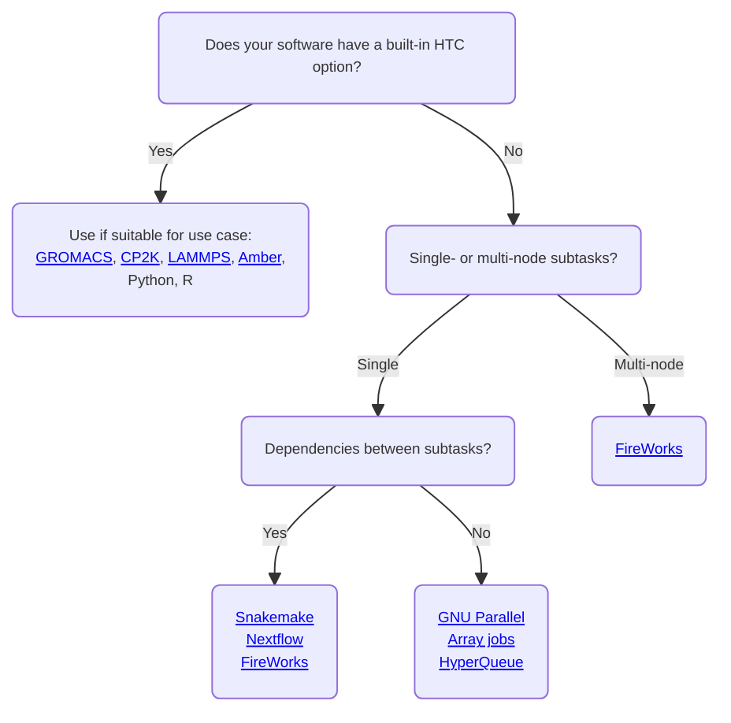
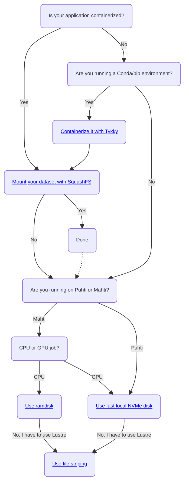

# High-throughput computing and workflows

High-throughput computing (HTC) refers to running a large amount of jobs,
frequently enabled by automatization, scripts and workflow managers. Workflow
automation saves human time and reduces manual errors. Workflows are frequently
very specific and one seldom finds a method that would work out of the box for a
certain application.

This page introduces some critical aspects you should consider when designing
high-throughput workflows and helps you in narrowing down the right set of tools
for your use case. By carefully selecting the most appropriate technology stack,
your jobs will idle less in the queue, IO-operations will be more efficient and
the performance of the whole HPC system will remain stable and fast for all users.

## General guidelines

### Running and managing high-throughput jobs

Does your workflow involve running a substantial amount of (short) batch jobs?
This is a characteristic feature of high-throughput computing, frequently referred
to as "task farming". However, it poses problems for batch job schedulers such as
Slurm used in HPC systems. A large number of jobs (launched with `sbatch`) and job
steps (launched with `srun`) generate excess log data and slow down Slurm. Short
jobs have also a large scheduling overhead, meaning that an increasing fraction
of the time will actually be spent in the queue instead of computing.

To enable high-throughput computing while avoiding the above issues, jobs and job
steps should be packed so that they can be executed with minimal invocations of
`sbatch` and `srun`. The first and best option is to check whether the software
you're using comes with a [built-in option for farming-type workloads]. This
applies for applications such as [CP2K][cp2k], [GROMACS][gmx], [LAMMPS][lmp], Python and R.

If integrated support for farming-type workloads is unavailable in your software,
another option is to use external tools such as [HyperQueue] or [GNU Parallel].
Be aware that some tools, for example [FireWorks], still create a lot
of job steps although they may allow you to conveniently pack your, possibly
interdependent, subtasks to be executed as a single batch job.

!!!info "Note"
    You do not need to issue `srun` if you intend to run *serial* jobs as a part
    of your HTC workflow. A lot of job steps can be avoided just by dropping
    unnecessary calls of `srun`.

You can use the flowchart below to narrow down the most appropriate technologies
for your high-throughput computing workflow. Please note that this is not a complete
list and other tools might also work for your use case. These tools usually work fine
in HTC use cases with around 100 subtasks (or even more if subtasks utilize max. one
node each, see [HyperQueue]). If your workflow contains hundreds or thousands of
*multi-node* subtasks, please [contact CSC Service Desk] as this may require special
solutions. However, don't hesitate to contact us also if you have any other concerns
regarding how to implement your workflow.

A qualitative overview of the features and capabilities of some of the HTC
tools recommended by CSC is presented below.

||[Nextflow]|[Snakemake]|[HyperQueue]|[FireWorks]|[Array jobs]|[GNU Parallel]|
||:------:|:-------:|:--:|:-------:|:--------:|:----------:|
|No excessive IO|||||||
|Packs jobs/job steps||||||NA|
|Easy to setup|||||||
|Dependency support|||||||
|Automatic container integration|||||||
|Error recovery|||||||
|MPI/OpenMP-parallel subtasks|||||||
|Slurm integration |||||||
|Multi-partition support|||?|?|||

*[No excessive IO]: The workflow tool does not produce a lot of extra files/directories
*[Packs jobs/job steps]: The workflow tool is able to pack multiple jobs (job steps) to be executed as a single job (job step)
*[Easy to setup]: The workflow tool is easy to install and setup
*[Dependency support]: The workflow tool supports dependencies between subtasks
*[Automatic container integration]: The workflow tool supports automatic execution of containers without any extra work
*[Error recovery]: The workflow tool supports detection/logging of errors and restarting of failed subtasks
*[MPI/OpenMP-parallel subtasks]: The workflow tool supports MPI/OpenMP-parallel subtasks
*[Slurm integration]: The workflow tool integrates well with Slurm
*[Multi-partition support]: The workflow tool supports usage of different HPC partititions in one workflow, for example GPU and CPU partitions.

### Input/output efficiency

Often when running many parallel jobs, the problem of input/output (IO) efficiency
arises. If you're doing a lot of IO-operations (reading and writing files) in your
high-throughput workflows, you should pay special attention to *where* these
operations are performed. CSC supercomputers use [Lustre] as the
parallel distributed file system. It is designed for efficient parallel IO of
large files, but when dealing with many small files IO quickly becomes a bottleneck.
Importantly, intensive IO-operations risk degrading the file system performance for
all users and should thus be moved away from Lustre.

If you need to read and write thousands of files in your HTC workflow, please use:

* [Fast local NVMe disk] on Puhti and Mahti GPU-nodes
* [Ramdisk] (`/dev/shm`) on Mahti CPU-nodes
* If your application can be run as a [Singularity container], another good option
  is to [mount your datasets with SquashFS]. Creating a SquashFS image from your
  dataset, possibly composed of thousands of files, reduces it to a single file
  from the point of view of Lustre. However, mounting the image to your Singularity
  execution makes it appear as an ordinary directory inside the container.
* If you have to use Lustre for IO-heavy tasks, make sure to leverage [file striping]

Whether or not you are running HTC workflows, another important aspect affecting
IO-efficiency is how your application is installed.
[CSC has deprecated the direct usage of Conda environments] due to the huge amount
of files they bring about. A large fraction of these files are read each time a
Conda application is run, causing excessive load on Lustre and system-wide slowdowns.
**Conda environments and other applications reading thousands of files at start-up
should thus be containerized**. To make this easy, the [container wrapper tool Tykky]
has been made available.

Further details on [how to work efficiently with Lustre are documented here].
Please also consider the flowchart below as a guideline for selecting the most
appropriate technologies for your IO-intensive workflows.

!!!warning "Note"
    Please do not reserve GPU nodes just to utilize the node's NVMe disk. To run
    on GPUs, your code must be GPU-enabled and benefit from using the resources,
    [see usage policy]. Remember that the CPU nodes of Puhti also have NVMe disks.
    If you have questions about your particular workflow, please [contact CSC Service Desk].

## More information on workflows and efficient IO

### General tools that run multiple jobs with one script

* [Array jobs] are a native Slurm tool to submit several independent
  jobs with one command
* [GNU Parallel] tutorial shows how to efficiently run a very large number of
  serial jobs without bloating the Slurm log. You can also replace GNU Parallel
  with `xargs`, see [xargsjob.sh] for example.
* [FireWorks] is a workflow tools for complex dependencies and multi-node subtasks
* [HyperQueue] is a tool for efficient sub-node task scheduling
* [Nextflow] is a popular workflow tool with jobs with dependecies
* [Snakemake] is a popular workflow tool with jobs with dependecies
  

### Science specific workflow tools and tutorials
* [Data storage guide for machine learning] explains where to work with ML data
  and how to use the shared file system efficiently
* [Farming Gaussian jobs with HyperQueue]

### Workflow tools integrated into common simulation software

The following built-in tools allow running multiple simulations in parallel
within a single Slurm job step. If you're using any of the applications below,
please consider these as the first option for implementing your high-throughput
workflows.

* [GROMACS multidir option][gmx]
* [FARMING mode of CP2K][cp2k] (supports dependencies between subjobs)
* [LAMMPS multi-partition switch][lmp]
* [Amber multi-pmemd][amber-multi-pmemd]
* Python:
    * [Python parallel jobs](../../support/tutorials/python-usage-guide.md#python-parallel-jobs)
    * [CSC Dask tutorial](../../support/tutorials/dask-python.md)
    * [CSC machine learning guide](../../support/tutorials/ml-guide.md)
* R:
    * [Parallel jobs using R](../../support/tutorials/parallel-r.md)
    * [R targets library](https://docs.ropensci.org/targets/)

### General tools and tutorials for efficient IO

* [Fast disk areas in CSC computing environment]

[built-in option for farming-type workloads]: throughput.md#workflow-tools-integrated-into-common-simulation-software
[gmx]: ../../support/tutorials/gromacs-throughput.md
[amber-multi-pmemd]: ../../apps/amber.md#high-throughput-computing-with-amber
[cp2k]: ../../apps/cp2k.md#high-throughput-computing-with-cp2k
[lmp]: ../../apps/lammps.md#high-throughput-computing-with-lammps
[HyperQueue]: ../../apps/hyperqueue.md
[GNU Parallel]: ../../support/tutorials/many.md
[FireWorks]: fireworks.md
[Nextflow]: ../../apps/nextflow.md
[contact CSC Service Desk]: ../../support/contact.md
[Snakemake]: ../../apps/snakemake.md
[Array jobs]: array-jobs.md
[Lustre]: ../lustre.md
[Fast local NVMe disk]: ../disk.md#compute-nodes-with-local-ssd-nvme-disks
[Ramdisk]: ../disk.md#compute-nodes-without-local-ssd-nvme-disks
[Singularity container]: ../containers/run-existing.md
[mount your datasets with SquashFS]: ../containers/run-existing.md#mounting-datasets-with-squashfs
[file striping]: ../lustre.md#file-striping-and-alignment
[CSC has deprecated the direct usage of Conda environments]: ../../support/tutorials/conda.md
[container wrapper tool Tykky]: ../containers/tykky.md
[how to work efficiently with Lustre are documented here]: ../lustre.md#best-practices
[Data storage guide for machine learning]: ../../support/tutorials/ml-data.md
[xargsjob.sh]: https://a3s.fi/pub/xargsjob.sh
[see usage policy]: ../usage-policy.md#gpu-nodes
[Fast disk areas in CSC computing environment]: https://csc-training.github.io/csc-env-eff/hands-on/disk-areas/disk-areas-tutorial-fastdisks.html
[Farming Gaussian jobs with HyperQueue]: https://csc-training.github.io/csc-env-eff/hands-on/throughput/gaussian_hq.html
