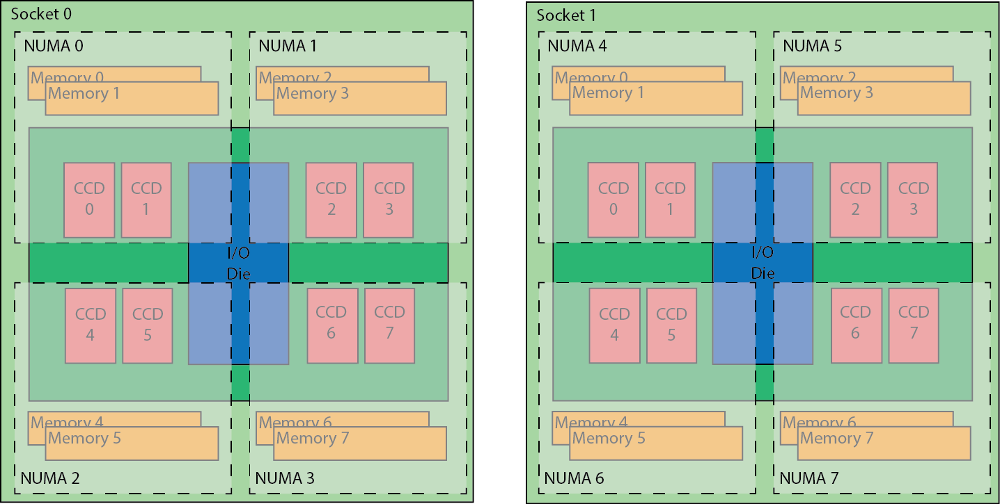

# Systems

The Puhti supercomputer was launched on September 2, 2019. It is an
Atos cluster system with a variety of different node types. It is
targeted at a wide range of workloads, e.g. single core to medium sized
jobs, AI workloads, jobs requiring large amounts of memory or local scratch space.

The Mahti supercomputer will be launched in August, 2020. It is
a watercooled Atos BullSequana XH2000 system with a uniform set of
compute nodes with a large amount of cores and a very powerful
interconnect.  It is targeted at medium to large workloads, each
utilizing full nodes. Also, there are no local disks or GPUs in the system.

Both of them have a fairly similar compute environment, and there is a
wide range of workloads that can utilize both efficiently. At the same
time their hardware is different, and this makes some workloads
uniquely suitable for either Puhti or Mahti.

!!! warning "Login nodes: important note for Puhti and Mahti"
    The login nodes can be used for **light** pre- and postprocessing, compiling
    applications and moving data. All other tasks are to be done in the 
	compute nodes using the [batch job system](running/getting-started.md). 
	Programs not adhering to these rules will be terminated without warning. 
	Note that compute nodes can be used also [interactively](running/interactive-usage.md)

## Puhti  

### Compute

**Puhti** has a total of **682 CPU nodes**, with a theoretical peak
performance of 1,8 petaflops. Each node is equipped with two Intel
Xeon processors, code name _Cascade Lake_, with 20 cores each running
at 2,1 GHz. The interconnect is based on Mellanox HDR InfiniBand. The
nodes are connected with a 100 Gbps HDR100 link, and the topology is a
fat tree with a blocking factor of approximately 2:1.

The **Puhti AI** artificial intelligence partition has a total of **80 GPU
nodes** with a total peak performance of 2,7 petaflops. Each node has
two latest generation Intel Xeon processors, code name _Cascade Lake_,
with 20 cores each running at 2,1 GHz. They also have four Nvidia
Volta V100 GPUs with 32 GB of memory each. The nodes are equipped with
384 GB of main memory and 3,6 TB of fast local storage. This partition
is engineered to allow GPU-intensive workloads to scale well across
multiple nodes. The interconnect is based on a dual-rail HDR100
interconnect network connectivity providing 200 Gbps of aggregate
bandwidth in a non-blocking fat-tree topology.

### Nodes

| Name      |  Number of nodes |  Compute       | Cores                  | Memory  | Local disk |     
|-----------|------------------|----------------|------------------------|---------|------------|
| M         |  532             | Xeon Gold 6230 | 2 x 20 cores @ 2,1 GHz | 192 GiB |            |
| L         |  92              | Xeon Gold 6230 | 2 x 20 cores @ 2,1 GHz | 384 GiB |            |
| IO        |  40              | Xeon Gold 6230 | 2 x 20 cores @ 2,1 GHz | 384 GiB |  3600 GiB  |
| XL        |  12              | Xeon Gold 6230 | 2 x 20 cores @ 2,1 GHz | 768 GiB |            |
| BM        |  12              | Xeon Gold 6230 | 2 x 20 cores @ 2,1 GHz | 1,5 TiB |            |
| GPU       |  80              | Xeon Gold 6230 Nvidia V100  | 2 x 20 cores @ 2,1 GHz  4 GPUs connected with NVLink | 384 GiB 4 x 32 GB |  3600 GiB  |

In addition to the compute nodes above, Puhti has two login nodes with 40 cores and 2900 GiB
[local disk](disk.md#login-nodes) each. 

### Storage

Puhti has a 4.8 PB Lustre parallel storage system providing space for [home](disk.md#home-directory), 
[project](disk.md#projappl-directory) and [scratch](disk.md#scratch-directory) storages. 

## Mahti 

Mahti is an Bull Sequana XH2000 system from Atos. It consists of 1404 compute nodes each with two 64 core AMD processors and each node has 256 GB of memory. The storage conistst of a lustre filesystem with a capacity of XX PB.

### Mahti compute node

Each node has two AMD Rome 7H12 CPUs, with 64 cores each. The CPUs are based on AMDs Zen 2 architecture, supporting the AVX2 vector instruction set. 

The cores in each CPU has two hardware threads, brining the total thread count for a node to 256 threads. Each core has 32 KiB of L1 data cache and 32 KiB of L1 instruction cache, the L2 cache is also private per core and each core has 512 KiB L2 cache. Each core has two FMA (fused multiply add) units, that operate on full 256 bit vectors, meaning operations in 8 single precision floats or 4 double precision floats can be carried out by each unit each clock cycle. Moving up from the core, 4 cores are grouped together into a core complex (CCX), within the CCX the cores share the same 16 MiB of L3 cache. Two of these CCX parts are then combined to form a compute die (CCD). For an in depth description of the Zen 2 core you can read further on it at WikiChip https://en.wikichip.org/wiki/amd/microarchitectures/zen_2

  

Two core complexes are combined in the same compute die, each processor then consists of 8 compute dies and an additional I/O die that houses the memory controllers and PCI-e controller. Each node is then made up of two of these processors and one 200gbit HDR network adapter.

  

To make the massive amounts of cores more manageable and to provide slightly increased memory performance we run each CPU in NPS4 (NUMA per socket 4) mode that splits each CPU into 4 NUMA domains. Each NUMA domain gets two compute dies for a total of 16 cores, and two memory controllers with 32 GiB of memory in total. Core 0 runs threads 0 and 128, core 1 threads 1 and 129 and so on. The figure below shows how the threads are distributed over each of the cores and NUMA nodes.

  

### Network

The interconnect is based on Mellanox HDR InfiniBand and each node is connected to the network with a single 200 Gbps HDR link. The network topology is a dragonfly+ topology. The topology consists of multiple groups of nodes, each of which is internally connected with a fat tree topology, these fat trees are then connected to each other using all to all links. 

  

In Mahti there are 234 nodes in each dragonfly group and the internal fat tree has a blocking factor of 1.7:1, with 20 or 18 nodes connected per leaf switch and each leaf switch has 12 links going to the spine switch in the group, all links are 200 Gbps links. There are in total 6 groups, and between the groups there is fully non-blocking all-to-all connectivity, with 5 200 Gbps links going from each spine switch to one spine switch in every other group. 

  

### Storage

Mahti has a 8.7 PB Lustre parallel storage system providing space for [home](disk.md#home-directory), 
[project](disk.md#projappl-directory) and [scratch](disk.md#scratch-directory) storages. 

## Kvasi

**The Quantum Learning Machine**

Quantum computers differ from their classical counterparts when it comes to the basic 
computational operators. Before QPUs can be utilized, they require tailor-made programs 
and algorithms. With Kvasi, the user can explore and develop algorithms 
for quantum computers. Read here [detailed instructions on how to access](kvasi.md)

Kvasi provides an ecosystem for developing and simulating quantum algorithms in both 
ideal, and realistic, noisy conditions. With Kvasi, you can optimize your algorithm 
for a specific hardware (QPU), with specific connections and basic gate operations.

The algorithms can be developed either at a level close to the hardware, using 
the Atos Quantum Assembler (AQASM) language, or using a higher level, Python based 
language and ready-made libraries. The QLM comes with several ready-made examples.
You can also download and run locally [myQLM](./kvasi.md#myqlm) - a light-weight version of the 
QLM ecosystem.
