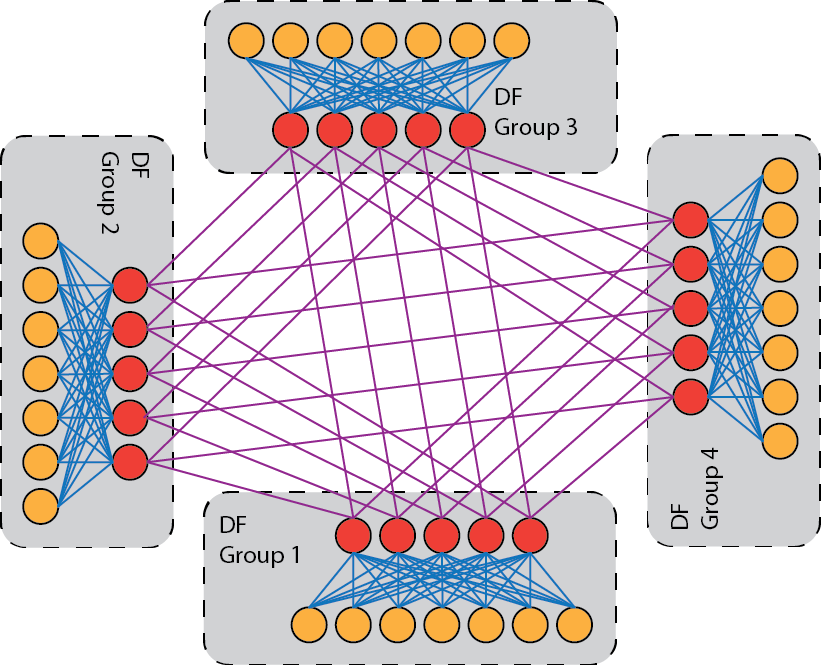

# Technical details about Mahti

## Compute

**Mahti** has a total of **1404** nodes, with a theoretical peak performance
of 7,5 petaflops. Each node has two AMD Rome 7H12 CPUs with 64 cores each,
making the total core count about 180 000. The CPUs are based on AMD Zen 2 architecture, 
supporting the AVX2 vector instruction set, and run at 2.6 GHz base frequency (max boost up to 3.3 GHz). 
The CPUs support simultaenous multithreading (SMT) where each core can run two
hardware threads. When SMT is enabled, the total thread count per node is 256
threads. Each node has 256 GB of memory. 

Mahti node has a highly hierachical structure. There are two sockets in the
node, each containing a single CPU and memory DIMMs. All
the memory within the node is shared, but memory performance depends on the
distance of the core to the memory. In order to provide slightly increased memory performance 
we run each CPU in NPS4 (NUMA per socket 4) mode that further splits each CPU 
into 4 NUMA domains. Each NUMA domain has 16 cores, and two memory controllers with 32 GiB of memory in total. Core 0 runs threads 0 and 128, core 1 threads 1 and 129 and so on. The figure below shows how the threads are distributed over each of the cores and NUMA nodes.

  

The basic building block of the processor is a core, which are then grouped
into core complexes (CCXs), and furthermore into compute dies (CCDs). 

Each core has 32 KiB of L1 data cache and 32
KiB of L1 instruction cache, the L2 cache is also private per core and each
core has 512 KiB L2 cache. Each core has two FMA (fused multiply add) units,
that operate on full 256 bit vectors, meaning operations in 8 single precision
floats or 4 double precision floats can be carried out by each unit each clock
cycle. Thus, at best 2 (multiply+add) x 2 (two units) x 4 (vector width) = 16
double precision floating point operations per cycle.

Moving up from the core, 4 cores are grouped together into a core
complex (CCX), within the CCX the cores share the same 16 MiB of L3 cache. Two
of these CCX parts are then combined to form a compute die (CCD). 

  

Each processor consists of 8 compute dies and an additional I/O die that houses the memory controllers and PCI-e controller. Each node is then made up of two of these processors and one 200gbit HDR network adapter.

  

For an in depth description of the Zen 2 core you can read further on it at
[WikiChip](https://en.wikichip.org/wiki/amd/microarchitectures/zen_2)

## Network

The interconnect is based on Mellanox HDR InfiniBand and each node is connected to the network with a single 200 Gbps HDR link. The network topology is a dragonfly+ topology. The topology consists of multiple groups of nodes, each of which is internally connected with a fat tree topology, these fat trees are then connected to each other using all to all links. 

  

In Mahti there are 234 nodes in each dragonfly group and the internal fat tree has a blocking factor of 1.7:1, with 20 or 18 nodes connected per leaf switch and each leaf switch has 12 links going to the spine switch in the group, all links are 200 Gbps links. There are in total 6 groups, and between the groups there is fully non-blocking all-to-all connectivity, with 5 200 Gbps links going from each spine switch to one spine switch in every other group. 

## Storage

Mahti has a 8.7 PB Lustre parallel storage system providing space for [home](disk.md#home-directory), 
[project](disk.md#projappl-directory) and [scratch](disk.md#scratch-directory) storages. 
