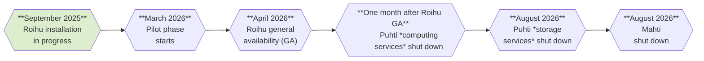

# Roihu supercomputer

!!! info "Note"
    This page contains preliminary information about CSC's next national
    supercomputer Roihu, which is projected to be in researchers' use in spring
    2026. Please note that the details may evolve over time.
    [See tentative schedule below](#schedule).

## Schedule

**Roihu** will be installed in the same datacenter as LUMI, meaning that the
system will be brought up without disturbing Puhti and Mahti services. There
will also be a margin between Roihu general availability and the
decommissioning of Puhti and Mahti to enable users to migrate to Roihu without
a break in HPC access.

Puhti will be decommissioned in two steps: First, the computing services of
Puhti will be shut down one month after the general availability of Roihu. This
means that jobs cannot be submitted on Puhti anymore. Puhti's storage will,
however, remain accessible until August 2026, after which Puhti will be retired
completely. Mahti will be closed in August 2026.

If you have any data that you need to migrate from Puhti to Roihu, please be
prepared to do it during spring 2026, at the very latest in August 2026. CSC
will publish a detailed Roihu migration guide in early 2026.

## Compute

Roihu will have a total of 486 CPU nodes and 132 GPU nodes. The
high-performance LINPACK (HPL) performance is estimated to be 10.5 PFlop/s for
the CPU nodes and 23.4 PFlop/s for the GPU nodes, resulting in an aggregate HPL
performance of 33.9 PFlop/s for the full system.

The CPU nodes will have two 192-core AMD Turin 9965 CPUs each, amounting to
186 624 CPU cores altogether. The CPUs are based on the AMD Zen 5 architecture,
which supports the AVX-512 vector instruction set. 414 of the CPU nodes will
have 768 GiB of memory, while the remaining 72 nodes will have an extended
memory of 1 536 GiB each.

Each GPU node will be equipped with 4 Nvidia GH200 Grace Hopper superchips.
Each GH200 superchip comprises one Hopper (H100) GPU and one Grace CPU with
72 ARM CPU cores which are connected with a very fast interface. Each
GH200 superchip has 120 GiB CPU memory and 96 GiB GPU memory, providing
a total of 480 GiB CPU memory per node. This gives a total of 528 GPUs and
38 016 CPU cores in the whole GPU partition.

The system will also provide four visualization nodes with two Nvidia L40 GPUs
each, as well as four high-memory CPU nodes with 6 TiB memory and higher
single-thread performance.

### Nodes

| Name | Number of nodes | Compute        | Cores                          | Memory (GiB) | Local disk (TB) |
|:-----|----------------:|---------------:|-------------------------------:|-------------:|----------------:|
| M    | 414             | AMD Turin 9965 | 2 x 192 cores (x86) @ 2.25 GHz | 768          | 0.96            |
| L    | 72              | AMD Turin 9965 | 2 x 192 cores (x86) @ 2.25 GHz | 1536         | 0.96            |
| XL   | 4               | AMD Turin 9555 | 2 x 64 cores (x86) @ 3.20 GHz  | 6144         | 15.36           |
| V    | 4               | AMD Turin 9335 Nvidia L40 | 2 x 32 cores (x86) @ 3.40 GHz 2 x GPUs | 384 2 x 48 | 15.36 |
| GPU  | 132             | Nvidia GH200   | 4 x 72 cores (ARM) 4 x GPUs | 4 x 120 4 x 96 | 0.96 |

The operating system of Roihu will be Red Hat Enterprise Linux 9 (RHEL9).

## Storage

### Parallel file system

Roihu will have two independent flash-based DDN EXAScaler Lustre file systems –
a 6.0 PiB Scratch space and a 0.5 PiB storage system for project applications
and users' personal Home directories. Separate file systems will ensure
responsiveness of Home and ProjAppl even under heavy Scratch usage.

The Scratch disk of Roihu will be more than ten times as performant as Puhti
Scratch. Specifically, the peak I/O performance of Roihu Scratch is expected to
be around 560 GB/s for read and 280 GB/s for write. The Home and ProjAppl will
have read and write bandwidths of 120 GB/s and 100 GB/s, respectively.

Similar to Puhti, Roihu Scratch disk will be regularly cleaned of files that
have not been accessed in the last 180 days to avoid inactive data accumulating
on the system. For longer-term storage and sharing of datasets we will
introduce a new disk area called **ProjData**. ProjData access and quota will
be applied for and managed in MyCSC, and the disk area will have its own
billing model.

### Local storage capacity

Each Roihu CPU and GPU node will have a small 960 GB local disk suitable for
storing temporary files during jobs. High-performance local storage will be
available on the high-memory and visualization nodes, each of which will
include 2 x 7.68 TB fast NVMe disks.

As a new feature, users will also be able to request local disk mounts from a
centralized pool of fast storage resources. This fast storage capacity will be
provided over the network and will appear as local scratch from within a Slurm
job. The total capacity of the disaggregated NVMe resource will be 307.2 TB.

## Network

The network of Roihu is based on Infiniband NDR interconnect. Each CPU node
will be connected to the network with one 200 Gb/s link, while in the GPU
partition there will be four 200 Gb/s links per node, one for each GPU.

## Software and programming environment

We intend to provide a comprehensive stack of pre-installed HPC libraries and
scientific software on Roihu similar to Puhti and Mahti. Some older and less
used software and software versions may, however, be deprecated. Please also
note that any software compiled on Puhti and Mahti will most likely need to be
recompiled on Roihu. More information will be included in the migration guide.

The programming environment of Roihu will otherwise be similar to Mahti,
including e.g.

* GNU compiler stack
* AOCC compiler stack
* CUDA and Nvidia HPC Software Development Kit (SDK)
* OpenMPI as main MPI library

Like Puhti and Mahti, Roihu will also feature a web interface for easy-to-use
interactive access and running graphical user interfaces.

## More information

* [Frequently asked questions](../support/faq/roihu.md)
* [See the latest Roihu presentation slides](https://a3s.fi/docs-files/roihu-presentation-2025-12-19.pdf)
  (updated 2025-12-19)
* Do you have questions about Roihu or the retirement of Puhti and Mahti?
  Please [contact CSC Service Desk](../support/contact.md), we're happy to
  help!

