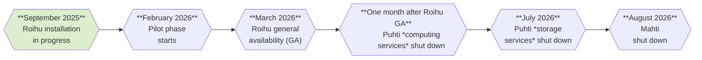

# Roihun tekniset tiedot { #technical-details-about-roihu }

!!! note
    Tämä sivu sisältää alustavaa tietoa CSC:n seuraavasta kansallisesta
    supertietokoneesta Roihusta, jonka arvioidaan tulevan tutkijoiden käyttöön
    vuoden 2026 alussa. Huomaathan, että tiedot voivat muuttua ajan myötä.
    [Katso alustava aikataulu alla](#schedule).

## Aikataulu { #schedule }

## Laskenta { #compute }

**Roihu**ssa on yhteensä 486 CPU-solmua ja 132 GPU-solmua. High Performance LINPACKin (HPL) suorituskyvyn arvioidaan olevan CPU-solmuilla 10.5 PFlop/s ja GPU-solmuilla 23.4 PFlop/s, mikä antaa koko järjestelmälle yhteenlasketun HPL-suorituskyvyn 33.9 PFlop/s.

CPU-solmuissa on kussakin kaksi 192-ytimistä AMD Turin 9965 -prosessoria, yhteensä 186 624 CPU-ydintä. Prosessorit perustuvat AMD Zen 5 -arkkitehtuuriin, joka tukee AVX-512 -vektorikäskykantaa. 414 CPU-solmussa on 768 GiB muistia, kun taas lopuissa 72 solmussa on laajennettu 1 536 GiB muisti.

Jokaisessa GPU-solmussa on 4 Nvidia GH200 Grace Hopper -superpiiriä. Kukin GH200-superpiiri sisältää yhden Hopper-GPU:n ja yhden Grace-CPU:n, jossa on 72 ARM-CPU-ydintä; ne on yhdistetty erittäin nopealla liitännällä. Kussakin GH200-superpiirissä on 120 GiB CPU-muistia ja 96 GiB GPU-muistia, mikä tuottaa yhteensä 480 GiB CPU-muistia per solmu. Tämä tarkoittaa, että koko GPU-osiossa on yhteensä 528 GPU:ta ja 38 016 CPU-ydintä.

Järjestelmä tarjoaa lisäksi neljä visualisointisolmua, joissa kussakin on kaksi Nvidia L40 -GPU:ta, sekä neljä suuren muistin CPU-solmua, joissa on 3 TiB muistia ja korkeampi yksisäikeinen suorituskyky.

### Solmut { #nodes }

| Nimi | Solmujen lukumäärä | Laskenta       | Ytimet                         | Muisti (GiB) | Paikallinen levy (TB) |
|:-----|-------------------:|---------------:|-------------------------------:|-------------:|----------------------:|
| M    | 414                | AMD Turin 9965 | 2 x 192 ydintä (x86) @ 2.25 GHz | 768          | 0.96                  |
| L    | 72                 | AMD Turin 9965 | 2 x 192 ydintä (x86) @ 2.25 GHz | 1536         | 0.96                  |
| XL   | 4                  | AMD Turin 9555 | 2 x 64 ydintä (x86) @ 3.20 GHz  | 3072         | 15.36                 |
| V    | 4                  | AMD Turin 9335 Nvidia L40 | 2 x 32 ydintä (x86) @ 3.40 GHz 2 x GPU:ta | 384 2 x 48 | 0.96 |
| GPU  | 132                | Nvidia GH200   | 4 x 72 ydintä (ARM) 4 x GPU:ta | 4 x 120 4 x 96 | 0.96             |

## Tallennus { #storage }

Roihussa on kaksi toisistaan riippumatonta flash-pohjaista DDN EXAScaler Lustre -tiedostojärjestelmää – 6.0 PiB scratch-tila ja 0.5 PiB tallennusjärjestelmä projektisovelluksille ja käyttäjien henkilökohtaisille kotihakemistoille. Erilliset tiedostojärjestelmät varmistavat home- ja projappl-alueiden vasteen myös raskaan scratch-käytön aikana.

Roihun scratch-tilan huippu-I/O-suorituskyvyn odotetaan olevan noin 560 GB/s lukemisessa ja 280 GB/s kirjoituksessa. Home- ja projappl-alueiden luku- ja kirjoituskaistanleveydet ovat vastaavasti 120 GB/s ja 100 GB/s.

Toisin kuin Puhtissa ja Mahtissa, kaikissa Roihun CPU- ja GPU-solmuissa on pieni 960 GB nopea NVMe-levy esimerkiksi väliaikaistiedostojen tehokasta tallennusta varten. Suuren muistin solmuissa on kussakin 2 x 7.68 TB nopeat levyt.

## Verkko { #network }

Roihun verkko perustuu Infiniband NDR -kytkentään. Kukin CPU-solmu liitetään verkkoon yhdellä 200 Gb/s linkillä, kun taas GPU-osiossa on neljä 200 Gb/s linkkiä per solmu, yksi kutakin GPU:ta kohden.