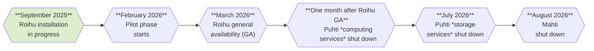

# Technical details about Roihu

!!! note
    This page contains preliminary information about CSC's next national
    supercomputer Roihu, which is projected to be in researchers' use early
    2026. Please note that the details may evolve over time.
    [See tentative schedule below](#schedule).

## Schedule

## Compute

**Roihu** will have a total of 486 CPU nodes and 132 GPU nodes. The
high-performance LINPACK (HPL) performance is estimated to be 10.5 PFlop/s for
the CPU nodes and 23.4 PFlop/s for the GPU nodes, resulting in an aggregate HPL
performance of 33.9 PFlop/s for the full system.

The CPU nodes will have two 192-core AMD Turin 9965 CPUs each, amounting to
186 624 CPU cores altogether. The CPUs are based on the AMD Zen 5 architecture,
which supports the AVX-512 vector instruction set. 414 of the CPU nodes will
have 768 GiB of memory, while the remaining 72 nodes will have an extended
memory of 1 536 GiB each.

Each GPU node will be equipped with 4 Nvidia GH200 Grace Hopper superchips.
Each GH200 superchip comprises one Hopper GPU and one Grace CPU with
72 ARM CPU cores which are connected with a very fast interface. Each
GH200 superchip has 120 GiB CPU memory and 96 GiB GPU memory, providing
a total of 480 GiB CPU memory per node. This gives a total of 528 GPUs and
38 016 CPU cores in the whole GPU partition.

The system will also provide four visualization nodes with two Nvidia L40 GPUs
each, as well as four high-memory CPU nodes with 3 TiB memory and higher
single-thread performance.

### Nodes

| Name | Number of nodes | Compute        | Cores                          | Memory (GiB) | Local disk (TB) |
|:-----|----------------:|---------------:|-------------------------------:|-------------:|----------------:|
| M    | 414             | AMD Turin 9965 | 2 x 192 cores (x86) @ 2.25 GHz | 768          | 0.96            |
| L    | 72              | AMD Turin 9965 | 2 x 192 cores (x86) @ 2.25 GHz | 1536         | 0.96            |
| XL   | 4               | AMD Turin 9555 | 2 x 64 cores (x86) @ 3.20 GHz  | 3072         | 15.36           |
| V    | 4               | AMD Turin 9335 Nvidia L40 | 2 x 32 cores (x86) @ 3.40 GHz 2 x GPUs | 384 2 x 48 | 15.36 |
| GPU  | 132             | Nvidia GH200   | 4 x 72 cores (ARM) 4 x GPUs | 4 x 120 4 x 96 | 0.96 |

The operating system of Roihu will be Red Hat Enterprise Linux 9 (RHEL9).

## Storage

Roihu will have two independent flash-based DDN EXAScaler Lustre file systems –
a 6.0 PiB scratch space and a 0.5 PiB storage system for project applications
and users' personal home directories. Separate file systems will ensure
responsiveness of home and projappl even under heavy scratch usage.

The peak I/O performance of Roihu scratch space is expected to be around 560
GB/s for read and 280 GB/s for write. The home and projappl will have read and
write bandwidths of 120 GB/s and 100 GB/s, respectively.

Contrary to Puhti and Mahti, all Roihu CPU and GPU nodes will have a small 960
GB fast NVMe disk for efficient storage of, for example, temporary files. The
high-memory nodes will include 2 x 7.68 TB fast disks each.

## Network

The network of Roihu is based on Infiniband NDR interconnect. Each CPU node
will be connected to the network with one 200 Gb/s link, while in the GPU
partition there will be four 200 Gb/s links per node, one for each GPU.
