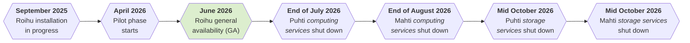

# Roihu supercomputer

!!! info "Note"
    This page contains information about CSC's next national
    supercomputer Roihu, which is now available for researchers.

    As part of the transition, Mahti and Puhti will be decommissioned
    in steps over summer and fall 2026.
    [See the schedule for Mahti and Puhti shutdown below](#schedule).

## Schedule

```mermaid
graph LR;
    A{{"<b>September 2025</b>
        Roihu installation
        in progress"}} --> B;
    B{{"<b>April 2026</b>
        Pilot phase
        starts"}} --> C;
    C{{"<b>June 2026</b>
        Roihu general
        availability (GA)"}} --> D;
    D{{"<b>End of July 2026</b>
        Puhti <i>computing
        services</i> shut down"}} --> E;
    E{{"<b>End of August 2026</b>
        Mahti <i>computing
        services</i> shut down"}} --> F;
    F{{"<b>Mid October 2026</b>
        Puhti <i>storage
        services</i> shut down"}} --> G;
    G{{"<b>Mid October 2026</b>
        Mahti <i>storage services</i>
        shut down"}}
    style C fill:#dceeceff;
```

**Roihu** is installed in the same datacenter as LUMI, meaning that the
system will be brought up without disrupting Puhti and Mahti services. There
will also be a margin between Roihu general availability and the
decommissioning of Puhti and Mahti to enable users to migrate to Roihu without
a break in HPC access.

Puhti will be decommissioned in two stages: First, Puhti's computing services
will be shut down 31 July 2026 at 12:00 EEST. This
means that jobs will not run after this date on Puhti anymore. Puhti's storage and login nodes will,
however, remain accessible until midday October 15th 2026, after which Puhti will be retired
completely.

Mahti will be closed in a similar two-stage process. Mahti’s computing services will be shut down on 31 August 2026 at 12:00 EEST, and jobs will not run on Mahti after this date.
Its storage and login nodes will remain accessible until midday 15 October 2026, after which Mahti will be retired completely.

Between September and October 2026, the storage services will not be covered by service contracts.
As a result, we cannot guarantee that they will remain accessible throughout this period.
We strongly encourage all users to prioritize moving their data by the end of August 2026.

### Prepare for data migration from Mahti and Puhti to Roihu

If you have any data that you need to migrate from Puhti to Roihu, please be
prepared to do it during summer 2026, aiming to complete it by the **end of August**.
See the [Roihu migration guide](../support/tutorials/roihu-data.md) on how you can transfer data
directly from Mahti and Puhti to Roihu.

If you cannot move data directly from Mahti or Puhti to Roihu between early July and end of August,
consider [using Allas or LUMI-O for short-term data storage](../support/tutorials/roihu-data-preparation.md).

For any questions and concerns regarding transferring data between the systems,
feel free to contact the [CSC service desk](https://research.csc.fi/support/),
or attend [CSC's weekly user support coffee breaks](https://research.csc.fi/training/csc-research-support-coffee-every-wednesday-at-1400-finnish-time/).

## Compute

Roihu has a total of 486 CPU nodes and 132 GPU nodes. The
high-performance LINPACK (HPL) performance is estimated to be 10.5 PFlop/s for
the CPU nodes and 23.4 PFlop/s for the GPU nodes, resulting in an aggregate HPL
performance of 33.9 PFlop/s for the full system.

The CPU nodes have two 192-core AMD Turin 9965 CPUs each, amounting to
186 624 CPU cores altogether. The CPUs are based on the AMD Zen 5 architecture,
which supports the AVX-512 vector instruction set. 414 of the CPU nodes
have 768 GiB of memory, while the remaining 72 nodes have an extended
memory of 1 536 GiB each.

Each GPU node is equipped with 4 Nvidia GH200 Grace Hopper superchips.
Each GH200 superchip comprises one Hopper (H100) GPU and one Grace CPU with
72 ARM CPU cores, which are connected via a very fast interface. Each
GH200 superchip has 120 GiB CPU memory and 96 GiB GPU memory, providing
a total of 480 GiB CPU memory per node. This results in a total of 528 GPUs and
38 016 CPU cores in the whole GPU partition.

The system also provides four visualization nodes with two Nvidia L40 GPUs
each, as well as four high-memory CPU nodes with 6 TiB memory and higher
single-thread performance.

### Nodes

!!! note "Node names"
     The node names below describe the different node types in Roihu. Batch job partitions and allocation types in Slurm may use different names. 
     See the [Slurm partition documentation](running/batch-job-partitions.md) for how to request these resources in Slurm.

| Name | Number of nodes | Compute        | Cores                          | Memory (GiB) | Local disk (TB) |
|:-----|----------------:|---------------:|-------------------------------:|-------------:|----------------:|
| M    | 414             | AMD Turin 9965 | 2 x 192 cores (x86) @ 2.25 GHz | 768          | 0.96            |
| L    | 72              | AMD Turin 9965 | 2 x 192 cores (x86) @ 2.25 GHz | 1536         | 0.96            |
| XL   | 4               | AMD Turin 9555 | 2 x 64 cores (x86) @ 3.20 GHz  | 6144         | 15.36           |
| V    | 4               | AMD Turin 9335 Nvidia L40 | 2 x 32 cores (x86) @ 3.40 GHz 2 x GPUs | 384 2 x 48 | 15.36 |
| GPU  | 132             | Nvidia GH200   | 4 x 72 cores (ARM) 4 x GPUs | 4 x 120 4 x 96 | 0.96 |

The operating system of Roihu is Red Hat Enterprise Linux 9 (RHEL9).

## Storage

### Parallel file system

Roihu has two independent flash-based DDN EXAScaler Lustre file systems –
a 6.0 PiB Scratch space and a 0.5 PiB storage system for project applications
and users' personal Home directories. Separate file systems ensure
responsiveness of Home and ProjAppl even under heavy Scratch usage.

The Scratch disk of Roihu is more than ten times as performant as Puhti
Scratch. Specifically, the peak I/O performance of Roihu Scratch is expected
to be around 560 GB/s for read and 280 GB/s for write. The Home and ProjAppl
disk areas are expected to have read and write bandwidths of 120 GB/s and
100 GB/s, respectively.

Similar to Puhti, Roihu Scratch disk will be regularly cleaned of files that
have not been accessed in the last 180 days to avoid inactive data accumulating
on the system. For longer-term storage and sharing of datasets between multiple projects, we will
introduce a new disk area called **Dataset**. Dataset access and quota will
be applied for and managed in MyCSC, and the disk area will have its own
billing model.

The dataset project will be implemented into Roihu after general availability.

### Local storage capacity

Each Roihu CPU and GPU node have a small 960 GB local disk suitable for
storing temporary files during jobs. High-performance local storage is
available on the high-memory (XL) and visualization (VIZ) nodes, where each
node includes a total of 13 TiB of fast NVMe disks.

The available storage quota that a single user can access in their jobs depends
on the system [partition](running/batch-job-partitions.md) they use:

| Allocation type         | Quota per user |
|:------------------------|---------------:|
| R (shared nodes)        | 20 GiB         |
| N (full nodes)          | 600 GiB        |
| G (GPU nodes)           | 150 GiB        |
| Hugemem (XL) nodes      | 1.6 TiB        |
| V (visualization nodes) | 6.5 TiB        |

As a new feature, users can also request local disk mounts from a
centralized pool of fast storage resources. This fast storage capacity is
provided over the network and will appear as local scratch storage from within a
Slurm job. The total capacity of the disaggregated NVMe resource is 307.2 TB.

## Network

The network of Roihu is based on an InfiniBand NDR interconnect. Each CPU node
is connected to the network with one 200 Gb/s link, while in the GPU
partition there are four 200 Gb/s links per node, one per GPU.

## Software and programming environment

We intend to provide a comprehensive stack of pre-installed HPC libraries and
scientific software on Roihu, similar to those on Puhti and Mahti. Some older and less
used software packages and versions may, however, be deprecated. Please also
note that any software compiled on Puhti and Mahti will most likely need to be
recompiled on Roihu.
Instructions for installing applications are provided in
[the getting started with Roihu tutorial](../support/tutorials/roihu.md#installing-software)

The programming environment of Roihu is otherwise similar to Mahti,
including:

* The GNU compiler stack
* The AOCC compiler stack
* CUDA and NVIDIA HPC Software Development Kit (SDK)
* OpenMPI as the main MPI library

Like Puhti and Mahti, Roihu also features a web interface for easy-to-use
interactive access and running graphical user interfaces.

A list of currently supported applications on Roihu can be found on the
[applications page](../apps/by_availability.md#roihu).

## Sensitive data services in Roihu

CSC supercomputers, including Roihu, are maintained according to the best practices of HPC
management: processes are planned and documented, systems are constantly monitored, and
security patches are applied without delay.
Further, all users log in using two-factor authentication.
Thus, these environments are quite secure by default.
However, CSC can't guarantee that there is no risk of a data breach, as
new security incidents emerge from time to time.

For use cases that require higher security, Roihu is being developed to support workflows
that require enhanced controls for handling sensitive and confidential data.
Roihu will introduce dedicated capabilities for regulated data workflows.

The sensitive data capability will be introduced after Roihu's initial availability.
Pilot use of the sensitive computing environment is currently estimated to begin in autumn 2026,
with general availability potentially following in early 2027, depending on the results and
experiences from the pilot phase.

The user workflow is expected to resemble CSC’s current Sensitive Data Desktop to HPC job submission model,
where sensitive data jobs are submitted from a secure environment (SD Desktop) and input/output data are
handled through protected data services (SD Connect). The jobs will be executed in job-specific isolated
environments that will not be able to access the internet or the shared disk areas of Roihu.

Read more about the [sensitive data services at CSC](../data/sensitive-data/index.md).

## More information

* [Getting started with Roihu](../support/tutorials/roihu.md)
* [Frequently asked questions](../support/faq/roihu.md)
* [See the latest Roihu presentation slides](https://a3s.fi/docs-files/roihu-presentation.pdf)
  (updated 2026-06-15)
* Do you have questions about Roihu or the retirement of Puhti and Mahti?
  Please [contact CSC Service Desk](../support/contact.md), we're happy to
  help!

