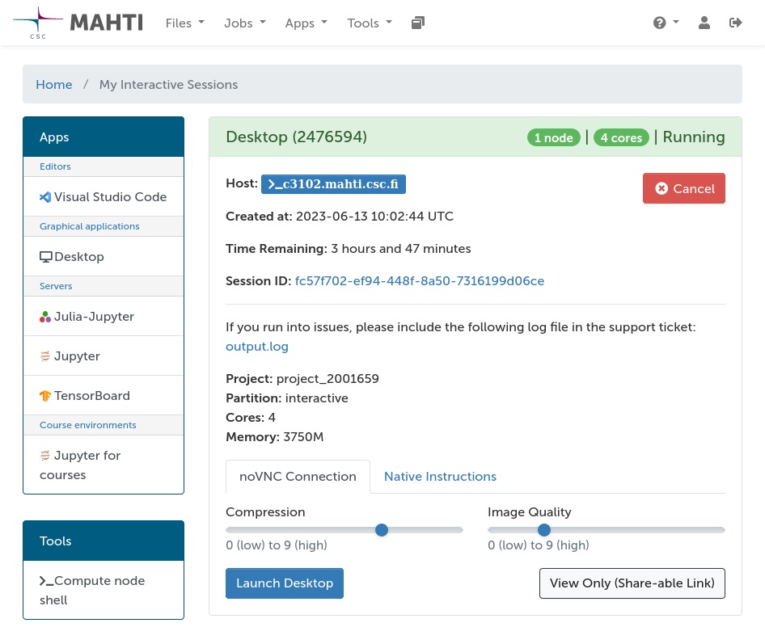

# Interactive apps

## Available apps

  - [Accelerated visualization](accelerated-visualization.md)
  - [Desktop](desktop.md)
  - [Jupyter](jupyter.md)
  - [Julia on Jupyter](julia-on-jupyter.md)
  - [Jupyter for courses](jupyter-for-courses.md)
  - [MATLAB](matlab.md)
  - [MLflow](mlflow.md)
  - [RStudio](rstudio.md)
  - [TensorBoard](tensorboard.md)
  - [Visual Studio Code](vscode.md)

## Launching an interactive app

1. The interactive apps can be found in the navigation bar under _Apps_, or on
   _My Interactive Sessions_ page.
2. To launch an app on a compute node, select it from the menu. 
3. After selecting an interactive app from the list you will be presented with
   a form to configure the session.
    1. Fill in appropriate billing project, partition, resources and
       app-specific settings.
4. After submitting the app form, and the Slurm job for the app has finished
   queuing, the app will be started and you will be able to connect to the
   application on the _My Interactive Sessions_ page (see below).

!!! warning "Avoid idle interactive sessions"
    Note that apps keep running and consuming resources even if you close the
    browser tab for the app session. To stop the app, you can cancel the
    session from the _My Interactive Sessions_ page.

## Troubleshooting

Several factors may cause your interactive session to fail to launch. Common
reasons for failures are temporary issues with the shared file system (Lustre),
job running out of memory, or invalid settings in the session configuration
form (e.g. invalid Python installation for Jupyter). Below are some general
tips for troubleshooting:

1. File system issues come and go. The level of disk lag displayed on the web
   interface dashboard may give a hint if Lustre issues might be the reason for
   why your job failed to start. In this case there's not much that can be
   done, and the best option is typically to wait for a moment and then try
   re-launching the session.
2. To rule out errors due to limited computing resources, try launching a new
   session requesting more memory or cores.
3. Make sure to double-check that all the other settings in the configuration
   form are correct, e.g. path to a custom Python interpreter is correct, and
   that the environment contains all packages needed to launch the session
   (e.g. Jupyter).
4. Information about a session is stored in a log file `output.log`, which can
   be viewed from the card of your session on the _My Interactive Sessions_
   page. Checking the contents of this file for error messages is a good
   starting point to understand why your job failed to launch. If you're unable
   to interpret the contents of the log file, don't hesitate to
   [contact CSC Service Desk](../../support/contact.md). **Please include the
   log file of your failed session in your support request.** This will help us
   to solve your issue faster. Other ways in which you can speed up the
   processing of your support request are discussed on the
   [How to write good support requests](../../support/support-howto.md) page.
