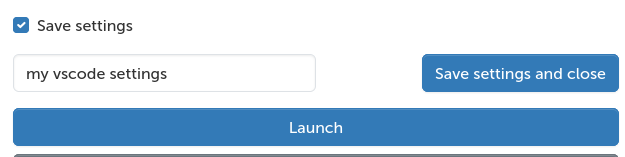
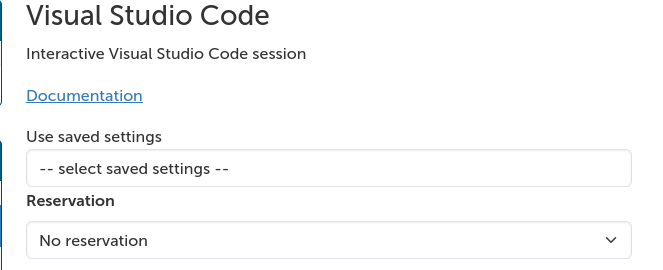
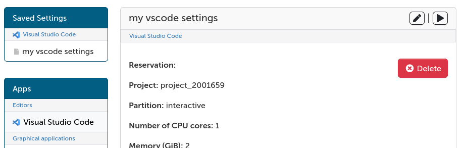

# Interaktiiviset sovellukset

## Saatavilla olevat sovellukset

  - [Nopeutettu visualisointi](accelerated-visualization.md)
  - [Työpöytä](desktop.md)
  - [Jupyter](jupyter.md)
  - [Julia Jypyterillä](julia-on-jupyter.md)
  - [Jupyter kursseille](jupyter-for-courses.md)
  - [MATLAB](matlab.md)
  - [MLflow](mlflow.md)
  - [RStudio](rstudio.md)
  - [TensorBoard](tensorboard.md)
  - [Visual Studio Code](vscode.md)

## Interaktiivisen sovelluksen käynnistäminen {#launching-an-interactive-app}

1. Interaktiiviset sovellukset löytyvät navigaatiopalkista kohdasta _Sovellukset_ tai
   _Omat interaktiiviset istunnot_ -sivulta.
2. Käynnistääksesi sovelluksen laskentasolmussa, valitse se valikosta.
3. Kun valitset interaktiivisen sovelluksen listalta, sinulle esitetään lomake
   istunnon konfiguroimiseksi.
    1. Täytä asianmukainen laskutusprojekti, osasto, resurssit ja
       sovelluskohtaiset asetukset.
4. Kun olet lähettänyt sovelluslomakkeen ja sovellusjonon Slurm-työ on valmistunut,
   sovellus käynnistyy ja voit liittää sovellukseen _Omat interaktiiviset istunnot_ -sivulla (katso alla).

!!! varoitus "Vältä käyttämättömiä interaktiivisia istuntoja"
    Huomaa, että sovellukset kuluttavat resursseja myös silloin, kun suljet sovelluksen
    selaimen välilehden. Lopettaaksesi sovelluksen voit peruuttaa istunnon _Omat interaktiiviset istunnot_ -sivulta.

## Tallennetut interaktiivisen sovelluksen asetukset {#saved-interactive-app-settings}

Interaktiivisen sovelluksen lomakkeilla valitsemasi resurssit ja muut asetukset voidaan tallentaa ja
palauttaa myöhemmin.

### Asetusten tallentaminen {#saving-settings}

Tallentaaksesi asetukset, valitse *Tallenna asetukset* -valintaruutu lomakkeen lopussa. Modaalinen ikkuna ilmestyy,
jossa voit valita tallennetaanko uudet asetukset vai ylikirjoitetaanko vanhat. Anna nimi tallennettaville asetuksille ja paina "tallenna". Tämän jälkeen voit käynnistää sovelluksen,
joka tallentaa asetukset.

### Tallennettujen asetusten käyttö {#using-saved-settings}

Sovelluslomakkeissa voit valita, mitkä tallennetut asetukset ladataan sovellukseen:

*Omat interaktiiviset istunnot* -sivulla tai sovelluslomakesivuilla näet luettelon kaikista sovelluksista tallennetuista
asetuksista vasemmalla. Yhtä niistä napsauttamalla näet asetukset listassa.
Yläoikealla olevilla painikkeilla voit joko muokata lomakkeen asetuksia tai suoraan käynnistää
istunnon näillä asetuksilla.

## Vianmääritys {#troubleshooting}

Useat tekijät voivat estää interaktiivisen istunnon käynnistymisen. Yleisiä syitä epäonnistumiseen ovat väliaikaiset ongelmat jaetussa tiedostojärjestelmässä (Lustre), muistin loppuminen tai virheelliset asetukset istuntokonfiguraatiolomakkeessa (esim. virheellinen Python-asennus Jupyterille). Alla on joitakin yleisiä vinkkejä vianmääritykseen:

1. Tiedostojärjestelmäongelmat tulevat ja menevät. Verkkoliittymän informaatiopaneelin levyviive saattaa vihjata, onko Lustre-ongelma syynä työn epäonnistumiseen. Tässä tilanteessa ei yleensä ole paljon tehtävissä, joten parasta on odottaa hetki ja yrittää sitten käynnistää istunto uudelleen.
2. Sulje pois virheet rajallisista laskentaresursseista yrittämällä käynnistää uusi istunto, joka pyytää enemmän muistia tai ytimiä.
3. Varmista, että kaikki muut lomakkeen asetukset ovat oikein. Esim. varmista, että mukautetun Python-tulkinnan polku on oikea ja että ympäristössä on kaikki istunnon käynnistämiseen tarvittavat paketit (esim. Jupyter).
4. Istunnon tiedot tallennetaan lokitiedostoon `output.log`, joka voidaan katsoa omasta kortista _Omat interaktiiviset istunnot_ -sivulla. Tämän tiedoston sisältö, josta etsit virheilmoituksia, on hyvä lähtökohta ymmärtääksesi, miksi työsi epäonnistui. Jos et pysty tulkitsemaan lokitiedoston sisältöä, älä epäröi [ottaa yhteyttä CSC:n asiakaspalveluun](../../support/contact.md). **Liitä epäonnistuneen istunnon lokitiedosto tukipyyntösi mukaan.** Tämä auttaa meitä ratkaisemaan ongelmasi nopeammin. Muita tapoja nopeuttaa tukipyynnön käsittelyä on käsitelty sivulla [Kuinka kirjoittaa hyviä tukipyyntöjä](../../support/support-howto.md).
