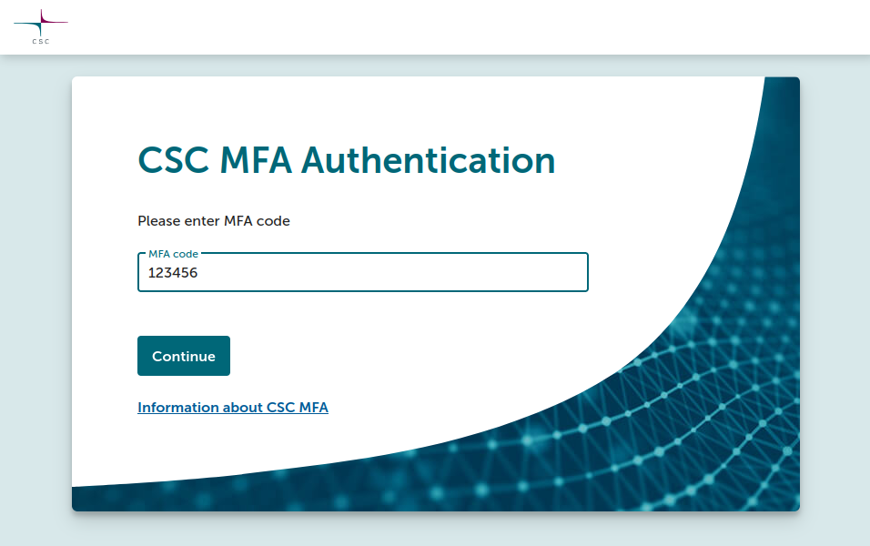

# Yhteyden muodostaminen Puhti- ja Mahti-verkkokäyttöliittymiin { #connecting-to-puhti-and-mahti-web-interfaces }

--8<-- "mfa-update.md"

1. Varmista, että sinulla on CSC-tili:
    * [Ohjeet uuden CSC-käyttäjätilin luomiseen](../../accounts/how-to-create-new-user-account.md).
2. Avaa verkkoselain ja siirry osoitteeseen [www.puhti.csc.fi](https://www.puhti.csc.fi) tai
   [www.mahti.csc.fi](https://www.mahti.csc.fi).
3. Aloitussivulla napsauta "Log in" ja valitse sopiva
   tunnistautumispalvelu.

    

=== "CSC-kirjautuminen"
    1. Syötä CSC-käyttäjätunnuksesi ja salasanasi.
    2. Syötä MFA-koodi (TOTP) CSC:n MFA-tunnistautumissivulla.
       

=== "Haka-kirjautuminen"
    1. Valitse organisaatiosi listasta.
    2. Tunnistaudu organisaatiosi myöntämillä tunnuksilla.
    3. Jos organisaatiollasi on käytössä Haka MFA, sinut ohjataan organisaatiosi
       MFA-tunnistautumissivulle. Syötä MFA-koodi (TOTP) ohjeiden mukaan.
    4. Jos organisaatiollasi **ei** ole käytössä Haka MFA:ta, sinut ohjataan
       CSC:n MFA-tunnistautumissivulle. Syötä MFA-koodi (TOTP) ohjeiden mukaan.
       

=== "Virtu-kirjautuminen"
    1. Valitse organisaatiosi listasta.
    2. Tunnistaudu organisaatiosi myöntämillä tunnuksilla.
    3. Sinut ohjataan CSC:n MFA-tunnistautumissivulle. Syötä MFA-koodi (TOTP)
       ohjeiden mukaan.
       

!!! warning "Tunnetut ongelmat"
    1. Tällä hetkellä, jos yrität siirtyä suoraan URL-osoitteeseen, jota suojaavat
       todennus ja valtuutus, sinut ohjataan oletuksena Haka MFA:han. Tässä
       tapauksessa käyttäjien, joilla ei ole Haka MFA:ta, on palattava
       manuaalisesti etusivulle kirjautuakseen.
    2. Jos sinulla on Haka-tunnukset, mutta et ole vielä luonut CSC-tiliä,
       saat kirjautuessasi virheellisen virheilmoituksen, jonka mukaan sinun
       täytyy aktivoida MFA. Tämä ei kuitenkaan ole ongelman varsinainen syy.
       Todellisuudessa sinun täytyy ensin
       [luoda CSC-tili](../../accounts/how-to-create-new-user-account.md),
       ja vasta sen jälkeen varmistaa, että sinulla on Haka MFA tai CSC MFA
       käytössä, jotta voit kirjautua.

Onnistuneen tunnistautumisen jälkeen näet kojelaudan. Täältä voit
[selailla tiedostojasi](file-browser.md) supertietokoneella,
[käynnistää komentokuoren](shell.md), tarkastella käynnissä olevia töitä tai
käynnistää jonkin monista [saatavilla olevista sovelluksista](apps.md).
Kojelauta sisältää myös tärkeää järjestelmätietoa.

## Lisätietoja { #more-information }

* [Monivaiheisen tunnistautumisen opas](../../accounts/mfa.md)