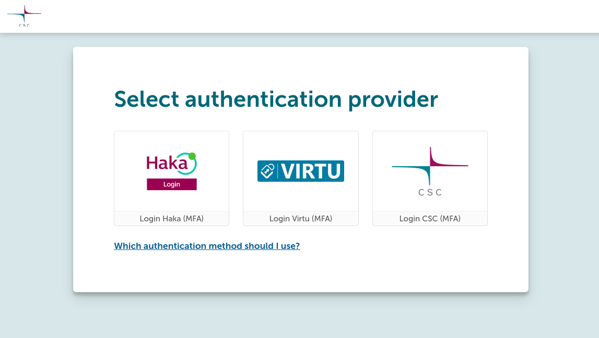

# Connecting to Puhti and Mahti web interfaces

1. Using a web browser, go to [www.puhti.csc.fi](https://www.puhti.csc.fi) or
   [www.mahti.csc.fi](https://www.mahti.csc.fi).
2. On the landing page, click on "Log in" and select an appropriate
   authentication provider.
      1. When logging in using your CSC user account, select CSC as the
         authentication provider and use the same username and password you use
         when connecting with `ssh`.

    

3. After successful authentication, you will see the dashboard.

    

4. From here, you can browse your files on the supercomputer, start a shell,
   view running jobs or start one of the many available applications. The
   dashboard also contains some important system information.
