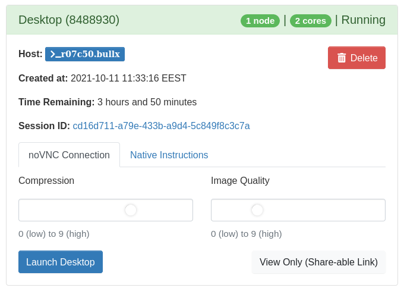

# Desktop
The desktop enables using graphical applications on a Puhti or Mahti compute node.

In the Puhti web interface, the following applications are available in the desktop:

* [CloudCompare](../../apps/cloudcompare.md)
* [COMSOL](../../apps/comsol.md)
* [GRASS GIS](../../apps/grass.md)
* [Grace](../../apps/grace.md)
* [MATLAB](../../apps/matlab.md)
* [Maestro](../../apps/maestro.md)
* [QGIS](../../apps/qgis.md)
* [SAGA GIS](../../apps/saga-gis.md)
* [SNAP](../../apps/snap.md)
* [VMD](../../apps/vmd.md)

On Mahti, the following applications are available:

* [Maestro](../../apps/maestro.md)
* [VMD](../../apps/vmd.md)

Only CPU rendering is supported in the graphical applications launched from the desktop.
See [here how to enable GPU-accelerated visualization](accelerated-visualization.md)
for selected applications on Puhti.

## Launching
1. Open `Desktop` page under Apps 
2. Specify the needed resources. Desktop is run as [batch job](../running/getting-started.md) as anything else on the supercomputers, so the required resources need to be defined before launching the desktop. The recommended partition is [interactive](../running/interactive-usage.md), so that the job could start as soon as possible, but if more resources are needed also other partitions are available.

## Connecting
There are two options for connecting to the remote desktop:

1. **With web-browser**. The noVNC Connection tab can be used to connect to the remote desktop using a web browser by selecting wanted compression and quality and then clicking `Launch Desktop`. Using the browser to connect is recommended for most users.

2. **With VNC client**. For better performance you can use a native VNC client, such as RealVNC or TigerVNC. Native VNC client may also be a good alternative if experiencing issues with clipboard integration between remote desktop and local host with the browser connection. Instructions for native VNC clients can be found in the Native instructions tab. This requires installing the VNC client on your local machine.

## Using the desktop
The available applications can be found in the applications menu, found in the top-left corner, or
by right-clicking the desktop. Application shortcuts directly on the desktop can also be generated
or reset to the defaults by enabling the *Reset desktop icons* option in the Desktop app launch form
on Mahti. To add additional desktop shortcuts, you can drag desired applications from the
applications menu to the desktop.

For starting any other software available on the supercomputers:

1. Open terminal
2. Start the software as described in [Applications section](../../apps/index.md), usually `module load XX` and `<start_command_for_XX>`.

(The applications menu in desktop does not include all Puhti or Mahti scientific applications.)

