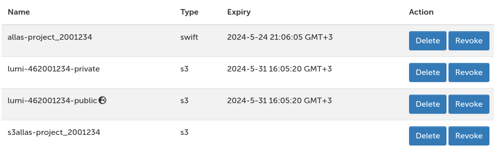

# File browser and accessing storage services from the web interfaces

The file browser can be opened from the _Files_ section on the top navbar
(this displays a list of all project disk areas), or using the shortcut to your
home folder in the _Pinned Apps_ view on the landing page (dashboard). In the
file browser, you can upload/download files, create new files and directories,
or open a shell in the current directory. You can also use it to move data
between Allas, LUMI-O, IDA and the supercomputer.

!!! warning "Important"
    Keep the tab with the file browser open while the file transfer is in
    progress to ensure that it completes successfully. Also note that uploaded
    files will overwrite existing files with the same name _without prompting_!
    Currently, the maximum size for individual file uploads is **10 GB**.

Clicking on a file will open it in view-only mode. For more options like
editing, renaming and deleting, use the button with three dots next to the
filename. 

The file browser comes with a basic text editor. Some important notes about the
editor:

- If no changes have been made, the _save_ button is grayed out.
- There is no _save-as_ feature.
- The user is not notified if a read-only file is opened using the editor.
  Accordingly, no changes will be applied to the file.

## Accessing Allas and LUMI-O

The **[Allas object storage service](../../computing/allas.md)** can also be
accessed from the web interfaces using the file browser.

To configure authentication for Allas: 

1. Open the _Cloud storage configuration_ app either from the _Pinned Apps_ or
   the _Tools_ dropdown in the navbar.
2. Once you open the app, you will be prompted to enter your CSC password at
   the bottom of the page.
3. After you have authenticated using your password, you will be able to create 
   both S3 and Swift connections, also known as remotes, to Allas. Each remote
   is only valid for a single project, but you can create multiple remotes to
   cover different projects.
4. The created remotes will be visible in the _Files_ dropdown in the navbar,
   as well as in the file browser (e.g. `s3allas-project_2001234`).

!!! info "Note"
    The Swift and S3 protocols are not fully compatible with each other,
    particularly for files larger than 5 GB. For more details about the
    differences between the protocols, see
    [Allas protocols](../../data/Allas/introduction.md#protocols).

**[LUMI-O](https://docs.lumi-supercomputer.eu/storage/lumio/)** can also be
used through the file browser.

To configure authentication for LUMI-O:

1. Open the _Cloud storage configuration_ app either from the _Pinned Apps_ or
   the _Tools_ dropdown in the navbar.
2. Select the LUMI-O tab in the _Configure new remotes_ section.
3. Select the project to create authentication for, as well as whether or not
   you want s3cmd configuration and a public remote.

!!! warning "Public LUMI-O remotes"
    Files uploaded to the public LUMI-O remotes (e.g. `lumi-462001234-public`)
    can be accessed by anyone using the URL
    `https://<project-number>.lumidata.eu/<bucket_name>`. Be careful to not
    upload private data there.

Once you've set up a connection to Allas/LUMI-O from a web interface, you can
use the file browser to access Allas/LUMI-O in the same way as when accessing
the shared file system on the supercomputers.

Note that configured remotes that are not accessible due to, for example,
expired authentication or network connection issues, will not be visible in the
_Files_ dropdown menu.

!!! warning "Large files"
    Uploading large files from your local computer to Allas via the web
    interfaces is currently not recommended due to technical limitations.

If you no longer need a configured remote, you can revoke the access token for
it in the list of remotes, or delete the remote from the configuration. Remotes
not configured using the Cloud storage configuration app will also be visible
and can be deleted, but the access tokens for those can not be revoked.


## Accessing IDA

The [IDA storage service](../../data/ida/using_ida.md) can also be used from
the web interfaces. However, some key features, such as moving data from the
staging area to the frozen area, are only possible though the
[IDA web interface](https://ida.fairdata.fi).

To use IDA from the Puhti/Mahti web interfaces, it must first be configured for
use with Rclone in a login node shell as follows:

```
module load allas
rclone config
```

In the Rclone configuration interface, create a new remote with the following
settings:

1. Storage: WebDAV (#45)
2. URL: <https://ida.fairdata.fi/remote.php/webdav/>
3. Vendor: Nextcloud (#1)
4. Username: Your CSC username
5. Password:
      1. Login to the [IDA web interface](https://ida.fairdata.fi).
      2. Go to the settings in the top right corner.
      3. Go to the _Security_ tab and create a new app password.
      4. Copy the password and paste it in the Rclone configuration interface.
6. Bearer token: Leave empty
7. Advanced config: No

After completing the Rclone configuration, restart the Puhti/Mahti web
interface by clicking _Restart web server_ in the _Help_ menu in the top-right
section of the navbar. IDA can now be accessed in the file browser, where you
will be able to upload, download, transfer and edit files in the staging area,
as well as view and download files in the frozen area.
