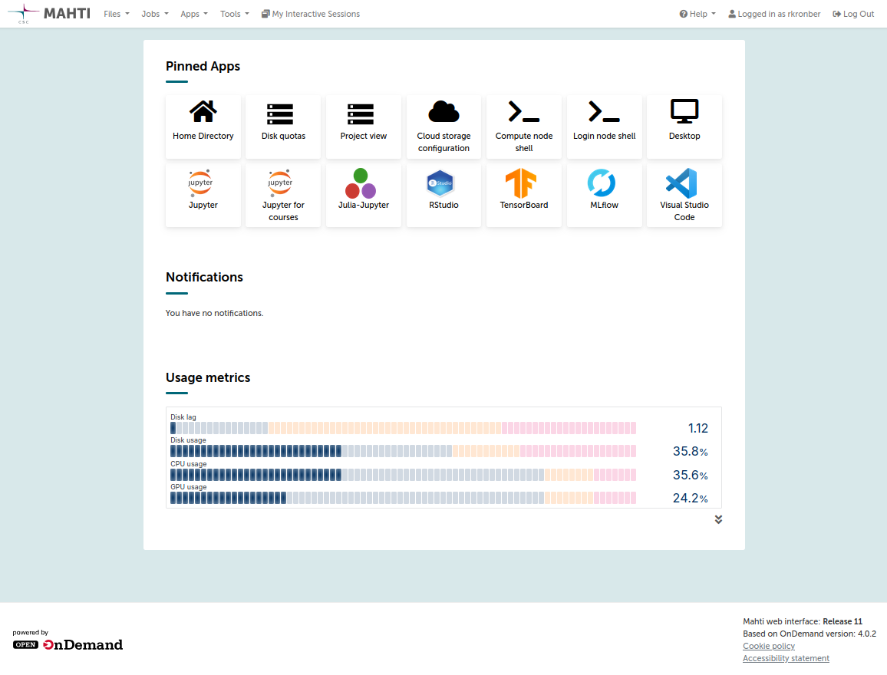

# Puhti web interface

## Intro

The Puhti web interface at [www.puhti.csc.fi](https://www.puhti.csc.fi) can be used to access the Puhti supercomputer 
using just a web browser. In the web interface you can:

- View, download and upload files
- Launch common graphical applications and connect to them directly from the browser
    - Jupyter
    - Rstudio
    - Visual Studio Code
    - and more
- Open a shell on the login node
- View running batch jobs

Everything still runs directly on Puhti, giving you all the resources and power
of a supercomputer, but easily accessible using just a web browser. 

!!! note
    The service is still in a beta state, and we are working on adding new features and generally improving the service. Please let us know if you experience any issues or have improvement suggestions. A link to a feedback form can be found on the frontpage of the web interface under the "Message of the day" or under the "Help" icon in the navbar.  

## Connecting

Go to [puhti.csc.fi](https:/puhti.csc.fi)using a web browser and login using your CSC user account (same username and password you use when connecting with `ssh`). 

After loggin in, you will see the front page.

From here you can browse your files on Puhti, start a shell, view running jobs and start one of the many available programs. The front page also contains important system information.  

## Available features

### Shell

The shell app can be found at the bottom of the page or on the top navbar under the _Tools_section. This will launch a normal linux shell on one of the Puhti login nodes. Note that the same rules apply here as during a normal ssh session. **Login node are only for light pre/post processing** (see [Usage policy](/computing/overview/#usage-policy)).

### Files

The file browser can be opened using the _Files_ section on the top navbar (this displays a list of all project disk areas), or using 
the shortcut to the home folder at the bottom of the front page. In the file browser
you can upload/download files, create new files and directories, or open a shell in the current directory. 

!!! note
    Uploaded files will overwrite exisisting files with the same name without prompting.
    Currently the maximum size for individual file upploads is 10GB

Clicking on a file will open it in view only mode, for more options like editing, renaming and deleting, use the button with three dots next to the filename.   

The file browser comes with a basic text editor. Some important notes on that:

- If no changes have been made, the _save_ button is grayed out.
- There is no _save-as_ feature
- If a read-only file is opened no indication will be given to the user but no changes will be applied

### Active jobs

Recent and running batch jobs can be viewed using the _Jobs_ section on the top navbar and selecting _Active jobs_. Here you can view the current status of the job and what kind of resources were requested. Deleting a running job will cancel the job. 

In the future it will become possible to submit batch jobs through the web interface, but for now the recommended way is to launch the jobs using `sbatch` from the shell.   

### Interactive apps

Interactive apps are programs that can be launched and run on the compute nodes and provide a web interface.
These are apps such as Jupyter Notebook, RStudio, Visual Studio Code and Rclone. 

If the interactive app does not start or does not work as expected you can delete the session and try to launch the app again.

#### Launching an interactive app

The interactive apps can be found in the navigation bar or on `My Interactive Sessions` page.
After selecting an interactive app from the list you will be presented with a form to configure the session.
After submitting the app form the app will be started and you will be able to connect to the application on the `My Interactive Sessions` page.

For a list of applications and specific instructions see [apps](apps.md)

### Project view

Using the project view under the _Tools_ section on the top navbar, you can view 
current disk and project billing unit quotas on Puhti. For more information see [project-view](project-view.md) 
