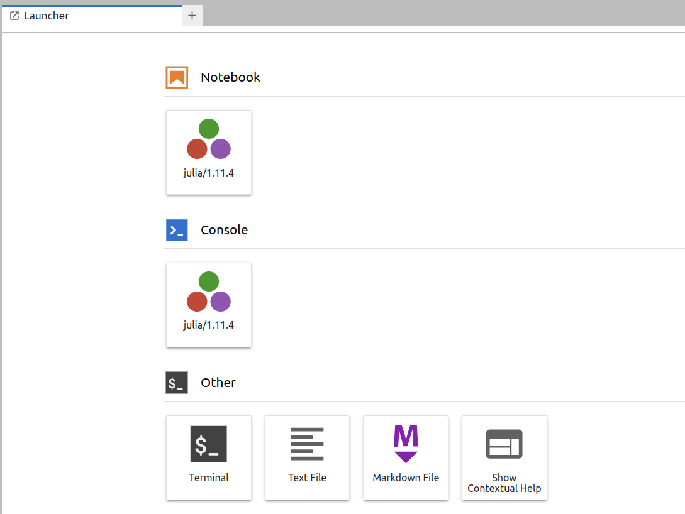

# Julia Jupyter

## Julia-Jupyter-sovelluksen valitseminen {#selecting-the-julia-jupyter-application}


Voimme käyttää [Juliaa](../../apps/julia.md) Jupyterissa
[Puhtin](https://www.puhti.csc.fi) ja [Mahtin](https://www.mahti.csc.fi) verkkoliittymien kautta valitsemalla valikosta **Julia-Jupyter**-sovelluksen.

## Julia-Jupyterin käynnistäminen {#launching-julia-jupyter}


Nyt meidän on valittava resurssit Julia-Jupyterin suorittamiseen. Ensimmäiseksi meidän on valittava projekti laskutusta varten ja osio laskentaresursseille.


Seuraavaksi meidän on asetettava halutut laskentaresurssit: CPU-ytimet, muisti, paikallinen levy ja aika.


Lopuksi meidän on valittava Jupyter-tyyppi. Suosittelemme käyttämään Jupyter Labia, mutta myös klassinen muistikirja on saatavilla. Työskentelyhakemisto asettaa Jupyterin juurihakemiston. Julia depot -hakemisto määrittelee sijainnin pakettiasennuksille, käännetyille tiedostoille ja muille Julian varastoille. Jos aiot asentaa suuren määrän Julian paketteja, suosittelemme käyttämään `/projappl` tai `/scratch` -hakemistoa `$HOME`-hakemiston sijaan, koska se saattaa ylittää kiintiön. Esimerkiksi Plots.jl asentaa yli 10 000 tiedostoa ja on melko suuri.

## Julian ytimen käynnistäminen {#starting-julia-kernel}



Kun käynnistämme ensimmäisen kerran Julia-Jupyter-istunnon, meillä ei ole saatavilla mitään Julian ytimiä. Kernelien asentamiseksi meidän on avattava *Terminal*-sovellus, ladattava Julia-moduuli ja suoritettava asennusskripti seuraavasti:

```bash
module load julia
install_ijulia_kernel.jl
```

Skripti asentaa [IJulia.jl](https://github.com/JuliaLang/IJulia.jl) ja ytimen Julia-versiolle, joka ladattiin moduulista. Nyt voimme sulkea terminaalin ja päivittää Launcher-ikkunan, jolloin meidän pitäisi nähdä asennettu Julia-ydin muistikirjavalikossa. Paina kuvaketta aloittaaksesi Julia-muistikirjan.

Huomaa, että Julian Jupyter-asennus on erillinen Pythonin Jupyter-asennuksesta eikä ole tarkoitettu muuhun käyttöön.