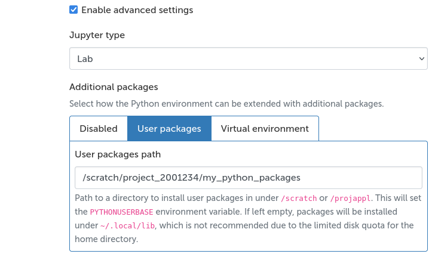
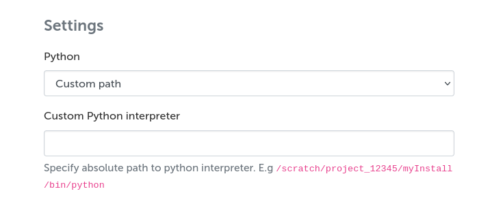

# Jupyter

The Jupyter interactive app launches a
[Jupyter computational notebook](../../apps/jupyter.md)
with the [IPython](https://ipython.readthedocs.io/en/stable/index.html)
kernel that is accessible through the [supercomputer web interface](./index.md).

In the app launch form you can define the Python environment,
Jupyter interface type (Jupyter Notebook or JupyterLab),
working directory as well as some more advanced settings.

For more information about working with different Python environments on Puhti
and Mahti, see our [Python application page](../../apps/python.md)
and [Python usage guide](../../support/tutorials/python-usage-guide.md).
Note that all the modules listed on the Python app page are not guaranteed to
work with the Jupyter interactive app. Additionally, installation of
Python packages works differently from the general instructions in
the usage guide.

### Currently supported Python environments

 - geoconda
 - python-data
 - pytorch
 - qiskit
 - tensorflow

## Installing packages

It is possible to install Python packages with `pip` inside an interactive Jupyter session. To do
this, you must enable either the *User packages* or the *Virtual environment* option under
*Additional packages*, and provide the desired installation path before launching the session. These
options are shown after enabling the *Enable advanced settings* option at the end of the form.

If you do not define an installation path, the packages will be installed under
`$HOME/.local/lib`. However, **this is not recommended** as the home directory
storage quota is limited.



To install packages to the defined user packages directory, use the following command in the notebook:  

```python
import sys 
!{sys.executable} -m pip install --user <package>
```

To install packages to a virtual environment you can use the command:  
`!{sys.executable} -m pip install <package>`

It is recommended to either use a virtual environment or set the Python user packages path to a directory under `/scratch` or `/projappl` when launching the app if you need to install packages.


## Customizing the environment
Custom Python environments can be created based on the Python modules or the system installed python.
The settings for customizing the Python environment are in the advanced settings in the app form.

To use a Python installation from a module that is not provided in the app form you can select
*Custom module* and enter your own modules in the *Custom Python module* field in the form.
If the *Custom Python module* field is left blank, the system Python will be used. Note that this
requires using virtual environments.


### Tykky installations


To use a Tykky installation with Jupyter, first [include Jupyter packages in your Tykky
installation](../containers/tykky.md#using-jupyter-with-a-tykky-installation). Then, open the Puhti
or Mahti web interface and navigate to the Jupyter app page. In the form, select the `Custom path`
option from the Python dropdown. Then, enter the full path to the Python interpreter of your Tykky
installation. So, if you created an installation with the command `conda-containerize new
--prefix=/scratch/proj/myInst env.yml` then the path to enter would be
`/scratch/proj/myInst/bin/python`.



### Virtual environment

You can create a virtual environment by enabling the *Virtual environment* option in the app form,
as seen in the [Installing packages section](#installing-packages), and providing desired path of
your virtual environment in the *Virtual environment path* field. The path should be under either
`/scratch` or `/projappl`. For example, `/scratch/<project>/<username>/<venv>`.

You can also create the virtual environment with your terminal by navigating to either `/scratch` or `/projappl` folder and then creating the environment with a command:   
`python -m venv --system-site-packages <venv>`      
Make sure to load the module you are planning to use before creating the virtual environment.

To launch a created virtual environment later you need to select the same Python module and provide the same virtual environment path as when creating the environment. In Jupyter you can check the virtual environment you are currently using by running a command `!echo $VIRTUAL_ENV` in your notebook.

To install packages in your virtual environment you can run the command `!{sys.executable} -m pip install <package>` in your Jupyter notebook.
The virtual environments are currently not completely isolated as they use packages from the loaded modules.


### Useful Jupyter commands
Remember to run `import sys` first.

| Functionality    | Command |
| -------- | ------- |
| Install package to user directory  | `!{sys.executable} -m pip install --user <package>`    |
| Install package to virtual environment | `!{sys.executable} -m pip install <package>`     |
| Check current venv    | `!echo $VIRTUAL_ENV`    |
