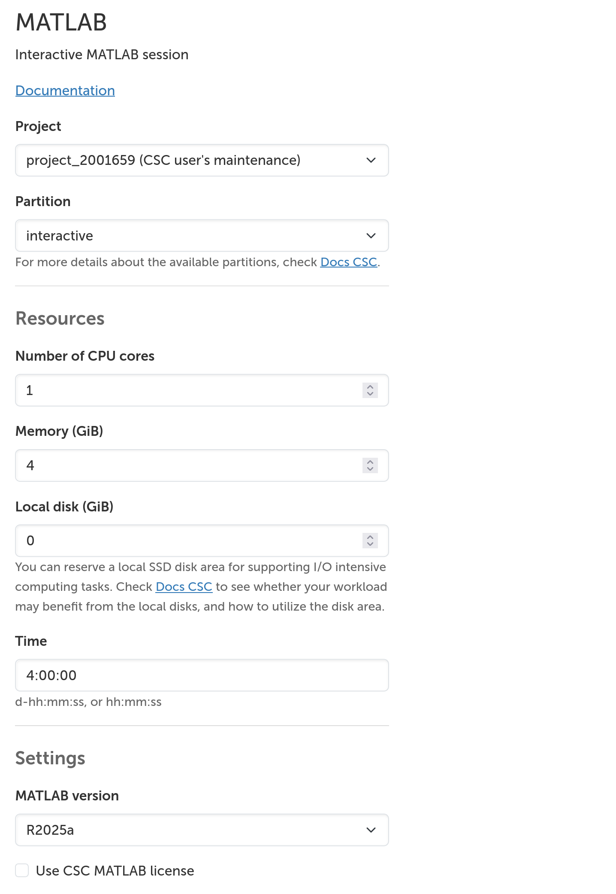
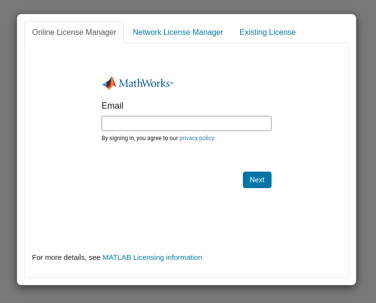

# MATLAB { #matlab }

Sovellus käynnistää MATLAB-istunnon määritetyillä resursseilla.
Puhtissa version voi valita mistä tahansa tuetuista moduuleista, ja Mahtissa käytetään versiota R2024b.

{ with="400" }

Puhtin MATLAB-sovelluksella voit käyttää CSC-lisenssiäsi. Mahtissa, tai jos CSC-lisenssiä ei ole valittu Puhtissa, sinun on kirjauduttava sisään MathWorks-tililläsi käyttääksesi omaa lisenssiäsi.

Tietoa MATLABin käytöstä ja saatavilla olevista versioista on [MATLABin dokumentaatiossa](../../apps/matlab.md).