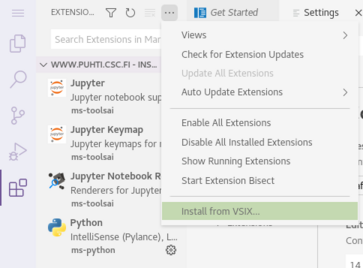

# Visual Studio Code
The Visual Studio Code interactive app can be used for editing and running code on Puhti or Mahti.
Make sure to load the correct modules before launching the session for the debugger to work correctly.

## Extensions
Extensions can be installed in the extensions tab in VSCode.
Dependencies for the extensions need to be loaded or installed for the extensions to work correctly.
E.g. the `go` module must be loaded before installing the `golang` extensions in VSCode.

## Python
Python environments can be loaded by loading the correct module before launching VSCode.
Make sure to select the correct Python version in the bottom bar of VSCode as the correct Python is not always selected automatically.

## C/C++
The C/C++ extension is not currently available in the extensions tab.
To install the extension:

1. Download the extension `.vsix` from [Visual Studio Marketplace](https://marketplace.visualstudio.com/items?itemName=ms-vscode.cpptools).
Select the *Linux x64* version.
2. Upload `ms-vscode.cpptools-1.x.x@linux-x64.vsix` to Puhti or Mahti, for example using the file browser in the web interface.
3. In the extensions tab in VS Code, click the three dots at the top to open a menu.
4. Click *Install from VSIX...*  
.
5. Navigate to the directory where you uploaded the `.vsix` file and select the file.

The compiler used can be selected when launching the interactive app.

Changing compiler between the Intel compiler and gcc in the workspace may cause issues.
Most of the problems can be solved by removing the launch and build configurations and creating them again.

## Julia Language
We can use the [**Julia Language**](../../apps/julia.md) by loading a Julia module, such as `julia/1.8.5`, when starting the VSCode session.
CSC has installed the [Julia for Visual Studio Code](https://www.julia-vscode.org/) extension to support Julia language features.

## Troubleshooting
If VSCode does not work properly you can clear the settings and launch the application again.
This can be done done by deleting the folder `~/.local/share/csc-vscode`.
