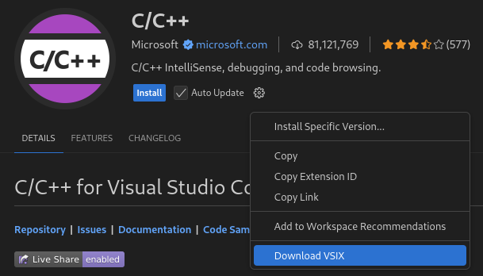

# Visual Studio Code
The Visual Studio Code interactive app can be used for editing and running code on Puhti or Mahti.
Make sure to load the correct modules before launching the session for the debugger to work correctly.

In the form, you will be able to select the VSCode version as well as any modules you would like to
use:
.

## Extensions
Extensions can be installed in the extensions tab in VSCode.
Dependencies for the extensions need to be loaded or installed for the extensions to work correctly.
E.g. the `go` module must be loaded before installing the `golang` extensions in VSCode.

## Python
In the application form you can select which Python module and version you would like to use in
VSCode. The available modules are the same as in the [Jupyter app](./jupyter.md).
Make sure to select the correct Python version in the bottom bar of VSCode, or when starting a
Jupyter notebook, as the correct Python is not always selected automatically.

## C/C++

The compiler used can be selected when launching the interactive app.
The C/C++ extension is not currently available in the extensions tab and must be manually installed.
Please check the [section below](#manual-installation-of-extensions) for instruction.

Changing compiler between the Intel compiler and gcc in the workspace may cause issues.
Most of the problems can be solved by removing the launch and build configurations and creating them again.

## Julia Language
We can use the [**Julia Language**](../../apps/julia.md) by loading a Julia module, such as `julia/1.8.5`, when starting the VSCode session.
CSC has installed the [Julia for Visual Studio Code](https://www.julia-vscode.org/) extension to support Julia language features.

## Manual installation of extensions

Due to licensing, the VSCode app in the web interface uses the
[Open VSX Registry](https://open-vsx.org/) for extensions, rather than the official
[Visual Studio Marketplace](https://marketplace.visualstudio.com). This means that some extensions
are not available in the extensions tab in VSCode. Some examples are the C/C++ and GithHub Copilot
extensions. However, installing these extensions manually from extension package files is possible.

To install the extension:

1. Open VSCode __on your local computer__, and open the page for the extension.
2. Click on the cog icon, and then on the *Download VSIX*. Note that if the extension is already
   installed, the download option may not be available.  
.
3. Select the *Linux x64* version in the menu that appears.
4. Upload the extension package, e.g. `ms-vscode.cpptools-1.x.x@linux-x64.vsix` to Puhti or Mahti,
   for example using the file browser in the web interface.
5. Open VSCode __in the web interface__ and navigate to the extensions tab.
6. In the extensions tab in VS Code, click the three dots at the top to open a menu.
7. Click *Install from VSIX...*  
.
8. Navigate to the directory where you uploaded the `.vsix` file and select the file.
9. If the installation was successful, you will be prompted to reload your session to activate the
   extension.

## Troubleshooting
If VSCode does not work properly you can clear the settings and launch the application again.
This can be done done by deleting the folder `~/.local/share/csc-vscode`.
