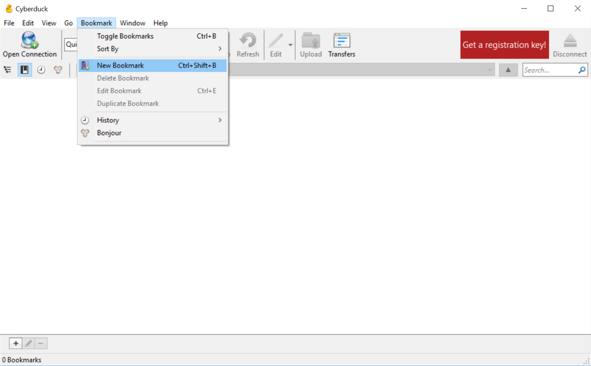
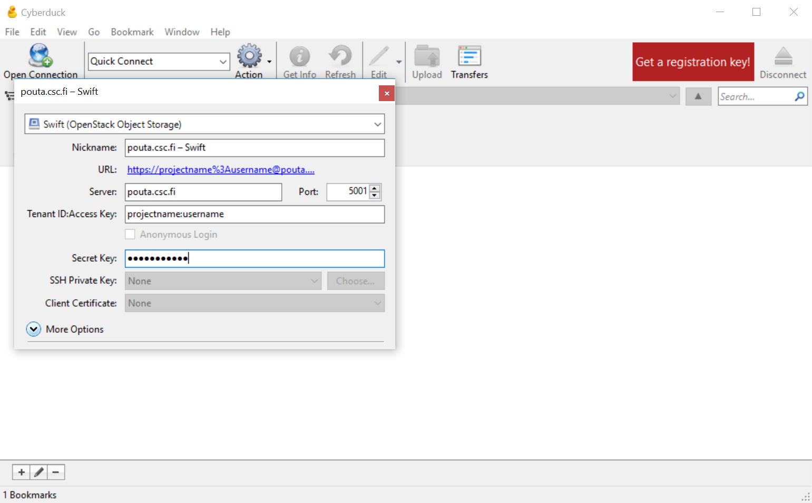
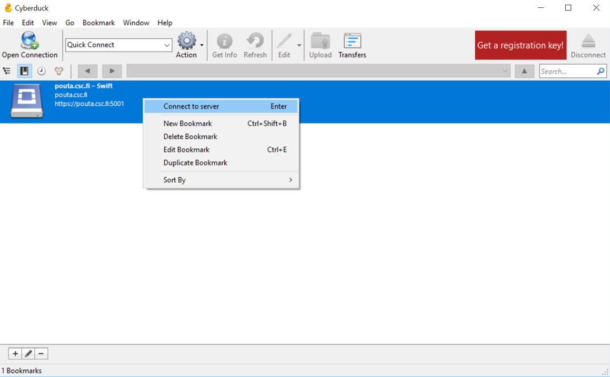

# Accessing Allas

&nbsp;


## Getting Access to Allas

Usage of **Allas** is based on CSC customer projects. To be able to use Allas you need to be a member in 
a CSC project that has permission to use Allas. If you do not have a CSC account, you must first register as a CSC user
and join or start a computing project for which Allas has been enabled. All these steps can be done in the
MyCSC user portal: [https://my.csc.fi]( https://my.csc.fi).

## Accessing Allas from Web

OpenStack Horizon web interface provides easy-to-use basic functions for data management in Allas:

[Web client - OpenStack Horizon Dashboard](./using_allas/web_client.md)


## Accessing Allas in CSC computing environment and other Linux platforms.

In order to use Allas in Puhti or Taito you must first load allas module:
```text
module load allas
```
After that you can open access to the Allas storage space of a specific project. This is done with command:
```text
allas-conf
```
or 
```text
allas-conf project_name
```
The allas-conf command above asks for your CSC password (the same that you use to login to CSC servers). After that it lists your projects in Allas and asks you to define the project that will be used (if you haven't defined the project name as an argument). After that allas-conf generates rclone configuration file for Allas service and autheticates the connection to the selected project in Allas. In one session you can have the connection open to only one Allas project at a time. The project that you are using in Allas does not need to match to the project you are using in Puhti or Taito and you can switch to another project by executing _allas-conf_ again. 

The authentication information is stored into shell variables OS_AUTH_TOKEN and OS_STORAGE_URL that are valid for max 3 hours. Hoverver you can refresh the authentication at any time my running _allas-conf_ again. The environment variables are available only for that login session, so if you log into Puhti in another session, you need to authenticate again in there to access Allas.

After opening you can start using Allas with one of the following options. Note that the tools utilize two different protocols: Swftt and S3. Data that is uploaded with one protocol is not necessary readable with another protocol. 
**Allas client software options for Puhti and Taito and other linux servers**

* **a-tools for basic usage:**(Swift protocol) [Quick and safe: a-commands](./using_allas/a_commands.md)
* **Advanced functions with rclone:**(Swift protocol) [Advanced tool: rclone](./using_allas/rclone.md)
* **A wide range of functionalities:**(Swift protocol) [Swift client](./using_allas/swift_client.md)
* **S3 client and persistent Allas connections:** (S3 protocol) [S3 client](./using_allas/s3_client.md#s3cmd-with-supercomputers)

The client software listed above can be used in other linux servers too, like a virtual machine running in cPouta or your own linux based laptop. However in that case you must install the client sofware and configure the connetion to Allas yourself. Instructions for this can be found the the home page of [allas-cli-utils](https://github.com/CSCfi/allas-cli-utils)

## Accessing Allas with Windows and Mac

With Windows and Mac we recommend the software [CyberDuck](https://cyberduck.io/). See the [list of functions](#cyberduck-functions) CyberDuck offers for data management.

The instructions below describe how to open a Swift protocol based Cybeduck conneition to Allas. With this setup Cybeduck is compatible with _rclone_, _swift_ and _a_tools_ but not with the s3cmd that is based on S3 protocol. For more information, see
    [directory object error](using_allas/directory_object_error.md).

1\. Install **CyberDuck**.

2\. Navigate to the CyberDuck mainmenu and choose **Bookmark | New Bookmark** (_Ctrl-Shift-B_).


**Figure** Creating a new bookmark

3\. In the first drop-down menu, choose _Swift (OpenStack Object Storage)_.

4\. As **Server**, write _pouta.csc.fi_ and choose **Port** _5001_. 

5\. In the section **Tenant ID:Access Key**, type (without spaces) first the desired _project's name_, then add "**:**" and after that your _Pouta username_ (this is the CSC user accout that you use in Puhti, Taito and cPouta ). Thus, it should be in form of *projectname:username*. For example, *project_123456:john*.

6\. Type your CSC password in the **Secret Key** part. After that, you can close the bookmark by clicking X on the upper right corner of the pop-up window.


**Figure** Filling the information for a bookmark

7\. Navigate to the top left corner to the icons under the _Open Connection_ and choose the **Bookmarks icon** (second from the left).
 
8\. Next, right-click with mouse the created bookmark and choose the option **Connect to server**.


**Figure** connecting to server

Now you should be able to see the content of your project (which might be empty).

### CyberDuck functions

CyberDuck offers some basic functionalities for managing data in object storage:


 * _Create_ buckets
 * _Upload_ objects
 * _List_ objects and buckets
 * _Download_ object and buckets
 * _Edit_ objects
 * _Edit_ metadata
 * _Share_ objects
 * _Remove_ objects and buckets


CyberDuck user interface is quite easy to use. The different data management options can be seen by either right-clicking the wanted bucket/object with mouse or choosing the bucket/object and then clicking the **Action** button on the menu bar. To navigate back to the previous directory use backspace. Feel free to explore and discover more about the possibilities of CyberDuck.


&nbsp;


