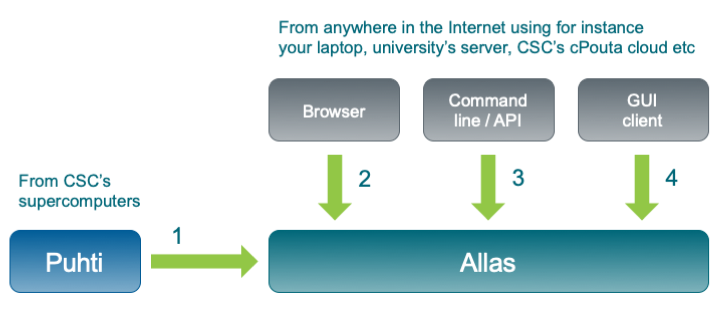

# Introduction to Allas storage service

&nbsp;

## What is Allas?

**Allas** is CSCs' general purpose storage server for research data. It is part of the CSC storage portfolio and it can be used from the CSC servers as well as from anywhere on the Internet. Allas can be used both for static research data that needs to be available for analysis as well as to collect and host data that is cumulating and/or changing from time to time. To be able to import data to Allas you must have a project at CSC. Allas can be used to host your data as long as your CSC project is active. 

From technical point of view, Allas is a modern object storage system - it comes with _S3_ and _Swift_ interfaces on _CEPH_ storage. In practice, this means that instead of files, the data is stored as objects within buckets. 
A bucket is simply a container for objects that may also include metadata describing the bucket. 

The stored objects can be of any data type, such as images or compressed data files. In general, you can think of objects as files. Object storage can be used for many different purposes. It has benefits but also limitations.

**Benefits**

 * The object storage can handle practically any static data.
 * The data can be accessed from anywhere using URL.
 * The data can have different levels of access control.

**Limitations**

 * You have to use specific tools to use object storage. Object storage cannot be properly mounted for local disk-like usage. There are some tools that can do this, but they have their limitations. For example, _svfs_ can be used to mount _Swift_ as filesystem, but it uses _FUSE_ which is slow.
 * Unsuitable for files that change constantly during their lifetime (e.g. most SQL databases).
 * The data cannot be modified while it is in Allas. It must be downloaded to a server for processing and then you can replace the previous version with the new one.
 * Files larger than 5 GB must be divided into smaller segments (normally this is done automatically during upload), see [Files larger than 5 GB](./using_allas/common_use_cases.md#files-larger-than-5-gb).

## Different flavors for using Allas

You cannot mount Allas direcly to a computer.  This means that in order to use Allas you need software tools to access it. There are four flavors of tools to access Allas:

1. In CSC computing environment (e.g. **Puhti**) you have ready-to-use tools, provided by CSC, to access Allas. These tools are mostly the same you could also install to any linux environment like a virtual machine in cPouta or local Linux server.  
In the CSC computing environment Allas should be used to store any data that needs to be preserved for longer than just few weeks. Supercomputer's own storage has a policy to delete idle data (see [Computing disk environment](../../computing/disk.md)), so your data must be moved to Allas after computing. 

2. WWW access to Allas is provided by the web interface of cPouta cloud environment [https://pouta.csc.fi](https://pouta.csc.fi). To access Allas with a browser you naturally do not have to install anything special on your computer, so this is by far the simplest way to access Allas. On the other hand, the browser user interface has a bunch of limitations compared to other access flavors, most notable are less performance and upload/download only a single file at the time. The instructions for accessing and using Allas with a browser can be found from [OpenStack Horizon web interface](./using_allas/web_client.md).

3. To access Allas with a GUI client you have to install a suitable GUI client in to your server/laptop. The client needs to be capable to use Swift or S3 access protocol. Instructions to use one such client can be found from [Accessing Allas with Windows and Mac](./accessing_allas.md#accessing-allas-with-windows-and-mac).

4. To access Allas with command-line commands you need to install Swift or S3 protocol supporting client software in to your server/laptop. This is the most flexible way to access Allas, but it requires more effort from you than other access flavors. Instructions to use one such client can be found from [Accessing Allas with Linux](./accessing_allas.md#accessing-allas-in-csc-computing-environment-and-other-linux-platforms).

In addition to these access flavors you can also see how to use Allas based on [Common Use Cases](./using_allas/common_use_cases.md).

&nbsp;

## Billing and Quotas

Allas usage is founded on project based storage quotas. The default quota for a new project is 10 TB, but that can be increased if needed. Allas is the preferred storage site for any large datasets in CSC environment, so you should not hesitate to request larger quota for Allas, if you need to work with larger data sets. 

All the project members have equal access rights to the storage area that has been granted for the project. In practice, this means that if one project member uploads data to Allas, all the other project members can read, edit and also delete the data. Allas itself does not store any information about who has uploaded the data to Allas.

The default quotas for every project are:

| Resource | Limit |
| :-------- |:------- |
| Storage amount | 10 TiB |
| Buckets per project | 1 000 |
| Objects per bucket | 500 000 |

Storing data in Allas consumes _billing units_. In Allas, the billing is based in the amount data stored in Allas. The rate is 1BU/TiBh meaning that 1 TB of data stored in allas consumes 24 BU in a day and 8760 Bu in a year.

Unlike most other object storage providers, CSC does <u>not</u> charge for object storage network transfers or API calls.

## Protocols

The object storage service is provided over two different protocols, _Swift_ and _S3_. From user perspective one of the main differences between S3 and Swift is in the authentication. The token based Swift authentication, used in Allas, remains valid for three hours at a time, but in the key based S3 the connection can stay permanently open. The permanent connection of S3 is handy in many ways, but it includes a security aspect too: if your server where you use Allas is compromised, the object storage space will be compromised too.

Because of this security concern, Swift is the recommended protocol to be used in many-user servers, such as Mahti and Puhti. Thus, for example, the CSC specific *a_commands* as well as the standard _rclone_ configuration in Puhti are based on Swift. However, in some cases the permanent connections provided by S3 protocol may be the most reasonable option, for example, in users own virtual machine running in cPouta.

Swift and S3 protocols are <u>not</u> compatible when handling objects. Small objects, that do not need to be splitted during upload, can be cross used, but splitted objects can be used only with the protocol that was used for the upload. The size limit for splitting an object depends on the settings and on the protocol. The limit is typically between 500 MB and 5 GB.

Below is a quick list of generic recommendations for selecting the protocol.
 
 * If you have a choice, use the _Swift_ protocol, it is better supported.
 * In any case, settle on one protocol. Do not mix _S3_ and _Swift_.
 * It is better to store a few large objects than a lot of small objects.

##Clients

Allas is used by a client softwar, that takes care of moving data to and from Allas and manging the data objects in Allas. There are several different clients software for accessing object storage servers. Allas can be used with any object storage clients that are compatible with Swift or S3 protocols. Below is just a short list of tools. There are more.

| Client | Usable | Chapter | Notes |
| :-------- | :-------: | :--------: | :------- |
| web client | Yes | [Link](./using_allas/web_client.md) | Use via [https://pouta.csc.fi](https://pouta.csc.fi). Provides basic functions. |
| a_commands | Yes | [Link](./using_allas/a_commands.md) | Provides easy-to-use tools for basic usage. Requires Rclone, Swift and OpenStack. |
| swift python-swiftclient | Yes | [Link](./using_allas/swift_client.md)| This is the recommended Swift client. |
| s3cmd	| Yes | [Link](./using_allas/s3_client.md) | This is the recommended S3 client. Use version 2.0.2 or later. |
| python-swift-library | Yes | [Link](./using_allas/python_library.md) |	| 
| rclone | Yes | [Link](./using_allas/rclone.md) | Useful with Supercomputers. |
| libs3	| Yes | | |	 	 
| python-openstackclient | Yes | | |
|aws-cli | Yes | | aws-cli and the boto3 python library. |
|curl | Yes | | Extremely simple to use with public objects and temporary URLs. |
|wget | Yes | | Same as curl. |

Below is a rough table summarizing the available operations with four of the clients. _Web client_ suits well for a basic user who manages with the simple basic functions. The *a_commands* offer easy-to-use functions for a basic user using Allas either from own computer or from supercomputer. Power users might want to consider the clients -rclone_, _Swift_ and _s3cmd_. The table shows only the most central functions of the power clients concerning data management in Allas, but feel free to explore more.

| | &nbsp;&nbsp;&nbsp; web client | &nbsp;&nbsp;&nbsp; a_commands | &nbsp;&nbsp;&nbsp;&nbsp; swift &nbsp;| &nbsp;&nbsp;&nbsp;&nbsp;&nbsp; s3cmd &nbsp;|
| :----- | :-----: | :----: | :-----: | :----: |
| Usage | _Basic_ | _Basic_ | _Power_ | _Power_ |
| **Create buckets** | &#x2714; | &#x2714; | &#x2714; | &#x2714; |
| **Upload objects** | &#x2714;&#8226; | &#x2714; | &#x2714; | &#x2714; |
| **List** | | | | |
| &nbsp;&nbsp;&nbsp;&nbsp;&nbsp;&nbsp; objects | &#x2714; | &#x2714; | &#x2714; | &#x2714; |
| &nbsp;&nbsp;&nbsp;&nbsp;&nbsp;&nbsp; buckets | &#x2714;  | &#x2714;  | &#x2714; | &#x2714;  |
| **Download** | | | | |
| &nbsp;&nbsp;&nbsp;&nbsp;&nbsp;&nbsp; objects | &#x2714;&#8226; | &#x2714; | &#x2714; | &#x2714; |
| &nbsp;&nbsp;&nbsp;&nbsp;&nbsp;&nbsp; buckets | | | &#x2714; | &#x2714; |
| **Remove** | | | | |
| &nbsp;&nbsp;&nbsp;&nbsp;&nbsp;&nbsp; objects | &#x2714; | &#x2714; | &#x2714; | &#x2714; |
| &nbsp;&nbsp;&nbsp;&nbsp;&nbsp;&nbsp; buckets | &#x2714;&#8226;&#8226; | &#x2714;&#8226;&#8226; | &#x2714; | &#x2714;&#8226;&#8226; |
| **Managing access rights** | | | | |
| &nbsp;&nbsp;&nbsp;&nbsp;&nbsp;&nbsp; public/private | &#x2714; | &#x2714; | &#x2714; | &#x2714; |
| &nbsp;&nbsp;&nbsp;&nbsp;&nbsp;&nbsp; read/write access &nbsp;&nbsp;&nbsp;&nbsp;&nbsp;&nbsp; to another project | | | &#x2714; | &#x2714; |
| &nbsp;&nbsp;&nbsp;&nbsp;&nbsp;&nbsp; temp URLs | | | &#x2714; | &#x2714; |
| **Move objects** | | | &#x2714; | &#x2714; |
| **Edit metadata** | | | &#x2714; | &#x2714; |
| **Upload large files** (over 5 GB) | | &#x2714; | &#x2714; | &#x2714; |
| **Download whole project** | | | &#x2714; | |
| **Remove whole project** | | | &#x2714; | |

&#8226; Only one object at a time

&#8226;&#8226; Only empty buckets

## System Characteristics

In Allas, the objects are stored in buckets. A bucket is simply a container for data objects. These buckets should not be confused with _dockers_, or other containers used for computing. A bucket basically acts like a filesystem directory, but you can have only one level of them, so you cannot have buckets within buckets.

**Figure** Data structure in Allas

Each bucket has a name, which must be unique across all Allas users. So, if somebody else has a bucket called "_test_", you cannot create a bucket called "_test_". All the bucket names are public, so please do <u>not</u> put private information in the bucket name. You may use, for example, your project id in the bucket name, such as _2000620-raw-data_.

URLs to objects can be in DNS format: _https://a3s.fi/bucketname/objectname_ - for this reason use a valid DNS name (RFC 1035) for the bucket. Specifically, we recommend not using upper case characters or Scandic letters (&auml;, &ouml;, etc.) in the bucket name.

## Naming buckets

Below is a short checklist concerning naming of a bucket.

**Checklist for naming a bucket:**

 * Do <u>not</u> use uppercase characters or Scandic letters (&auml;, &ouml;, etc.).
 * Do <u>not</u> include sensitive information (since the bucket names are public). 
 * Must be unique across all users (you may use your project id in the bucket name, for example, _2000620-raw-data_).
 * It is <u>not</u> possible to rename a bucket, so consider the name carefully. 

Data is spread across different servers, which protects against disk and server failures. **Please note:** This does not protect from e.g. accidental deletion, and you should still make backups of important data.

&nbsp;
