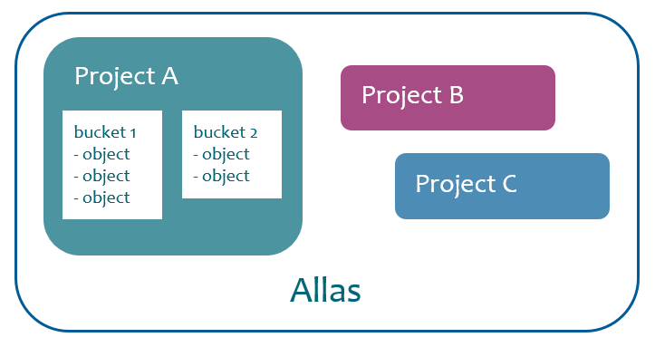

# Introduction to the Allas storage service

## What is Allas?

**Allas** is CSC's general purpose research data storage server. It is a part of the CSC storage portfolio and can be accessed on the CSC servers as well as from anywhere on the internet. Allas can be used both for static research data that needs to be available for analysis and to collect and host cumulating or changing data. A CSC project is required to import data to Allas. Allas can be used to host data for as long as the CSC project is active.

From the technical point of view, Allas is a modern object storage system. It comes with the _S3_ and _Swift_ interfaces on a _CEPH_ storage. In practice, this means that instead of files, the data is stored as objects in buckets. A bucket is a container for objects that may also include metadata describing the bucket.

The stored objects can be of any data type, such as images or compressed data files. In general, objects are similar to files. The object storage can be used for a variety of purposes. It has benefits but also limitations.

**Benefits**

 * The object storage can handle practically any static data.
 * The data can be accessed from anywhere using the URL.
 * The data can have different levels of access control.
 * The data can have lifecycle policy set.

**Limitations**

 * Specific tools are required to use the object storage. The object storage cannot be properly mounted for local disk-like usage. There are some tools that can do this, but they have their limitations. For example, _svfs_ can be used to mount _Swift_ as a file system, but it uses _FUSE_ which is slow.
 * It is unsuitable for files that change constantly during their lifetime (e.g. most SQL databases).
 * The data cannot be modified while it is in Allas. It must be downloaded to a server for processing, and the previous version replaced with a new one.
 * In case of swift protocol, files larger than 5 GB are divided into smaller segments. Normally, this is done automatically during the upload. See [Files larger than 5 GB](./using_allas/common_use_cases.md#files-larger-than-5-gb).

## Billing and quotas

Allas usage is based on CSC projects. All project members have equal access rights to the storage area that has been granted for the project. In practice, this means that if one project member uploads data to Allas, all other project members can also read, edit and delete the data. Allas itself does not store any information about who has uploaded the data to Allas.

The default quota for a new project is 10 TB, but that can be increased if needed. Allas is the preferred storage site for any large datasets in the CSC environment, so you should not hesitate to request a larger quota for Allas, if you work with larger data sets.

To increase your Allas quota, please send a request to: `servicedesk@csc.fi`
In the request, define what Allas project you are using, how large storage space is needed and what kind of data will be stored to Allas.

**The default quotas for projects:**

| Resource | Limit |
| :-------- |:------- |
| Storage amount | 10 TiB |
| Buckets per project | 1 000 |
| Objects per bucket | 500 000 |

The maximum for the "Objects per bucket" quota is 500 000. By exeeding the limit you might get your bucket in a situation where you can't make any operations. If you need more objects than this, please plan on spreading the objects across multiple buckets. Spreading data to multiple buckets will give a better performance whenever writing objects.

Storing data in Allas consumes _billing units_. In Allas, billing is based on the amount of data stored. The rate is 1 BU/TiBh, i.e. 1 TB of data stored in Allas consumes 24 BU in a day and 8760 BU in a year.

Unlike most other object storage providers, CSC does <u>not</u> charge for object storage network transfers or API calls.

## Different ways to use Allas

You cannot mount Allas direcly to a computer. This means that in order to use Allas, you need software tools to access it. There are four main ways to access Allas:

1. In the CSC computing environment (Puhti and Mahti), there are ready-to-use tools provided by CSC to access Allas. These tools are mostly the same that can also be installed in any Linux environment, e.g. a virtual machine in cPouta or a local Linux server.
In the CSC computing environment, Allas should be used to store any data that needs to be preserved for longer than a few weeks. The supercomputer's own storage has a policy to delete idle data, so the data must be moved to Allas after computing. See [Computing disk environment](../../computing/disk.md)

2. WWW access to Allas is provided by the web interface of the cPouta cloud environment [https://pouta.csc.fi](https://pouta.csc.fi). No special software is required to access Allas with a browser, making this the by far simplest way to access Allas. On the other hand, the browser user interface has a number of limitations compared to other clients, the most notable of which are lower performance and uploading/downloading only a single file at a time. Instructions for accessing and using Allas with a browser: [OpenStack Horizon web interface](./using_allas/web_client.md)

3. To access Allas with command line commands, client software supporting the _Swift_ or _S3_ protocol is required. This is the most flexible way to access Allas, but it requires more effort than other access methods. Instructions to use a command line client: [Accessing Allas with Linux](./accessing_allas.md#accessing-allas-in-the-csc-computing-environment-and-other-linux-platforms).

4. To access Allas with a GUI client, a suitable GUI client is required. The client needs to be capable to use the _Swift_ or _S3_ access protocol. Instructions to use a GUI client: [Accessing Allas with Windows and Mac](./accessing_allas.md#accessing-allas-with-windows-or-mac).

See also the [common use cases](./using_allas/common_use_cases.md).

## Protocols

The object storage service is provided over two different protocols, _Swift_ and _S3_. From the user perspective, one of the main differences between S3 and Swift is authentication. The token-based Swift authentication used in Allas remains valid for eight hours at a time, but in the key-based S3, the connection can stay permanently open. The permanent connection of S3 is practical in many ways, but it includes a security aspect: if the server where Allas is used is compromised, the object storage space will be compromised as well.

Due to this security concern, Swift is the recommended protocol for multiple-user servers such as Mahti and Puhti. Thus, for example, the CSC-specific _a-commands_, as well as the standard _rclone_ configuration in Puhti and Mahti, are based on Swift. However, in some cases, the permanent connections provided by the S3 protocol may be the most reasonable option, for example, in personal virtual machines running in cPouta.

The Swift and S3 protocols are <u>not</u> mutually compatible when handling objects. For small objects that do not need to be split during the upload, the protocols can be used interchangeably, but split objects can be accessed only with the protocol that was used for uploading them. The size limit for splitting an object depends on the settings and protocol. The limit is typically between 500 MB and 5 GB.

Generic recommendations for selecting the protocol:

 * If possible, use the _Swift_ protocol. It is better supported.
 * In any case, choose only one of the protocols. Do not mix _S3_ and _Swift_.
 * It is better to store a few large objects than many small objects.
 * Using over 100 GB objects may cause problems because of long upload/download times.

## Clients

Allas is accessed via a client software that takes care of moving data to and from Allas and managing data objects. There are several different kinds of client software for accessing the object storage servers. Allas can be used with any object storage client that is compatible with the Swift or S3 protocol.

| Client | Notes |
| :-------- | :------- |
| [web client](./using_allas/web_client.md) | Use via [https://pouta.csc.fi](https://pouta.csc.fi). Provides basic functions. |
| [SD Connect](../sensitive-data/sd_connect.md) | Sensitive data orinented [Web interface for Allas](https://sd-connect.csc.fi). |
| [a-commands](./using_allas/a_commands.md) | Provides easy-to-use tools for basic use. Requires Rclone, Swift and OpenStack. |
| [swift python-swiftclient](./using_allas/swift_client.md)| The versatile Swift client. |
| [s3cmd](./using_allas/s3_client.md) | The versatile S3 client (version 2.0.2 or later). |
| [Python with S3](./using_allas/python_boto3.md) |	Programmatic access. |
| [Python with SWIFT](./using_allas/python_swift.md) |	Programmatic access. |
| [rclone](./using_allas/rclone.md) | Versatile command line tool for both Swift and S3 protocols |
| libs3	| |
| python-openstackclient | |
| aws-cli | aws-cli and the boto3 Python library. |
| curl | Extremely simple to use with public objects and temporary URLs. |
| wget | The same as curl. |

### Client operations

A _web client_ is suitable for using the basic functions. *a-commands* offer easy-to-use functions for using Allas either via a personal computer or supercomputer. Power users might want to consider the clients _rclone_, _Swift_ and _s3cmd_. The table displays the core functions of the power clients concerning data management in Allas.

| | web client | a-commands | rclone | Swift | s3cmd |
| :----- | :-----: | :----: | :----: | :-----: | :----: |
| Usage | _Basic_ | _Basic_ | _Power_ |_Power_ | _Power_ |
| **Create buckets** | &#x2714; |&#x2714; | &#x2714; | &#x2714; | &#x2714; |
| **Upload objects** | &#x2714;&#8226; | &#x2714; | &#x2714; | &#x2714; | &#x2714; |
| **List** | | | | | |
| &nbsp;&nbsp;&nbsp;&nbsp;&nbsp;&nbsp; objects | &#x2714; | &#x2714; | &#x2714; | &#x2714; | &#x2714; |
| &nbsp;&nbsp;&nbsp;&nbsp;&nbsp;&nbsp; buckets | &#x2714;  | &#x2714;| &#x2714;  | &#x2714; | &#x2714;  |
| **Download** | | | | |
| &nbsp;&nbsp;&nbsp;&nbsp;&nbsp;&nbsp; objects | &#x2714;&#8226; |&#x2714; | &#x2714; | &#x2714; | &#x2714; |
| &nbsp;&nbsp;&nbsp;&nbsp;&nbsp;&nbsp; buckets | | |&#x2714; | &#x2714; | &#x2714; |
| **Remove** | | | | | |
| &nbsp;&nbsp;&nbsp;&nbsp;&nbsp;&nbsp; objects | &#x2714; | &#x2714; | &#x2714; | &#x2714; | &#x2714; |
| &nbsp;&nbsp;&nbsp;&nbsp;&nbsp;&nbsp; buckets | &#x2714;&#8226;&#8226; | &#x2714; | &#x2714; | &#x2714; | &#x2714;&#8226;&#8226; |
| **Managing access rights** | | | | |
| &nbsp;&nbsp;&nbsp;&nbsp;&nbsp;&nbsp; public/private | &#x2714; | &#x2714;| | &#x2714; | &#x2714; |
| &nbsp;&nbsp;&nbsp;&nbsp;&nbsp;&nbsp; read/write access &nbsp;&nbsp;&nbsp;&nbsp;&nbsp;&nbsp; to another project | | &#x2714; | | &#x2714;| &#x2714; |
| &nbsp;&nbsp;&nbsp;&nbsp;&nbsp;&nbsp; temp URLs | | | | &#x2714; | &#x2714; |
| **Set lifecycle policies** | | | | | &#x2714; |
| **Move objects** | | | | &#x2714; | &#x2714; |
| **Edit metadata** | | | | &#x2714; | &#x2714; |
| **Download whole project** | | | &#x2714; | &#x2714; | |
| **Remove whole project** | | | &#x2714; | &#x2714; | |

&#8226; Only one object at a time

&#8226;&#8226; Only empty buckets

## System characteristics

In Allas, objects are stored in buckets. A bucket is a data object container. Buckets should not be confused with _dockers_ or other computing containers. A bucket functions similarly to a file system directory, except that there can only be one level, i.e. buckets cannot contain other buckets.

**Figure** Data structure in Allas

## Naming buckets

Each bucket has a name that must be unique across all Allas users. If another user has a bucket called "_test_", another bucket called "_test_" cannot be created. All bucket names are public, so please do <u>not</u> include any confidential information in the bucket names. You may, for example, use your project ID, e.g. _2000620-raw-data_.

Object URLs can be in the DNS format, e.g. _https://a3s.fi/bucketname/objectname_. Please use a valid DNS name (RFC 1035). We recommend not using upper case or non-ASCII (&auml;, &ouml; etc.) characters.

It is <u>not</u> possible to rename a bucket.

The data is spread across various servers, which protects against disk and server failures. **Please note:** This does not protect the data from e.g. accidental deletion. Please make regular backups of important data.
