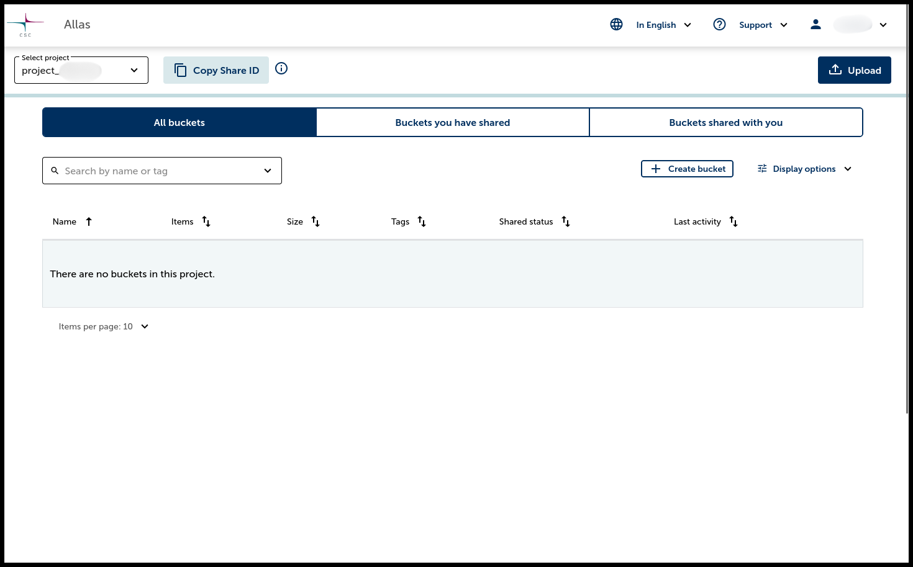

# Allas Web UI

Allas Web UI tarjoaa helppokäyttöisen selainpohjaisen käyttöliittymän CSC:n objektitallennuspalveluun, Allakseen.

## Aloittaminen {#getting-started}

1. Siirry osoitteeseen [https://allas.csc.fi](https://allas.csc.fi) ja kirjaudu sisään.
2. Valitse projektisi **Select Project** -alasvetovalikosta.

=== "Login Page"
    { width=80% }

=== "Main Page"
    { width=80% }

## Säiliön luominen {#creating-a-bucket}

Säiliö (bucket) on säilytysastia tiedostoillesi (objekteille). Luo säiliö seuraavasti:

1. Napsauta **Create bucket**.
2. Syötä säiliölle nimi (nimeä ei voi muuttaa myöhemmin. Katso [nimisäiliön nimeämisen tarkistuslista](../introduction.md#naming-buckets)).
3. (Valinnainen) Lisää tunnisteita (tagit) säiliön järjestelyä ja hakua varten.
4. Napsauta **Save**.

{ width=80% }
 Uuden säiliön luominen

## Objektien lataaminen {#uploading-objects}

Voit ladata objekteja kahdella tavalla:

### Lataaminen pääsivulta {#uploading-from-the-main-page}
1. Napsauta **Upload**-painiketta kojetaululla (dashboard).
2. Syötä säiliön nimi (nimeä ei voi muuttaa myöhemmin. Katso [nimisäiliön nimeämisen tarkistuslista](../introduction.md#naming-buckets)).
3. Valitse / "raahaa ja pudota" objekteja ja napsauta **Upload**.
4. Uusi säiliö, joka sisältää objektit, luodaan.

### Lataaminen olemassa olevaan säiliöön {#uploading-to-an-existing-bucket}
1. Napsauta olemassa olevaa säiliötä.
2. Paina **Upload**-painiketta.
3. Valitse / "raahaa ja pudota" objekteja ja napsauta **Upload** tallentaaksesi ne valittuun säiliöön.

=== "Uploading from the main page"
    { width=80% }

=== "Uploading to an existing bucket"
    { width=80% }

## Säiliöiden tarkastelu ja hallinta {#viewing-and-managing-buckets}

Kun olet luonut säiliöitä ja ladannut objekteja, voit tarkastella ja hallita niitä helposti.

1. Pääkojetaululla näkyvät kaikki säiliösi.
2. Napsauta säiliön nimeä nähdäksesi sen sisällön.
3. Käytä **[Download](#downloading-objects-and-buckets)**-, **[Share](#sharing-a-bucket)**- tai **Options** (*[Copy](#copying-a-bucket)*, *Edit tags*, *[Delete](#removing-objects-and-buckets)*) -painikkeita säiliöihin ja objekteihin kohdistuviin toimintoihin.

{ width=80% }
 Säiliöiden hallinta Allaksessa

## Säiliön jakaminen {#sharing-a-bucket}

Säiliön jakaminen onnistuu seuraavasti:

1. **Hanki Share ID**:
    - Jos jaat toisen omistamasi projektin kanssa: Vaihda kyseiseen projektiin, paina **Copy Share ID**, ja palaa alkuperäiseen projektiisi.
    - Jos jaat toisen käyttäjän projektille: Pyydä, että hän kopioi oman Share ID:nsa ja lähettää sen sinulle.
2. Etsi haluamasi jaettava säiliö, napsauta **Share** ja liitä kopioitu Share ID.
3. **Valitse käyttöoikeudet**:
    - **Transfer data**: Sallii lataamisen ja kopioimisen.
    - **Collaborate**: Sallii lataamisen ja poistamisen.
    - **View**: Vain lukuoikeus.
4. Paina **Share** viimeistelläksesi jaon.
5. Näet itse jakamasi säiliöt **Buckets you have shared** -välilehdellä.
6. Näet sinulle jaetut säiliöt **Buckets shared with you** -välilehdellä.

**Huom:** Voit koska tahansa poistaa säiliön jaon napsauttamalla **Share** ja painamalla **Delete**.

=== "Sharing Permissions"
    { width=80% }

=== "Buckets You Have Shared"
    { width=80% }

## Säiliön kopioiminen {#copying-a-bucket}

**Käyttötapaus**: Jos haluat säilyttää säiliön tiedot esimerkiksi testauksen tai muokkauksen ajaksi, voit kopioida säiliön ja työskennellä kopion kanssa ilman, että alkuperäinen muuttuu.

Kopioi säiliö seuraavasti:

1. Napsauta **Options**-painiketta halutun säiliön vieressä.
2. Valitse **Copy**.

## Objektien ja säiliöiden lataaminen {#downloading-objects-and-buckets}

!!! warning ""
    Yli **5 GiB** kokoisten säiliöiden tai kansioiden lataamista ei tällä hetkellä tueta. Isompia latauksia varten suosittelemme käyttämään **[Command Line Tools](./rclone.md)** -työkaluja.

1. Napsauta **Download**-painiketta säiliön tai objektin vieressä.
2. Tiedosto tallennetaan koneellesi.

## Objektien ja säiliöiden poistaminen {#removing-objects-and-buckets}

- **Säiliöt**: Tyhjennä säiliö ensin, sitten napsauta **Options** > **Delete** säiliön vieressä.
- **Objektit**: Napsauta **Delete** objektin vieressä.