# Allas Web UI

Allas Web UI provides a simple-to-use web user interface for CSC Object Storage service, Allas.

## Getting Started

1. Go to [https://allas.csc.fi](https://allas.csc.fi) and log in.
 > [MFA required] Since November 25th 2025

 - Multi Factor Authentication (MFA) is required when logging in. For more information, visit the [Multi-Factor Authentication (MFA) Guide](../../../accounts/mfa.md)
2. Select your project from the **Select Project** dropdown menu.

=== "Login Page"
    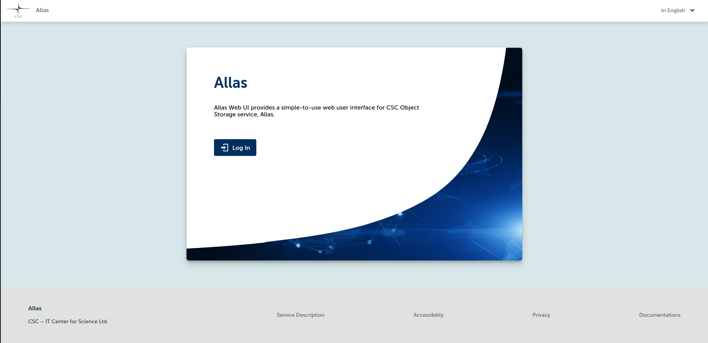{ width=80% }

=== "Main Page"
    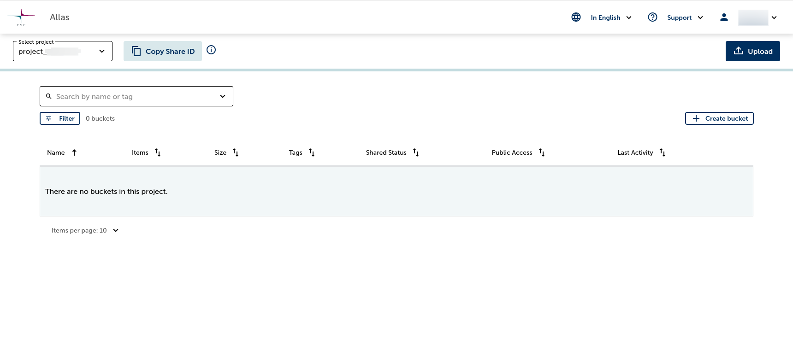{ width=80% }

## Creating a Bucket

A bucket is a storage container for your objects. Follow these steps to create one:

1. Click on **Create bucket**.
2. Enter a bucket name (names cannot be modified later. See the [checklist for naming a bucket](../introduction.md#naming-buckets-and-objects)).
3. (Optional) Add tags for better organization and search abilities.
4. Click **Save**.

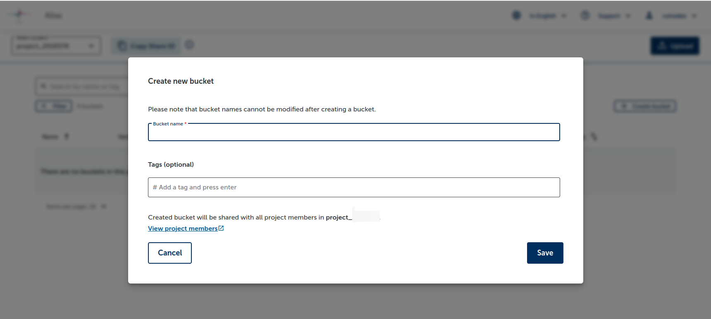{ width=80% }
 Creating a new bucket

## Uploading Objects

You can upload objects in two ways:

### Uploading from the main page:
1. Click the **Upload** button on the dashboard.
2. Enter a bucket name (names cannot be modified later. See the [checklist for naming a bucket](../introduction.md#naming-buckets-and-objects)).
3. Select / "Drag & Drop" objects and click **Upload**.
4. A new bucket with the specified name will be created and the selected objects uploaded into it.

### Uploading to an existing bucket:
1. Click on an existing bucket.
2. Press the **Upload** button.
3. Select / "Drag & Drop" objects and click **Upload** to store them in the chosen bucket.

=== "Uploading from the main page"
    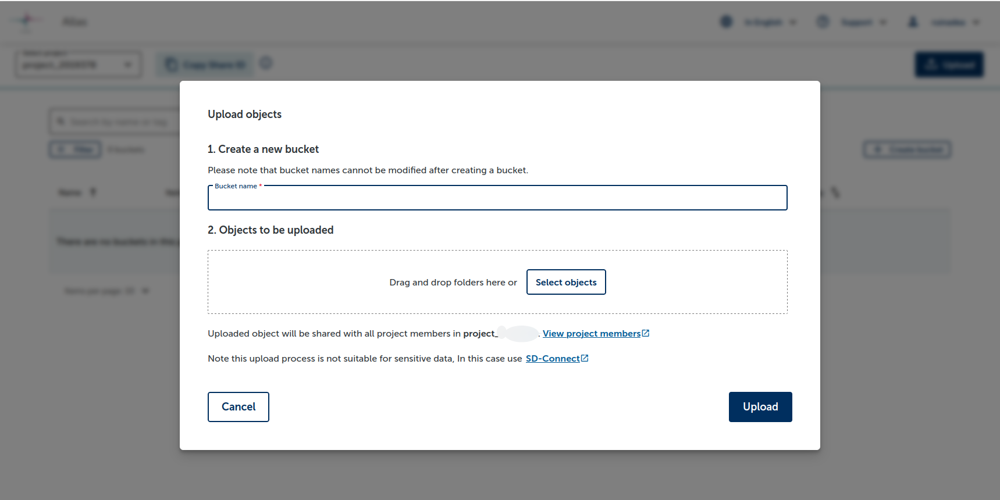{ width=80% }

=== "Uploading to an existing bucket"
    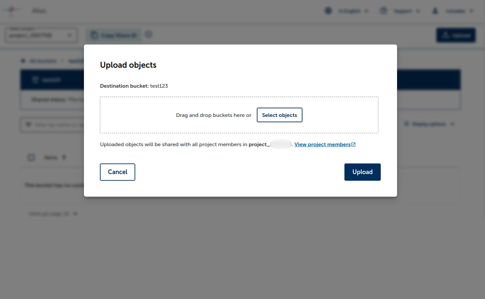{ width=80% }

## Viewing and Managing Buckets

After creating buckets and uploading objects, you can view and manage them easily.

1. The main dashboard lists all your buckets.
2. Click on a bucket name to view its contents.
3. Use the **[Download](#downloading-objects-and-buckets)**, **[Share](#sharing-a-bucket)**, **[Copy](#copying-a-bucket)** or **Options** (*Edit tags*, *[Delete](#removing-objects-and-buckets)*) buttons for actions on objects and buckets.

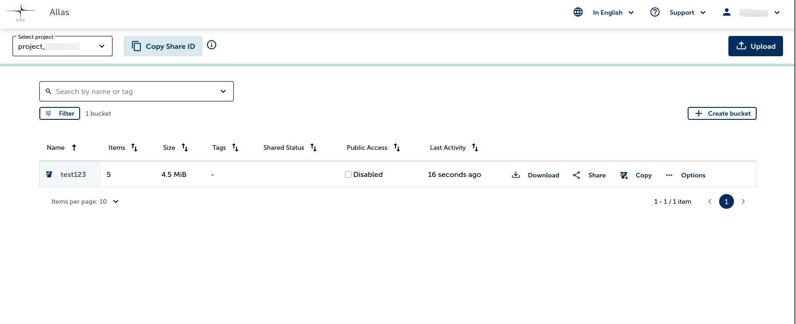{ width=80% }
 Managing buckets in Allas

## Previewing Objects

You can preview the objects inside your bucket without the need to download them. Simply press on the object name and the browser will open it in a new tab.

!!! note "Preview depends on object Content Type"

    The browser will preview the object only if the content type is supported.
    If it is not supported, the object will be downloaded instead.

    You can see your object's content type by pressing the **[Info](#object-info)** button.

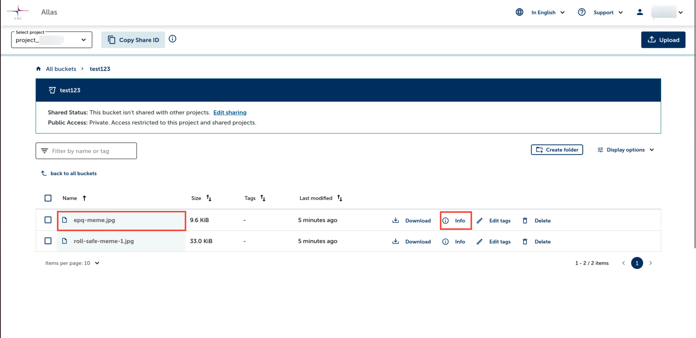{ width=80% }
 Preview an object

## Object Info

By pressing the **Info** button you can see the following info for the object / folder:

- Name
- Size
- Full Path
- Content Type
- ETag
- Last Modified Date
- *Creation Date
- *Checksum (SHA-256)

Creation date and checksum are available only for objects uploaded via this UI. 

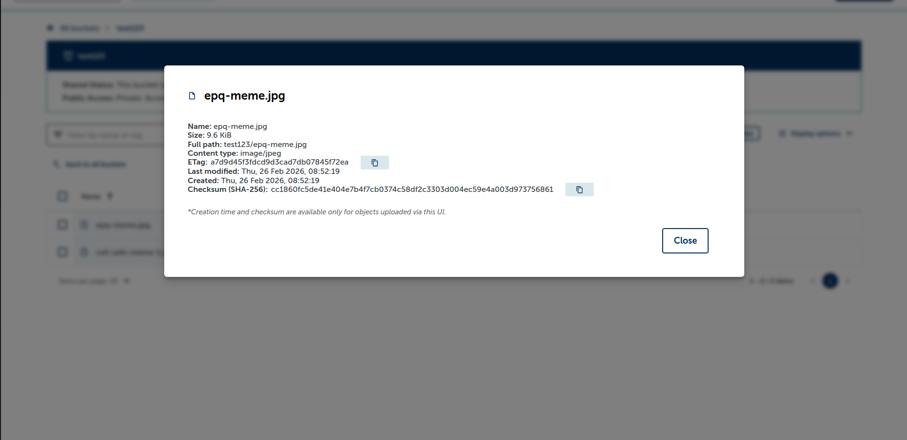{ width=80% }
 Object info

## Making Buckets Public    

Making a bucket public means that every file and directory on the bucket will be accessible without any kind of authentication from anywhere on the internet using the HTTPS protocol.

!!! warning "Public access"
    Anyone with the URL can access all objects in a public bucket.
    Do not store sensitive or personal data in public buckets.

1. On the main dashboard you can see the `Public Access` column.
2. Click the checkbox to make the bucket public.
3. Press on the link. This will open a new tab with the public URL. 
4. Append the file name to the URL to see it publicly.
5. Check again the checkbox to make the bucket private.

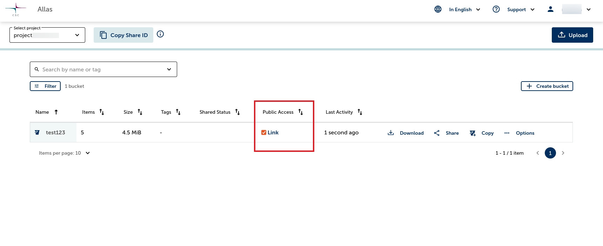{ width=80% }
 Making a bucket public

## Sharing a Bucket

To share a bucket, follow these steps:

1. **Obtain the Share ID**:
    - If you are sharing with another project you own: Switch to that project, press **Copy Share ID**, then return to your original project.
    - If you are sharing with another user's project: Ask them to copy their Share ID and send it to you.
2. Look for the bucket you want to share, click **Share**, and paste the copied Share ID.
3. **Select the permissions**:
    - **Transfer data**: Allows downloading and copying.
    - **Collaborate**: Allows uploading and deleting.
    - **View**: Read-only access.
4. Click **Share** to finalize the process.
5. You can see the buckets you have shared under the **Buckets you have shared** tab.
6. You can see buckets shared with you under the **Buckets shared with you** tab.

**Note:** You can always remove a share of a bucket by clicking **Share** and pressing **Delete**.

=== "Sharing Permissions"
    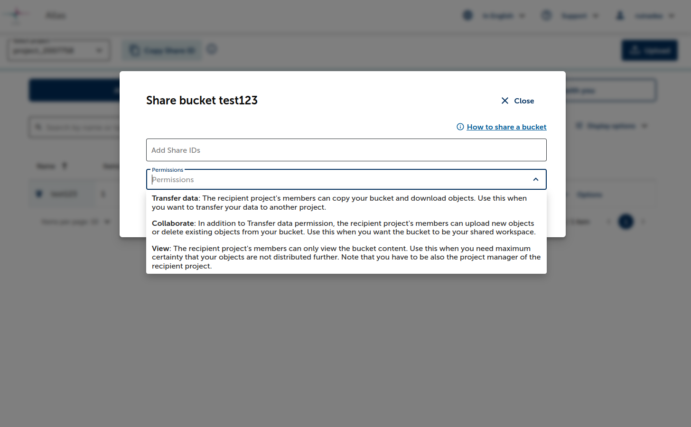{ width=80% }

=== "Buckets You Have Shared"
    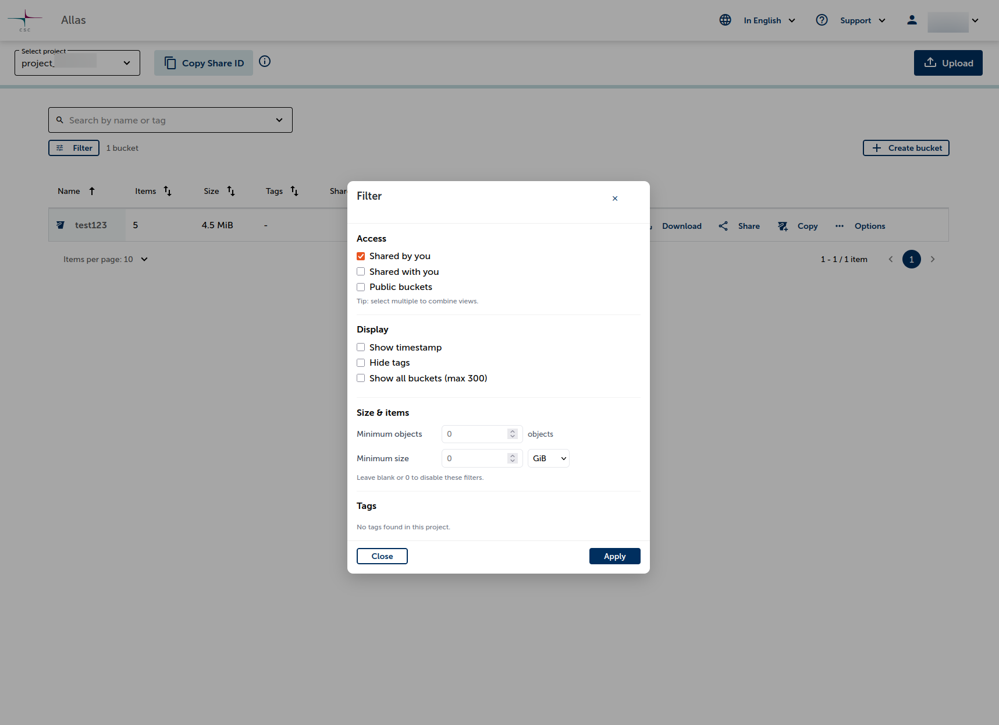{ width=80% }

## Copying a Bucket

**Use Case**: If you want to preserve the data in a bucket while performing tests or modifications, you can copy it and work on the duplicate without affecting the original.

To copy a bucket:

1. Click on the **Copy** button next to the bucket.
2. Add a new name and tags if wanted.

## Creating Subfolders Inside a Bucket

You can create subfolders inside a bucket in two ways:

1. "Drag & Drop" empty folders when [uploading](#uploading-objects).
2. Inside the bucket view click **Create folder** and name your subfolder.

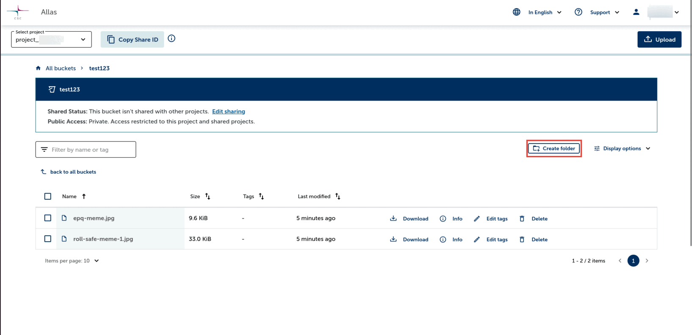{ width=80% }
 Creating an empty folder

## Downloading Objects and Buckets

!!! warning ""
    Downloading buckets or folders larger than **5 GiB** is currently not supported. For larger downloads, consider using the **[Command Line Tools](../accessing_allas.md#commandline-tools)** instead.

1. Click the **Download** button next to the Bucket / Object.
2. The file or archive will be saved to your local system.

## Removing Objects and Buckets

- **Buckets**: Click **Options** > **Delete** next to the bucket.
- **Folders**: Click **Delete** next to a folder.
- **Objects**: Click **Delete** next to an object.

## FAQ (Frequently Asked Questions)

---

### Why does preview download the file instead of showing it?

The preview feature depends on the object’s **Content Type**.  
If the content type is not supported by the browser, the file will be downloaded rather than displayed.

You can check the content type of an object by clicking the **Info** button.  
Common previewable types include images, PDFs, and text files.

---

### Why does the public URL download the file instead of showing it?

Public access uses the same content type rules as previewing.  
If the object’s content type is not supported by the browser, it will be downloaded automatically when accessed via the public URL.

To enable in-browser viewing, ensure the object has the correct content type set during upload.

---

### A bucket is shared with me. Why can’t I make it public or remove its public access?

Only the **bucket owner** can change public access settings.  
If a bucket is shared with you, you can only perform actions allowed by the permissions granted by the owner.

---

### Why can’t I rename a bucket?

Bucket names are permanent and cannot be modified after creation.  
This is a limitation of object storage systems and helps ensure consistent addressing of data.

If you need a different name, copy the bucket and give the copy a new name.

---

### Why can’t I download buckets or folders larger than 5 GiB?

The web interface currently has a **5 GiB download limit** for buckets and folders. 
For larger downloads, use the **Command Line Tools**, which are designed for large-scale data transfers.

This limitation will be removed in the upcoming S3 version.

---

### Why don’t I see the creation date or the checksum for some objects?

The creation date and the checksum information are available **only for objects uploaded via the Allas Web UI**.  
Objects uploaded using other tools (such as command line clients) may not include this metadata.

---

### Can I make only a single file public instead of the whole bucket?

No. Public access is applied at the **bucket level**.  
When a bucket is made public, all objects and folders inside it become publicly accessible.

If you need to share only specific files, consider copying them into a separate bucket.

---

### Why can’t I upload files to a bucket shared with me?

Uploading requires **Collaborate** permissions.  
If the bucket owner has shared the bucket with **View** or **Transfer data** permissions only, uploading and deleting objects will not be allowed.

---