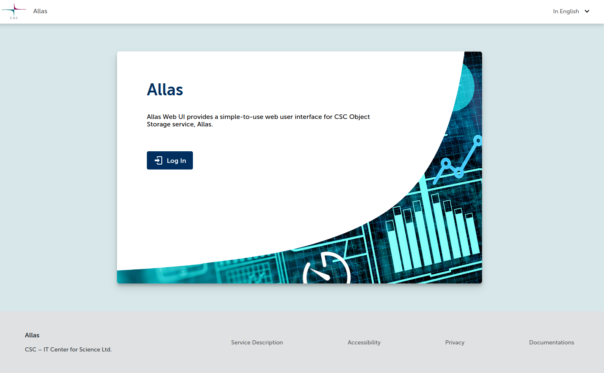
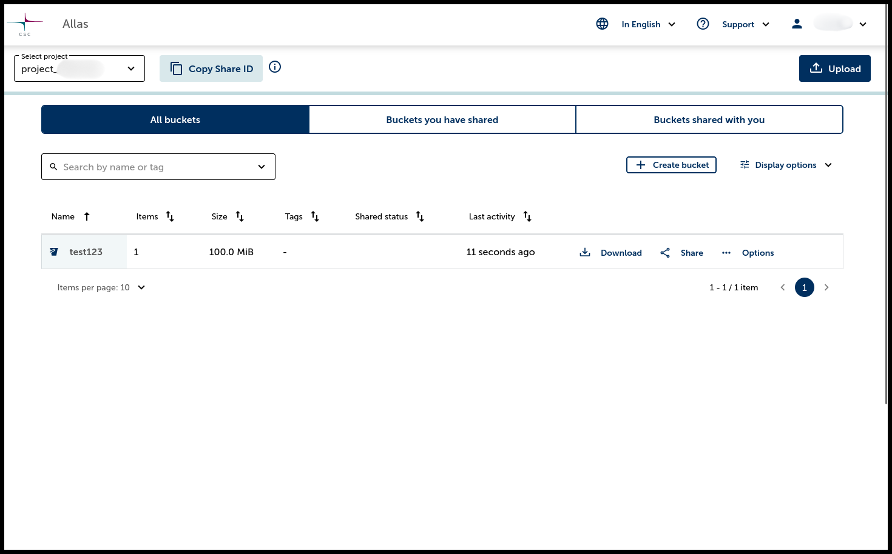

# Allas Web UI

Allas Web UI provides a simple-to-use web user interface for CSC Object Storage service, Allas.

## Getting Started

1. Go to [https://allas.csc.fi](https://allas.csc.fi) and log in.
 > [MFA required] Since November 25th 2025

 - Multi Factor Authentication (MFA) is required when login. For more information, visit the [Multi-Factor Authentication (MFA) Guide](../../../accounts/mfa.md)
2. Select your project from the **Select Project** dropdown menu.

=== "Login Page"
    { width=80% }

=== "Main Page"
    { width=80% }

## Creating a Bucket

A bucket is a storage container for your objects. Follow these steps to create one:

1. Click on **Create bucket**.
2. Enter a bucket name (names cannot be modified later. See the [checklist for naming a bucket](../introduction.md#naming-buckets-and-objects)).
3. (Optional) Add tags for better organization and search abilities.
4. Click **Save**.

{ width=80% }
 Creating a new bucket

## Uploading Objects

You can upload objects in two ways:

### Uploading from the main page:
1. Click the **Upload** button on the dashboard.
2. Enter a bucket name (names cannot be modified later. See the [checklist for naming a bucket](../introduction.md#naming-buckets-and-objects)).
3. Select / "Drag & Drop" objects and click **Upload**.
4. A new bucket containing the objects will be created. 

### Uploading to an existing bucket:
1. Click on an existing bucket.
2. Press the **Upload** button.
3. Select / "Drag & Drop" objects and click **Upload** to store them in the chosen bucket.

=== "Uploading from the main page"
    { width=80% }

=== "Uploading to an existing bucket"
    { width=80% }

## Viewing and Managing Buckets

After creating buckets and uploading objects, you can view and manage them easily.

1. The main dashboard lists all your buckets.
2. Click on a bucket name to view its contents.
3. Use the **[Download](#downloading-objects-and-buckets)**, **[Share](#sharing-a-bucket)**, or **Options** (*[Copy](#copying-a-bucket)*, *Edit tags*, *[Delete](#removing-objects-and-buckets)*) buttons for actions on objects and buckets.

{ width=80% }
 Managing buckets in Allas

## Sharing a Bucket

To share a bucket, follow these steps:

1. **Obtain the Share ID**:
    - If you are sharing with another project you own: Switch to that project, press **Copy Share ID**, then return to your original project.
    - If you are sharing with another user's project: Ask them to copy their Share ID and send it to you.
2. Look for the bucket you want to share, click **Share**, and paste the copied Share ID.
3. **Select the permissions**:
    - **Transfer data**: Allows downloading and copying.
    - **Collaborate**: Allows uploading and deleting.
    - **View**: Read-only access.
4. Click **Share** to finalize the process.
5. You can see the buckets you have shared under the **Buckets you have shared** tab.
6. You can see buckets shared with you under the **Buckets shared with you** tab.

**Note:** You can always remove a share of a bucket by clicking **Share** and pressing **Delete**.

=== "Sharing Permissions"
    { width=80% }

=== "Buckets You Have Shared"
    { width=80% }

## Copying a Bucket

**Use Case**: If you want to preserve the data in a bucket while performing tests or modifications, you can copy it and work on the duplicate without affecting the original.

To copy a bucket:

1. Click on the **Options** button next to the bucket.
2. Select **Copy**.

## Downloading Objects and Buckets

!!! warning ""
    Downloading buckets or folders larger than **5 GiB** is currently not supported. For larger downloads, consider using the **[Command Line Tools](../accessing_allas.md#commandline-tools)** instead.

1. Click the **Download** button next to the Bucket / Object.
2. The file will be saved to your local system.

## Removing Objects and Buckets

- **Buckets**: Click **Options** > **Delete** next to the bucket.
- **Folders**: Click **Delete** next to an folder.
- **Objects**: Click **Delete** next to an object.

