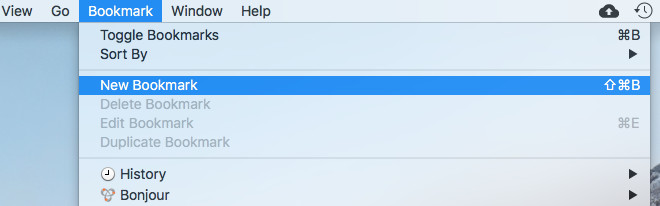
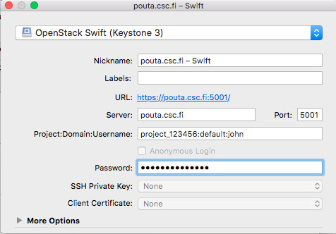
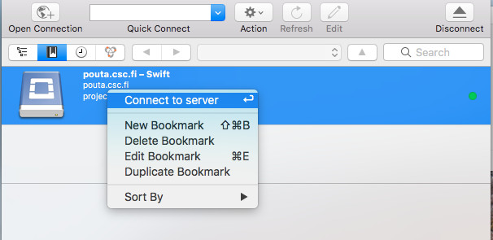

# Using Allas with Cyberduck

For Windows and Mac, [Cyberduck](https://cyberduck.io/) provides a graphical user interface to Allas.

The instructions below describe how to open a _Swift_-protocol-based Cyberduck connection to Allas. 
With this setup, Cyberduck is compatible with _rclone_, _Swift_ and _a-tools_. Cyberduck can be configured to use
_S3_ protocol too, but that option is not discussed here.

In the end fo this page there is a [list of functions](#cyberduck-functions) that Cyberduck offers for data management.
Please use [Cyberduck web site](https://cyberduck.io/) for more detailed information and instructions.

1\. Install **Cyberduck**.

2\. Navigate to the Cyberduck main menu and choose **Bookmark | New Bookmark** (_Ctrl-Shift-B_).

**Figure** Creating a new bookmark

3\. In the first dropdown menu, choose _OpenStack Swift (Keysone 3)_.
    ( if your Cyberduck does not have this option available, you need to update it to a more recent version)

4\. As the **Server**, type _pouta.csc.fi_ and choose the **Port** _5001_. 

5\. In the section **Project:Domain:Username**, type (without spaces) the desired _project's name_, add "**:default:**" and your _Pouta username_ (this is the CSC user accout you use in CSC supercomputers and cPouta). Thus, it should be in the format _projectname:default:username_, e.g. *project_123456:default:john*.

6\. Type your CSC password in the **Password** field. You can close the bookmark by clicking **X** on the upper right corner of the pop-up window.

**Figure** Entering information for a bookmark

7\. Navigate to the top left corner to the icons under _Open Connection_ and choose the **Bookmarks icon** (second from the left).
 
8\. Next, right-click the created bookmark and choose the option **Connect to server**.

**Figure** Connecting to the server

Now you should be able to see the content of your project (which might be empty).

### Cyberduck functions

Cyberduck offers some basic functionalities for managing data in the object storage:

 * _Create_ buckets
 * _Upload_ objects
 * _List_ objects and buckets
 * _Download_ object and buckets
 * _Edit_ objects
 * _Edit_ metadata
 * _Share_ objects
 * _Remove_ objects and buckets

The Cyberduck user interface is quite easy to use. 
The data management options can be displayed by either right-clicking the bucket/object or choosing the 
bucket/object and then clicking the **Action** button on the menu bar. 
To navigate back to the previous directory, use backspace.
