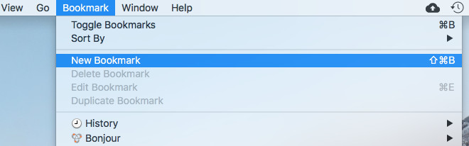
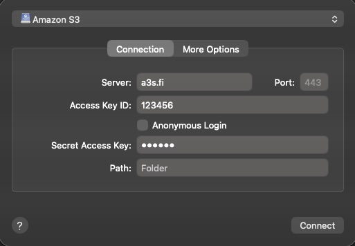
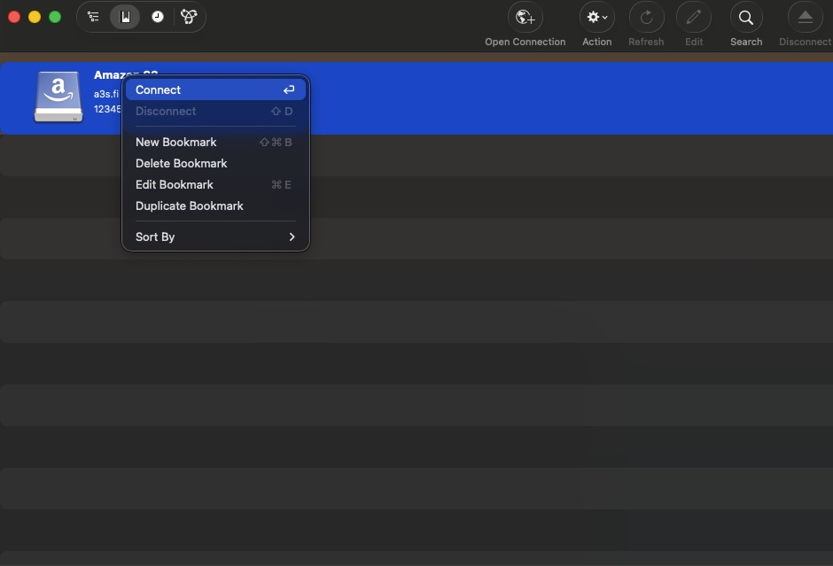
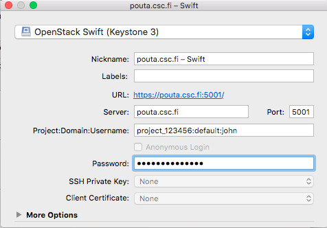
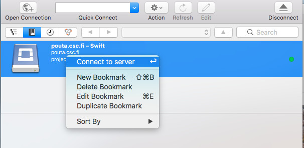

# Using Allas with Cyberduck

For Windows and Mac, [Cyberduck](https://cyberduck.io/) provides a graphical user interface to Allas.
Please use [Cyberduck web site](https://cyberduck.io/) for more detailed information and instructions.

## S3 connection to Allas

### 1. Create or obtain an Allas S3 access key

Cyberduck does not use your CSC username and password for an S3 connection.
It needs a project-specific S3 **Access Key ID** and **Secret Access Key**.

On a CSC supercomputer, load the Allas tools and configure an S3 connection:

```bash
module load allas
allas-conf -m S3
```

`allas-conf` asks for your CSC password and lets you choose the Allas project.
On Roihu, S3 is already the default mode, so `allas-conf` without `-m S3` also
configures an S3 connection; using `-m S3` is explicit and works as documentation
for what is being configured.

After configuration, the S3 credentials can be found in:

```bash
less ~/.aws/credentials
```

The relevant values are the access key and secret key. They look conceptually like this:

```text
AWS_ACCESS_KEY_ID=...
AWS_SECRET_ACCESS_KEY=...
```

Use the values created for your own CSC project.

!!! warning "Keep the S3 keys secret"

    Allas S3 keys are persistent credentials. Anyone who obtains both keys can
    access the Allas data permitted by those credentials. Store them only on
    trusted devices. Removing a local copy does not revoke the credentials in Allas.

    If a key pair must be revoked, use: `allas-conf --s3remove`

### 2. Create an S3 bookmark in Cyberduck

1\. [Install and open Cyberduck](https://cyberduck.io/download/)

2\. Choose **Bookmark | New Bookmark** (or **Open Connection** for a one-time connection).



3\. In the protocol dropdown, choose **Amazon S3** / **S3 (HTTPS)**.
   Cyberduck supports custom S3-compatible endpoints, so an Amazon AWS account is not required.

4\. Enter the following connection values:

| Cyberduck field | Value for Allas |
| --- | --- |
| Protocol | **Amazon S3** / **S3 (HTTPS)** |
| Server | **`a3s.fi`** |
| Port | **`443`** |
| Access Key ID | Your Allas S3 access key |
| Anonymous Login | **Off** |
| Secret Access Key | Your Allas S3 secret key |
| Path | Leave empty initially; optionally set a bucket name |



If Cyberduck shows a **Region** setting, leave it at its default or empty value
unless a current CSC instruction says otherwise.

!!! important

    The S3 endpoint is **`a3s.fi`**. Do not use `allas.csc.fi` as the S3 server.
    The `pouta.csc.fi:5001` address used in the Swift instructions below is also
    **not** the S3 endpoint.

5\. Click **Connect**. Cyberduck should display the buckets accessible with the selected project's S3 credentials.

To open a particular bucket directly, set the bookmark's **Path**
(also called **Default Path** in some Cyberduck versions)
to the bucket name. Otherwise, leave the path empty to start from the bucket list.



### 3. Verify the credentials if Cyberduck cannot connect

Before changing Cyberduck settings, verify that the same S3 credentials work from a CSC system.
After running `allas-conf -m S3`, either of these commands should list the project's buckets:

```bash
aws s3 ls --endpoint-url https://a3s.fi
```

or

```bash
s3cmd ls s3://
```

On Roihu, you can also inspect the active object-storage configuration with:

```bash
check-allas-connections
```

If the command-line test succeeds but Cyberduck does not, check the following:

* **Server:** it must be `a3s.fi`, not `allas.csc.fi` or `pouta.csc.fi`.
* **Port:** use HTTPS on port `443`.
* **Credentials:** enter the S3 access key and secret key, not your CSC username/password.
* **Project:** S3 credentials are associated with a CSC project. Make sure the keys were
  created for the project whose buckets you intend to access.
* **Path:** if a bookmark fails while opening a specific bucket, temporarily clear the
  Path/Default Path and connect to the bucket list first.
* **Saved credentials:** if Cyberduck has an older key saved in the macOS Keychain or
  Windows credential storage, update or remove the stale saved entry and enter the current key pair again.

Cyberduck's normal S3 (HTTPS) connection profile should be tried first. Do not switch to a legacy
AWS2-signature profile merely because Allas is not Amazon AWS; Allas is an S3-compatible service
and CSC's supported AWS CLI configuration works with the standard S3 endpoint.
If a signature-related error remains after the credentials and endpoint have been verified,
consult the current Cyberduck S3 documentation and CSC support before changing signing-profile settings.

## Swift connection to Allas

1\. [Install and open Cyberduck](https://cyberduck.io/download/)

2\. Choose **Bookmark | New Bookmark** (or **Open Connection** for a one-time connection).


3\. In the protocol dropdown, choose **OpenStack Swift (Keystone 3)**.
   If this option is not available, update Cyberduck to a recent version.

4\. As the **Server**, type `pouta.csc.fi` and use **Port** `5001`.

5\. In **Project:Domain:Username**, enter the desired project's name, `:default:`, and your
   CSC username without spaces. For example:

   ```text
   project_123456:default:jdoe
   ```

6\. Enter your CSC password in the **Password** field.



7\. Save the bookmark and connect to it.



Now you should be able to see the content of your project (which might be empty).

## Cyberduck functions

Cyberduck offers some basic functionalities for managing data in the object storage:

 * _Create_ buckets
 * _Upload_ objects
 * _List_ objects and buckets
 * _Download_ object and buckets
 * _Edit_ objects
 * _Edit_ metadata
 * _Share_ objects
 * _Remove_ objects and buckets

The Cyberduck user interface is quite easy to use. 
The data management options can be displayed by either right-clicking the bucket/object or choosing the 
bucket/object and then clicking the **Action** button on the menu bar. 
To navigate back to the previous directory, use backspace.
