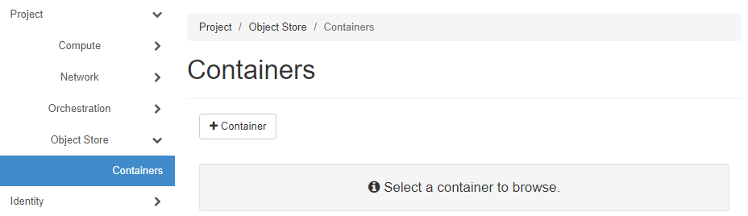
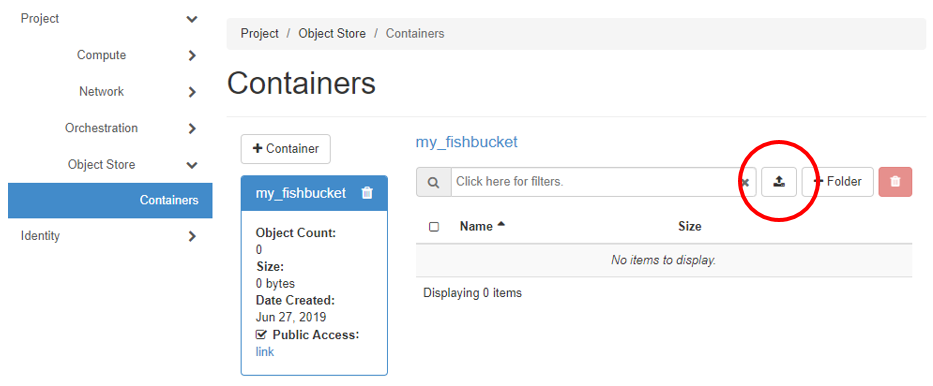
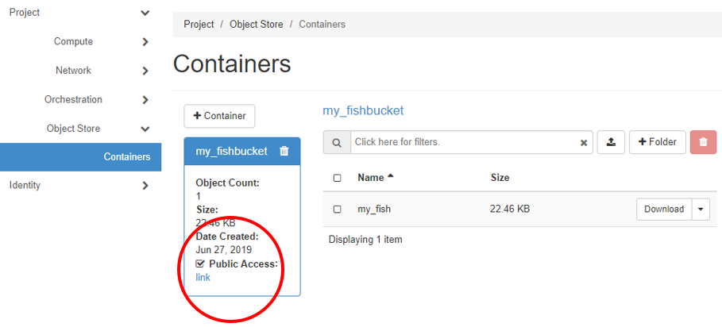
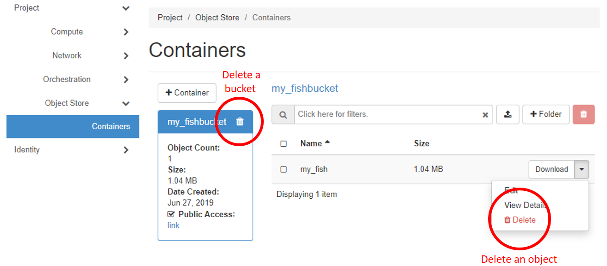

# The web client – OpenStack Horizon Dashboard

This chapter provides instructions for using Allas with the user-friendly _OpenStack Horizon Dashboard_. 

OpenStack documentation for managing buckets over the web interface: [https://docs.openstack.org/horizon/latest/user/manage-containers.html](https://docs.openstack.org/horizon/latest/user/manage-containers.html)

The OpenStack dashboard has a small subset of object storage functionalities. The available operations:

| Function |
| :--- |
| _Create_ a new bucket |
| _Upload_ an object (max. 5GB) |
| _View_ objects and buckets |
| _Download_ an object |
| _Remove_ objects and buckets |
| Make buckets _public_ or _private_ |

## Create a bucket

1\. Go to [pouta.csc.fi](https://pouta.csc.fi/) and login

2\. In the menu on the left, navigate to **Project | Object Store | Containers**  
(A container corresponds to a bucket)

  
**Figure** Creating a container

3\. Press the **+Container** button and name the bucket (see the [checklist for naming a bucket](../introduction.md#naming-buckets)). If you choose to make the bucket _Public_, the contents of the bucket can be [viewed via the internet](#view-objects-via-the-internet).

## Upload an object

The data upload function of this interface works only for files smaller than 5 GB.

1\. Choose the desired bucket and press the **upload symbol** on the right.

  
**Figure** Uploading an object

2\. Choose the object on your computer and name it. **Note:** Do <u>not</u> use non-ASCII characters (&auml;, &ouml; etc.). 

3\. Upload the object. It will appear in your container. You can also create pseudo folders for the objects with the **+Folder** button next to the upload symbol, e.g. to organize the objects into folders.

## View objects via the internet

If the bucket containing the objects is set to _public_, the objects can be viewed via the internet by anyone who knows the URL. This setting can be changed in [pouta.csc.fi/dashboard/project/containers](https://pouta.csc.fi/dashboard/project/containers/) by choosing the container and selecting the **Public Access** setting:

**Figure** Making an object public or private

For example, the public object called _my_fish_ in the container _my_fishbucket_ can be viewed with the URL _a3s.fi/my_fishbucket/my_fish_.
Note that in cases, where a large object is stored to Allas as segments, you must set to _public_ also the segments containing bucket ( e.g. _my_fichbucket_segments_ ).

## Download an object

Download an object by clicking the **Download** button on the right side of the object's name.

## Remove objects and buckets

Objects can be removed by expanding the dropdown menu on the right next to the _Download_ button and choosing **Delete**.

Buckets can be removed only when they are empty. Hence, all objects in a bucket must be removed or moved elsewhere before the bucket can be deleted. Remove a bucket by clicking the **trashcan symbol** next to the bucket's name. 

**Figure** Removing an object or a bucket

Alternatively, and especially if you want to remove several objects at once, you can choose the objects by selecting the small boxes on the left side of the object names and choosing the **trashcan symbol** on the red background in the upper right corner.
